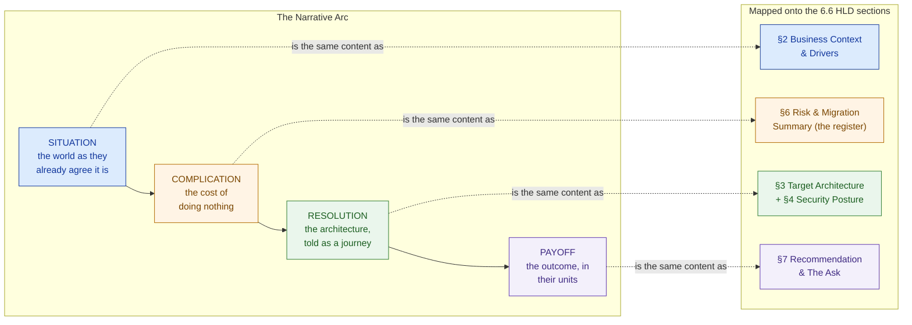

# Technical Storytelling & Messaging

> A board doesn't fund a diagram — it funds a story about its business getting better, told well enough to survive being repeated by someone who wasn't in the room.

**Type:** Present
**Track:** AI, Data & Infrastructure Solution Architect (Presales)
**Prerequisites:** Phase 6 (Solution Architecture)
**Time:** ~4h
**Lab:** —
**Ship It:** Solution narrative

## The Problem

You've done the work. Phase 6 gave you a real architecture for Cakrawala Group: a strangler-fig migration off three siloed legacy estates, an event bus and an anti-corruption layer protecting the finance-leasing core, a zero-trust security model with a segmented enclave, a sizing model landing at ~40 Kubernetes nodes and one GPU node, a BOM that lands at ~Rp 52 billion (banded Rp 48–58 billion) against a board ceiling of Rp 45–65 billion, a risk register that correctly ranks the organizational risk above the regulatory one, and a three-wave migration gated by compliance before finance-leasing ever cuts over. You wrote it all into 6.6's HLD. It is, genuinely, a good piece of architecture.

You walk into the board room and you present it the way you wrote it: Executive Summary, Business Context, Target Architecture, Security Posture, Sizing & Cost, Risk & Migration, Recommendation. Section by section, competently, in order. Forty minutes later you finish, and the CFO asks a question that tells you exactly how badly this went: *"So — remind me what we're actually buying?"* She was listening the whole time. She still can't repeat back what changes for Cakrawala Group if this gets approved. Two weeks later you hear the rival — a global systems integrator with, by your own estimate, a weaker architecture and a thinner risk register — won the room. Not because their technology was better. Because their SA opened with *"Cakrawala is losing ground to competitors who already run one platform instead of three, and here's how you close that gap in eighteen months"* — and the board remembered that sentence walking out, the way they never remembered your seven headings.

This is the failure mode of an SA who can design but can't narrate. A document organized by *section* is optimized for the person writing it, not the person deciding from it — it front-loads structure and back-loads meaning, so the "why should I care" lands, if it lands at all, on page six. A board member does not sit down to read an HLD the way an engineer reads an LLD; they hear it once, in a room, competing for attention with three other agenda items, and they will repeat exactly one sentence of it to the CEO who wasn't there. Worse: the same true facts land differently depending on who's holding them. The CFO wants to hear risk and payback. The COO wants to hear how the stores keep running during cutover. The CIO wants to hear whether her team can actually operate this thing on day two. The CEO wants to hear whether this closes the gap with the rival who's already ahead. If you tell all four people the identical section-by-section HLD, you have optimized for none of them — and the deal goes to whoever didn't. Technical storytelling is the discipline of taking a real, technically defensible solution and compressing it into a story that survives being retold by someone who wasn't there, reframed for whoever is holding it. It is not spin. Every fact you use must still be true and every risk you have must still be visible — you are changing the *order* and the *frame*, never the *substance*.

## The Concept

### The four-part arc

Every solution you have designed in Phase 6 already contains a story — you just wrote it down in the wrong order. The narrative arc pulls the same content into the shape a human brain actually retains: **Situation → Complication → Resolution → Payoff.**

- **Situation** — the world as the customer already agrees it is. Not your opinion; their facts. Scale, structure, what's working. This is where you establish that you understand their business before you say a single word about yours.
- **Complication** — the cost of the status quo, made concrete and urgent. Not "there is technical debt" — a scored, specific consequence: what breaks, what it costs, why *now* and not next year. This is where 6.5's risk register earns its keep — a risk register is a complication list that's already been scored for you.
- **Resolution** — the target architecture, told as a sequence of decisions and their reasons, not as a diagram read aloud. "We move retail first because it's the lowest-risk proving ground, then logistics, then finance-leasing behind a compliance gate" is a *story*. "Figure 3 shows the target state" is a caption.
- **Payoff** — the business outcome, in the customer's own units (money, risk avoided, competitive position), never left as a lone KPI. A percentage without a "so what" is a number nobody repeats; a percentage translated into what it buys is a sentence that survives the elevator ride to the CEO's office.



Notice what this diagram is *not* saying: it is not saying "write a different document." The HLD from 6.6 remains the artifact of record — the thing that survives scrutiny, gets appended to the contract, and holds every figure and every risk. The narrative is a **second rendering of the same content**, reordered and re-weighted for the fifteen minutes a board actually has, with the HLD standing behind it as the artifact that answers "prove it" when someone asks.

### The "so what" test, at every level of detail

You met the "so what" test in Phase 1 as a way to keep a discovery finding from staying a fact. In presales it becomes a discipline you run on *every sentence* of a narrative, at every depth: an executive should never hear a fact without immediately knowing why it matters *to them*. "The platform is sized at 40 Kubernetes nodes" fails the test — nobody in a board room can act on a node count. "The platform is sized once for all three business units instead of three times, one per BU" passes it for a CFO thinking about cost. "Zero trust means a breach in retail can't reach the finance-leasing core" passes it for a risk-conscious director. The number didn't change. The frame did.

### Message-market fit: one solution, four stories

The same architecture, priced once, does not get pitched once — it gets *told* differently to each stakeholder, because each stakeholder is buying a different consequence of the same fact.

```
 MESSAGE MAP — same fact, reframed per audience
 ══════════════════════════════════════════════════════════════════════════════
 AUDIENCE   │ WHAT THEY ACTUALLY CARE ABOUT      │ THE SAME FACT, REFRAMED
 ───────────┼─────────────────────────────────────┼────────────────────────────
 CFO        │ cost, risk-adjusted return,          │ "~Rp 52B, inside the
            │ downside exposure                    │  Rp45-65B ceiling, breaks
            │                                       │  even ~month 13"
 ───────────┼─────────────────────────────────────┼────────────────────────────
 COO        │ operational continuity — stores      │ "Retail moves first, proves
            │ and hubs keep running during          │  the pattern on the lowest-
            │ cutover                               │  risk BU before logistics
            │                                       │  or finance ever touch it"
 ───────────┼─────────────────────────────────────┼────────────────────────────
 CIO        │ technical credibility — can her       │ "Zero trust, a segmented
            │ team actually run this after          │  enclave, and a staged
            │ the SI leaves                          │  knowledge-transfer exit
            │                                       │  before full internal handover"
 ───────────┼─────────────────────────────────────┼────────────────────────────
 CEO        │ competitive position — are we          │ "This closes the gap with
            │ falling behind the rival               │  the SI-led rival who's
            │                                       │  already modernizing faster"
 ══════════════════════════════════════════════════════════════════════════════
 Same underlying fact (~Rp 52B / 40-node shared platform / 3-wave migration)
 rendered four times. Nothing here is invented — every reframe still traces
 back to one line in the HLD, the BOM, or the risk register.
```

Message-market fit is not four different truths. It is one truth, four *entry points*. If a CFO asks the COO's question in the room, the answer must still be consistent — you are choosing which door people walk in through, not building four separate houses.

### The customer is the hero, not you

One more correction the arc forces on you: in a feature-led pitch, the SA's architecture is quietly the hero — "look what we built." In a narrative-led pitch, **Cakrawala Group is the hero of its own story, and you are the guide who shows up with a plan.** This isn't a branding nicety; it changes what you say out loud. A hero-is-you narrative opens with "our platform uses zero trust and an event bus." A hero-is-them narrative opens with "you're running three estates that don't talk to each other, and here's the plan that gets you to one" — the same architecture, but the board hears themselves solving their own problem with your help, not being sold a product. Every "we" in a first draft of your narrative is worth rereading: does it belong to Cakrawala, or did it quietly slip to you?

### Anticipate the rival's story, not just their features

Cakrawala's rival — the global systems integrator — is not only pitching a different architecture; it is pitching a *different narrative*, and the board will hold both stories in their head at once, whether or not either SA mentions the other. If your narrative doesn't name the competitive stakes, the rival's will, and theirs will be the one that mentions you first. This is why Design It's Step 1 opens by naming the rival directly rather than leaving it as subtext — a board that hears "we know who else is in this room" trusts the rest of the story more, not less. (Building the full counter-narrative — the battlecard, the objection matrix — is 7.6's job; here, the discipline is narrower: make sure your Situation section doesn't pretend the room is uncontested.)

### Three nested lengths of the same story

The last piece of the mental model: the exact same arc has to work at three different lengths, like Russian dolls, because you never know how much time you'll actually get.

```
┌───────────────────────────────────────────────────────────────────────────┐
│  THE ELEVATOR VERSION  (~20 seconds — one breath, no slides)               │
│  "Cakrawala runs three technology estates that don't talk to each other,  │
│  and a rival is already unifying theirs. We migrate all three onto one    │
│  zero-trust platform in 12-18 months for ~Rp 52 billion, breaking even    │
│  around month 13, without ever putting the regulated finance-leasing      │
│  core at early-wave risk."                                                │
│  ┌─────────────────────────────────────────────────────────────────────┐  │
│  │  THE 15-MINUTE VERSION  (the board-meeting slot)                     │  │
│  │  Situation (2 min) → Complication, led with risk #1 not the          │  │
│  │  regulatory one (3 min) → Resolution as a 3-wave journey, not a      │  │
│  │  diagram walkthrough (6 min) → Payoff in cost-to-serve AND           │  │
│  │  competitive terms (2 min) → the ask, one sentence (2 min)           │  │
│  │  ┌───────────────────────────────────────────────────────────────┐  │  │
│  │  │  THE WRITTEN PROPOSAL VERSION  (the document that survives)   │  │  │
│  │  │  The full 6.6 HLD — all 7 sections, every appendix, every      │  │  │
│  │  │  figure traceable to 6.3/6.4/6.5 — the thing "prove it"        │  │  │
│  │  │  questions get answered from, after the room has already      │  │  │
│  │  │  agreed in principle.                                          │  │  │
│  │  └───────────────────────────────────────────────────────────────┘  │  │
│  └─────────────────────────────────────────────────────────────────────┘  │
└───────────────────────────────────────────────────────────────────────────┘
```

Each doll must be a compression of the one inside it, never a different story. If your elevator version and your written proposal disagree on the payback period, you have two stories, and the second question in the room will find the seam.

## Design It

Let's build the actual Cakrawala Group solution narrative — the arc and the message map — from the real 6.5 and 6.6 content, inventing nothing new.

### Step 1 — Situation: establish their world, in their facts

Open with what Cakrawala's own board already knows to be true, not with your architecture. Pull straight from 6.6 §2 (Business Context & Drivers):

> *"Cakrawala Group runs ~350 retail outlets, ~40 logistics hubs, and one finance-and-leasing back office — about 18,000 people generating roughly Rp 8 trillion a year. Three business units, three technology estates, each one working fine in isolation and none of them talking to the others. And a global systems integrator is already in this room, pitching a way to close that gap."*

Notice what this does: it names the rival before the rival's own SA can use surprise as an advantage, and it states the fragmentation as the board's own observation, not your critique.

### Step 2 — Complication: the cost of doing nothing, led by the right risk

This is where most first-pass narratives go wrong — they lead with the *regulatory* risk because it sounds scariest, when 6.5's own register says the *organizational* risk is the highest-scored item (9/9, Likelihood H × Impact H): **the mixed-skill team's ability to operate the new platform after cutover.** A narrative that leads with residency risk when the register says operations risk is the real exposure is not lying, but it is mis-weighting — and a board member who later reads the appendix will notice the mismatch. Lead with the true top risk:

> *"The hardest risk in this program isn't the regulator — it's us. Your team, operating a platform this size for the first time, is the single highest-scored risk in our own register, higher than the finance-leasing compliance risk. That's why the delivery model stages a knowledge-transfer exit before we ever hand you the keys. Second: every quarter you run three siloed estates instead of one is a quarter you pay the fragmentation tax again — and it compounds, because the rival in this process is already unifying theirs."*

Both sentences are load-bearing recaps of 6.5's register: risk #1 (score 9, organizational) and the general fragmentation-tax framing from 6.6 §2. Nothing invented.

### Step 3 — Resolution: the architecture as a journey, not a diagram

Take 6.6 §3's target architecture and 6.5 §2's wave plan, and narrate the *sequence of decisions*, not the boxes:

> *"We don't touch everything at once. Retail moves first — 350 outlets, but the lowest regulatory exposure — because it's the best place to prove the pattern: a strangler-fig cutover that replaces legacy piece by piece behind a facade, so a rollback is a service event, not a headline. Once that's stable, logistics follows the same pattern under real cross-BU traffic for the first time. Finance-leasing goes last, and it does not go at all until a dedicated compliance gate clears — data residency, audit-trail continuity, and a rehearsed rollback, not just a designed one. The whole platform sits behind a zero-trust boundary, so even during migration, a problem in retail physically cannot reach the finance-leasing core."*

Every clause here is a direct recap: strangler-fig and the wave order (6.5 §2), the compliance gate's four checks (6.5 §3), zero trust and the segmented enclave (6.6 §4).

### Step 4 — Payoff: the outcome, not the KPI

The BOM in 6.4 gives you a raw number: 15–20% cost-to-serve reduction. Left as a percentage, it is inert. 6.4 §7 already did the translation work — reuse it, don't recompute it:

> *"Fifteen to twenty percent of cost-to-serve, on your Rp 8 trillion revenue base, is worth roughly Rp 144 to 192 billion a year — call it Rp 168 billion at the midpoint. Against a Rp 52 billion investment, that's a payback around month 13, comfortably inside the 12-to-18-month delivery window itself. You are not waiting years to feel this. And unlike the rival's platform, you keep your regulated core insulated the entire time you're realizing it."*

Every number here — Rp 168B/yr midpoint, ~13-month payback, the 12–18 month window — is cited verbatim from 6.4 §7's own ramp-adjusted payback calculation. The narrative did not add a decimal of new math; it translated an existing one into a sentence a CFO repeats to the CEO without needing the spreadsheet.

### Step 5 — Build the message map from the same four facts

With the arc built, reframe its core facts for each stakeholder without changing any of them:

| Fact (source) | CFO frame | COO frame | CIO frame | CEO frame |
|---|---|---|---|---|
| ~Rp 52B, band Rp 48–58B (6.4) | "Inside the Rp 45–65B ceiling, ~13-month payback" | "One shared build, not three separate platform projects competing for the same budget" | "Priced with a real contingency line tied to the risk register, not padded" | "The investment that closes the gap with the rival" |
| ~40 K8s nodes + 1 GPU node (6.3, 6.6 §5) | "One platform sized once, not sized three times per BU" | "Shared capacity — logistics and retail don't wait on separate hardware cycles" | "A right-sized footprint your team can actually operate, not a science project" | "Enough capacity to run the whole group, not a pilot" |
| 3-wave migration, compliance gate (6.5) | "Contingency is banded by wave — Wave 3 carries the widest buffer" | "Retail and logistics prove the pattern before finance-leasing is ever touched" | "A rollback mechanism (the strangler-fig facade) rehearsed before it's ever needed live" | "We move fast where it's safe and carefully where it's regulated — not slow everywhere" |
| Zero trust, segmented enclave (6.2, 6.6 §4) | "Bounds the group's downside — a retail incident can't become a compliance incident" | "No new blanket access for anyone — the security model doesn't slow down day-to-day store ops" | "A defensible architecture a real audit will hold up" | "Protects the business unit the regulator watches closest" |

### Side by side: the same content, told two ways

To make the difference concrete, here is the Resolution beat of the *same* architecture told twice — once the way an SA who read 6.6 aloud would tell it, once the way Design It's Step 3 tells it:

```
FEATURE-LED (reads the HLD aloud)                NARRATIVE-LED (Design It, Step 3)
──────────────────────────────────────           ──────────────────────────────────────
"Section 3 shows the target architecture.        "We don't touch everything at once.
We use a strangler-fig pattern for retail        Retail moves first — because it's the
and logistics, an anti-corruption layer          best place to prove the pattern safely
in front of the finance-leasing core, an         — then logistics, under real cross-BU
event bus for integration, an API gateway,       traffic. Finance-leasing goes last, and
and a zero-trust security model with a           it doesn't go at all until a compliance
segmented enclave. Migration happens in          gate clears. The whole platform sits
three waves."                                    behind a zero-trust boundary the entire
                                                  time, so a retail problem can never
                                                  reach the regulated core."
──────────────────────────────────────           ──────────────────────────────────────
Same 5 architectural facts. Read in the          Same 5 facts, in the order a person
document's own order. Nobody in the room         actually needs them to follow *why*
can repeat this back — it's a list, not          the sequence exists. This is what
a sequence with reasons attached.                 gets repeated to the CEO afterward.
```

Nothing was added or removed on the right — every noun on the left (strangler-fig, ACL, event bus, API gateway, zero trust, three waves) still appears. What changed is that each fact now answers "why does this exist" in the same breath it's introduced, which is the "so what" test applied to architecture instead of to a KPI.

### Step 6 — Pressure-test the narrative before you ship it

A narrative isn't done when the arc reads well; it's done when it survives the room. Run two checks before you present it:

- **The recap check.** Read only your Situation and Complication sections aloud, then close the document and try to write down 6.5's top three risks from memory. If you can't, your Complication has smoothed over exactly the detail that makes the story honest — go back and re-anchor it to the register, not to your own paraphrase of the register.
- **The hostile-question check.** Ask the single question the rival's SA would ask if they were in the room: *"If your top risk is your own team's ability to operate this, why should the board trust your delivery model over ours?"* If your narrative doesn't already contain the answer — the staged knowledge-transfer exit criteria from 6.5's RACI — you have a narrative that wins the pitch and loses the Q&A. A story that can't answer the obvious hostile question isn't ready; it's just untested.

## Compare It

### Feature-led pitch vs. narrative-led pitch

| | Feature-led pitch | Narrative-led pitch |
|---|---|---|
| **Opens with** | "Our architecture uses a strangler-fig pattern, an event bus, and zero trust" | "You're running three technology estates that don't talk to each other, and a rival already unified theirs" |
| **Organizes by** | The document's own section order | The audience's attention span and stake |
| **Risk register's role** | An appendix, read only if asked | The Complication — load-bearing, told early |
| **What survives retelling** | Almost nothing — jargon doesn't repeat cleanly | One sentence, in the customer's own words |
| **Where it wins** | A technical evaluation committee scoring against an RFP checklist | A board or steering committee deciding on trust and story, not a checklist |
| **Where it loses** | Any room where attention is scarce and only one person repeats the pitch upward | An RFP scoring panel that specifically wants section-by-section compliance evidence |

Neither is universally right — they answer different rooms. An RFP technical-evaluation panel scoring against a rubric wants the feature-led document (that's what 6.6's HLD *is*, and it should stay that way as the artifact of record). A board deciding whether to trust you with Rp 52 billion wants the narrative. Presenting the wrong one to the wrong room is a common, avoidable loss.

### The Pyramid Principle vs. a chronological narrative

Phase 1 introduced the **Minto Pyramid Principle** — answer-first, then MECE-grouped supporting arguments — as the structure for a consulting readout. It is not in conflict with the arc here; it answers a different constraint. The Pyramid Principle is built for a room that will **interrupt with questions** and needs the conclusion up front so a cut-off presentation still lands the ask. The Situation→Complication→Resolution→Payoff arc is built for a room you get to **walk through in sequence**, where the emotional build — problem before solution, cost before payoff — is what makes the payoff land instead of read as a lone KPI.

In practice, the strongest board sessions use both, nested: open Pyramid-style with the answer ("we recommend approving ~Rp 52 billion, three-wave migration, 12–18 months" — 6.6 §7's own recommendation, verbatim), *then* walk the room through the chronological arc as the supporting argument for that answer, because an executive who already knows the ask can now enjoy — and remember — the story of how you got there. Answer-first is the *frame*; the arc is what fills it.

### Three narrative frameworks, and when each earns its keep

The arc taught in this lesson is one member of a small family of narrative frameworks. Knowing the other two by name matters because a customer's own executive team may already speak one of them, and matching their vocabulary buys you credibility for free.

| Framework | Shape | Reach for it when… |
|---|---|---|
| **SCRP (this lesson)** — Situation, Complication, Resolution, Payoff | Chronological, business-outcome-first close | You're walking a room through a *decision* start to finish, and the payoff needs to land after the cost has been felt — a board approval pitch, exactly Cakrawala's case |
| **Minto's SCQA** — Situation, Complication, Question, Answer | Answer-first, then the same shape as support | A written executive summary or a room that will interrupt with questions before you finish — the Pyramid Principle discussed above |
| **StoryBrand / Hero's Journey** — customer as hero, guide (you) offers a plan, warns of failure, promises success | Customer-centered, plan-then-stakes | Marketing collateral, RFP cover letters, or any written material the customer reads *without you in the room to adjust tone* — it's the most forgiving of the three when you can't read the audience live |

All three share the same non-negotiable underneath them: the risk register must still be visible somewhere in the shape, or the framework is just decoration on a story that hides its downside.

### When a story oversimplifies dangerously

A narrative is a compression, and compression can hide load-bearing detail if you let it. The single rule that keeps technical storytelling honest: **never let a good story make a real risk invisible.** Two concrete failure modes to watch for in your own drafts:

- **Burying the gate.** It would be a *smoother* story to say "we migrate Cakrawala onto one platform in 12–18 months" and stop there. It is a *dishonest* story, because it omits that Wave 3 does not start until the compliance gate in 6.5 §3 clears — and a board that later discovers the gate exists, un-mentioned, will wonder what else you left out. The correct narrative names the gate as a feature of the design ("we protect you by refusing to touch the regulated core until it's proven safe"), not as a footnote.
- **Reframing away a genuine downside.** The message map reframes the *same true fact* for four audiences — it must never reframe a risk into a non-risk. "Zero trust bounds the blast radius" is a true reframe of a real control. "This has no risk" about anything in the risk register is not a reframe; it is a fabrication, and the first hard question in Q&A will expose it in front of the room you were trying to win.

The test before you ship any narrative: read your Complication section next to 6.5's risk register. If the register's top three risks aren't recognizable in your story — even reframed, even compressed — you've told a story about a different, easier project than the one you're actually delivering.

## Ship It

**Deliverable:** Solution Narrative — the reusable 4-part arc plus the audience message map, worked for Cakrawala Group. Both files live in [`outputs/`](../outputs/):

- **[`template-solution-narrative.md`](../outputs/template-solution-narrative.md)** — a fill-in-the-blank template: the Situation→Complication→Resolution→Payoff skeleton, the three nested lengths (elevator / 15-minute / written), and a blank message-map table for CFO/COO/CIO/CEO (or your deal's own stakeholder set). Reusable on any deal that already has an HLD, a BOM, and a risk register behind it.
- **[`example-cakrawala-group-solution-narrative.md`](../outputs/example-cakrawala-group-solution-narrative.md)** — the template fully worked for Cakrawala Group, citing 6.4's exact BOM figures and 6.5's exact risk register, so the skeleton isn't abstract. This is what you'd actually bring into the board room.

This deliverable feeds forward twice: **7.2 (Whiteboarding & Architecture Communication)** reuses the same arc as the spine of a live whiteboard session, and **Capstone G** requires you to defend this exact narrative — and the HLD standing behind it — in front of a mock board.

## Exercises

1. **(Easy)** Take the raw fact "~40 Kubernetes nodes + 1 GPU node with 2× cards" from 6.3/6.6 and write two one-sentence reframes of it that pass the "so what" test — one for a CFO, one for a COO. Neither sentence may mention a node count.
2. **(Medium)** 6.5's risk register has ten scored risks. Pick the two highest-scored risks that are *not* risk #1, and write a Complication paragraph (3–4 sentences) that leads with the correct priority order — highest score first — the way Design It's Step 2 does for risk #1. State explicitly why leading with a lower-scored risk instead would be a mis-weighted narrative.
3. **(Hard)** Cakrawala's CIO privately tells you she is worried the board will approve the deal without understanding that her team cannot run the platform alone on day one — she wants that risk *heard*, not softened. Write the 15-minute-version Resolution section so that risk #1 (organizational, 9/9) is clearly present and un-softened, while still landing as a narrative a board wants to approve rather than a warning that scares them off. Then write one sentence explaining what you changed versus a version that buried the risk, and save both versions alongside your worked example — you'll defend this exact tension in Capstone G's Q&A.

## Key Terms

| Term | What people say | What it actually means |
|------|-----------------|------------------------|
| Solution narrative | "The pitch" | The same technically-grounded solution (HLD + BOM + risk register), reordered into Situation→Complication→Resolution→Payoff and reframed per audience, so it survives being retold by someone who wasn't in the room. |
| "So what" test | "Getting to the point" | A per-sentence discipline: no fact is spoken without its consequence to *this* listener attached in the same breath. Applies at every level of detail, from a one-line elevator pitch to a full HLD. |
| Message-market fit | "Knowing your audience" | The same true fact, reframed for each stakeholder's actual decision criteria (cost for a CFO, operations for a COO, defensibility for a CIO, competitive position for a CEO) — never four different facts. |
| Nested narrative lengths | "Having a short version" | The elevator, 15-minute, and written-proposal versions of one story, each a compression of the one inside it — not separate stories that can quietly disagree. |
| Pyramid Principle | "Executive summary first" | Answer-first, MECE-grouped argument structure (Minto) — the *frame* around a narrative, built for rooms that interrupt with questions before the story finishes. |
| Complication | "The problem statement" | The cost of the status quo, scored and specific — in practice, the risk register's highest-priority items retold as urgency, not buried as an appendix. |
| Narrative oversimplification | "Keeping it simple" | The failure mode where compression quietly removes a real risk instead of just reframing it — the line between good storytelling and a pitch that collapses in Q&A. |

## Further Reading

- [*The Pyramid Principle* (Barbara Minto)](https://www.barbaraminto.com/) — revisit it here specifically for the Situation-Complication-Question-Answer (SCQA) structure, the direct ancestor of the arc in this lesson.
- [Nancy Duarte — *Resonate: Present Visual Stories that Transform Audiences*](https://www.duarte.com/resonate-book/) — the "what is" vs "what could be" narrative gap that underlies why a Complication section has to feel urgent, not just accurate.
- [Andy Raskin — "The Greatest Sales Deck I've Ever Seen"](https://andyraskin.medium.com/the-greatest-sales-deck-ive-ever-seen-4f4c0dab00c3) — a widely-cited breakdown of naming a "big change in the world" (your Situation/Complication) before pitching the solution, aimed squarely at enterprise deals like this one.
- [Chip & Dan Heath — *Made to Stick*](https://heathbrothers.com/books/made-to-stick/) — the mechanics of why a concrete, translated number ("~13-month payback") outlives an abstract one ("15–20% cost-to-serve reduction") in a listener's memory.
- [Phase 1, Lesson 1.1 — Think Like a Consultant](../../../01-business-and-consulting/01-think-like-a-consultant/docs/en.md) — the "so what" test and the Minto Pyramid Principle as first introduced, before this lesson applies them to a board pitch.
