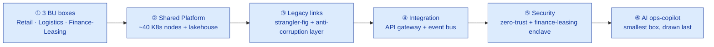

# Whiteboarding & Architecture Communication

> A deck tells the room what you built. A whiteboard lets the room watch you think — and a rehearsed improvisation is the only way to make that safe to do live.

**Type:** Present
**Track:** AI, Data & Infrastructure Solution Architect (Presales)
**Prerequisites:** 7.1 Technical Storytelling & Messaging
**Time:** ~4h
**Lab:** —
**Ship It:** Whiteboard playbook + recording

## The Problem

Cakrawala Group's board has already seen the 6.6 HLD — the target-architecture diagram with three business units, a shared platform, an event bus, a zero-trust enclave around finance-leasing, and a ~Rp 52 billion ask. The deck is good. It is also, this week, a problem: a rival **global systems integrator** is pitching the same board, with a nearly identical box-for-box shared-platform concept rendered on twelve gorgeous slides. Their SA reads it top to bottom in the meeting, in order, in the same voice they'd use for any client. Halfway through, Cakrawala's CIO — the most technical person in the room, and the one whose sign-off actually matters — interrupts with a pointed question about the anti-corruption layer. The rival SA flips forward two slides, finds the answer already written there, and reads it aloud. It is correct. It is also the moment the deal quietly starts slipping away, because the CIO has now watched someone recite an architecture rather than reason about one, and she has been burned before by a vendor who sold a diagram they didn't actually understand.

Your session is next. You could open the same 6.6 diagram and click through it slide by slide — safe, and indistinguishable from what the room just watched. Or you can pick up a marker, draw three empty boxes for the three business units, and build the architecture in front of them, live, answering the CIO's questions as they come up instead of finding them pre-answered on a slide. Done well, this is the single highest-trust move available to a presales SA: the room sees you *construct* the reasoning, not perform it, and a technical buyer reads "constructs it live" as "actually owns it." Done badly, live whiteboarding is worse than the deck it replaces. Draw every box at full engineering detail and you lose the non-technical board members in ninety seconds. Draw in silence while you think and the room's attention drains with every unexplained line. Get interrupted by a hard question, lose your sequence, and spend three minutes visibly lost — and the CIO now has evidence you *don't* understand the architecture, which is the opposite of what you walked in to prove.

The failure mode underneath all of this is treating "live" as "unplanned." It isn't. The whiteboard session that looks spontaneous is the one that was rehearsed the most — a fixed draw order, a fixed one-sentence narration for every box, and a fixed procedure for the moment someone interrupts. This lesson teaches that rehearsed improvisation: the **layered-reveal technique** for what to draw and in what order, how to narrate while drawing without narrating your uncertainty, and how to park a hard question visibly instead of losing the thread. You'll build the whiteboard playbook for Cakrawala Group's HLD, including a full written script — the "recording" — of a session that gets interrupted by exactly the objection Cakrawala's own risk register (6.5) already told you was coming, and comes out the other side stronger for it.

## The Concept

### The layered-reveal technique

The 6.6 HLD's target-architecture diagram (§3 of `example-cakrawala-hld.md`) is the finished picture: three business units, a shared platform, an event bus, an anti-corruption layer, a zero-trust enclave, all present at once. That diagram is exactly right *on the page* — an HLD is read at the reader's own pace, backward and forward, footnoted. A whiteboard session is not read; it is *experienced*, once, in the order you draw it. Put all of that detail up at once and you've handed a mixed room — one CIO who wants precision, five board members who want a story — the same overloaded page, except now it appeared instantly and nobody knows where to look first.

The fix is to never draw the finished diagram. Draw it in **layers**, each one a complete, coherent picture on its own, each one earning the next:



Each arrow in that diagram is a *pause point* in the room, not just a step in a plan. You draw layer ①, say one sentence, and stop — long enough for the slowest board member to catch up — before layer ② appears. The AI ops-copilot is deliberately last and deliberately the smallest box on the board: in a shared-platform pitch, the copilot is the feature everyone wants to talk about and the smallest part of what you're actually asking the board to fund. Drawing it last keeps the room's attention on the platform risk and cost story first, and lets the copilot land as "and here's the payoff," not "here's the whole pitch."

### Narrating while you draw

Silence while drawing is the single fastest way to lose a room — a marker moving with no voice behind it reads as either uncertainty or a rehearsed performance nobody's watching. The discipline is: **one sentence per box, spoken while or immediately after you draw it, that answers "why does this box exist" — not "what is in this box."** That one sentence should trace back to the core message you built in 7.1: the ask, the architecture in one sentence, and the risk in one sentence. If a box's one-liner doesn't obviously serve one of those three, you're narrating engineering detail the room didn't ask for and should probably cut the box, not just the sentence.

```
STEP  YOU DRAW                          YOU SAY (one sentence, the "why")
────  ────────────────────────────────  ──────────────────────────────────────────────────
 1    3 boxes: Retail / Logistics / F&L  "Three business units, three legacy stacks that
                                          don't talk to each other today."
 2    1 box underneath, spanning all 3   "One shared platform replaces three — this is where
                                          the cost-to-serve number comes from."
 3    Dotted lines, legacy → new         "We don't rip anything out on day one — each legacy
                                          system is strangled off gradually, at its own pace."
 4    Two arrows meeting in the middle   "This bus is the only reason three business units can
                                          share one platform without stepping on each other."
 5    A boundary drawn around one box    "Finance-leasing sits behind its own wall — a retail
                                          incident can never become a compliance incident."
 6    One small box, added last          "And once that's standing, this is the smallest, safest
                                          place to add the AI copilot everyone actually wants."
```

Notice what the narration *never* does: it never says "let me think about how to draw this." Uncertainty about content is rehearsed away before the session; uncertainty about *pace* is handled openly, because pausing on purpose reads as confidence and pausing by accident reads as being lost.

### Handling interruption without losing the thread

A live session invites interruption in a way a deck doesn't, and that's the point — but an unmanaged interruption is exactly how you end up visibly lost. The technique is a **visible parking lot**: a physically separate corner of the board (or a dedicated sticky-note column in a virtual tool) reserved for questions that arrive out of sequence. The rule, stated to the room the moment you start: *"If your question is about something I haven't drawn yet, I'll write it here and come back to it — I promise it gets answered before we're done."* This does three things at once: it tells a technical CIO you take her question seriously enough to guarantee an answer, it stops the question from derailing the sequence you rehearsed, and it visibly proves — because the parking lot is still on the board at the end — that you kept the promise.

```
WHITEBOARD SESSION SCRIPT — generic shape
┌──────┬─────────────────────────┬───────────────────────────┬───────────────────────────┐
│ Step │ What you draw            │ What you say              │ Anticipated question       │
├──────┼─────────────────────────┼───────────────────────────┼───────────────────────────┤
│  1   │ 3 BU boxes                │ one-sentence "why"         │ "Why not replace all 3?"   │
│  2   │ shared platform box        │ one-sentence "why"         │ "What does this cost?"      │
│  3   │ ← PARKING LOT used here if the room jumps ahead — write question, point, continue │
│  4   │ integration layer          │ one-sentence "why"         │ "What if the bus goes down?"│
│  5   │ security boundary          │ one-sentence "why"         │ "Who can see finance data?" │
│  6   │ smallest box, added last   │ one-sentence "why"         │ "Can it hallucinate?"       │
└──────┴─────────────────────────┴───────────────────────────┴───────────────────────────┘
```

The parking lot only works if you actually return to it — build a fixed return point into your rehearsed sequence (typically right before the closing summary) so "coming back to it" is never something you have to remember to do under pressure.

### The whiteboard toolkit — physical and virtual

The medium changes the mechanics, not the discipline. In a physical room: **one color per business unit or zone** (e.g., blue for new services, orange for legacy, pink for the security boundary — the same palette 6.6's Mermaid diagram already uses, so the whiteboard and the leave-behind HLD visually match), a thick marker for structure and a thin one for annotations, and boxes drawn large enough to be legible from the back row — a box you have to lean in to read has already lost half the room. Remotely, the same rules apply inside **Miro, FigJam, or Excalidraw**: pre-stage the empty canvas with the BU boxes positioned but not yet labeled or colored, so "drawing live" is really "revealing and narrating a prepared layout," which is both faster and far less likely to visibly go wrong on a shared screen.

### When not to whiteboard

Live whiteboarding is a trust-building tool, not a universal one, and using it in the wrong room actively costs you credibility. Skip it — and lead with the finished deck instead — when: the room is **senior-only and time-boxed** (a board that has fifteen minutes wants the 90-second read from 6.6's Executive Summary, not a six-layer build); the room is **hostile or adversarial** (a live build gives a skeptical audience more surface area to interrupt and derail than a deck does); or the session is **remote with poor connectivity or unfamiliar attendees** where you can't read the room well enough to pace the reveal. The hybrid — a finished deck with one deliberate live "zoom-in" moment on the single diagram that matters most — is often the better default for a first meeting with an unknown audience; save the full live build for a room you've already met once.

### Reading the room: adjusting pace mid-session

The draw sequence is fixed before you walk in; the *pace* through it is not, and a rehearsed session still has to flex to the room in front of you. Two cues to watch for, live, and how to answer each without abandoning the sequence:

- **The room is more technical than expected** (the CIO brought two architects, and they're leaning forward at Step 2). Don't skip ahead to Step 5's detail early — that breaks the reveal for the board members who aren't there yet. Instead, add one extra sentence of depth *within* the current step's narration, then move on at the planned pace. The sequence protects the non-technical majority; the extra sentence serves the technical minority without making them wait through five more steps.
- **The room is glazing over** (arms crossed, phones out, by Step 3). This is almost always a pacing problem, not a content problem — you're spending too long per box. Compress: skip the optional second sentence in any remaining step's narration and move straight to the pause. A shorter, faster reveal recovers attention better than a mid-session apology for "losing them."

Neither adjustment changes what gets drawn or in what order — the layered reveal is the one thing that stays fixed. What flexes is only how much you say at each pause, which is exactly why the narration script in Design It separates the *mandatory* one-sentence "why" from any optional elaboration.

### Common failure modes and how to fix them

| Failure mode | What it looks like in the room | The fix |
|---|---|---|
| Over-detailing early | Step 1's three boxes get five minutes of sub-bullets before Step 2 ever appears | Cap every step's narration at the one rehearsed sentence plus, at most, one optional elaboration (see Reading the Room above) |
| Drawing in silence | Marker moves, nobody talks, the room starts checking phones | Narration and drawing happen together — rehearse the two as one motion, not "draw, then explain" |
| Losing the sequence after an interruption | The presenter tries to answer a question fully mid-draw, forgets where they were, and re-starts an earlier box from memory | Use the parking lot — park anything that isn't a one-sentence answer, and pre-commit to a fixed return point (see Handling Interruption above) |
| Finishing without returning to parked items | The session ends, the parking-lot note is still on the board, unanswered | Build the return into the rehearsed sequence itself — it is a scripted step, not something to remember under pressure |
| Leading with the newest, shiniest component | The AI feature gets drawn first because it's the most exciting thing to talk about | Draw it last and smallest — see the layered-reveal technique's ordering rule |

## Design It

You're building the whiteboard playbook for the Cakrawala Group board session — the same 6.6 target-architecture diagram, but drawn live in six reveals, with one interruption handled on the record.

### Step 1 — Build the draw-sequence table

Every box in the 6.6 diagram gets an entry: what's drawn, what color, the one-sentence why, and which part of the 7.1 core message it serves.

| Step | Box / element | Color (physical) or lane (virtual) | One-line narration | Serves which message |
|---|---|---|---|---|
| 1 | 3 BU boxes: Retail (~350 outlets), Logistics (~40 hubs), Finance & Leasing (1 back office) | neutral outline | "Three business units, three legacy stacks that don't talk to each other today." | Sets up the ask |
| 2 | Shared Platform box (~40 K8s nodes + 1 lakehouse) | blue | "One shared platform replaces three — this is where the 15–20% cost-to-serve target comes from." | The ask |
| 3 | Legacy links: strangler-fig arrows + anti-corruption layer | orange (legacy) + green (ACL) | "Nothing is ripped out on day one — each legacy system is strangled off at its own pace, and finance-leasing's core is protected by a translation layer until it's safe to touch." | Architecture in one sentence |
| 4 | Integration: API gateway + event bus | purple | "This bus is the only reason three business units can share one platform without stepping on each other's data." | Architecture in one sentence |
| 5 | Security: zero-trust boundary around the Finance & Leasing enclave | pink | "Finance-leasing sits behind its own wall — a retail incident can never become a compliance incident." | Risk in one sentence |
| 6 | GPU node / AI ops-copilot (smallest box, added last) | blue, smaller | "And once that platform is standing, this is the smallest, safest place to add the AI ops-copilot everyone in this room actually wants to talk about." | The payoff, last |

### Step 2 — Write the full narration script

The table above is the skeleton; the script is what you actually rehearse until it's automatic. Each step gets an opening line, the one-sentence why, and a deliberate pause cue — the moment you physically put the marker down and look at the room instead of the board.

> **Step 1:** *(draw three boxes, label them)* "Let me start simple. Three business units — Retail, Logistics, Finance & Leasing — three legacy stacks. Today, none of them talk to each other." *(pause, marker down)*
> **Step 2:** *(draw the platform box underneath, spanning all three)* "Underneath all three, one shared platform. This is the ~40-node Kubernetes footprint and the lakehouse from our sizing work — and it's the single biggest reason we can promise a 15 to 20 percent cost-to-serve reduction: one platform to run, not three." *(pause)*
> **Step 3:** *(draw dotted arrows from legacy to new, then the ACL box on the Finance & Leasing side)* "We don't touch anything on day one. Retail and Logistics get strangled off their legacy systems gradually — old and new run side by side until we're confident. Finance & Leasing is different: its legacy core isn't touched at all yet. It sits behind an anti-corruption layer — a translation boundary — until its migration wave clears compliance." *(pause)*
> **Step 4:** *(draw the gateway and the bus, connecting all three BUs to the platform)* "This bus is the plumbing. It's the only reason three business units, each with their own systems of record, can share one platform without one BU's traffic colliding with another's." *(pause)*
> **Step 5:** *(draw a boundary line around the Finance & Leasing box and the ACL)* "This boundary is zero trust — every call across it is authenticated regardless of what network it comes from. A Retail incident cannot become a Finance & Leasing incident. That's not a slogan, that's the reason this box is drawn separately from the other two." *(pause — this is often where the interruption lands; see Step 3 below)*
> **Step 6:** *(draw one small box, last, off to the side of the platform)* "Last, and smallest on purpose: the AI ops-copilot everyone's been asking about. It's small because it's the payoff sitting on top of everything we just built, not the foundation — and putting it up first would have told you the wrong story about where the risk and the cost actually are."

### Step 3 — The recording: a full play-by-play script with a handled interruption

Because this environment has no video capability, the "recording" is a full written play-by-play script — a storyboard of exactly what happens, in order, including how a real interruption gets handled. This is the artifact you'd hand to a colleague who needs to run the same session without you in the room.

```
CAKRAWALA GROUP — BOARD WHITEBOARD SESSION — WRITTEN PLAY-BY-PLAY
Presenter: SA (Presales)  ·  Audience: CIO (technical) + 5 board members (mixed) ·  Format: in-person

[00:00] SA picks up blue marker, draws 3 boxes labeled Retail / Logistics / Finance & Leasing.
        SAYS: Step 1 narration (above). Pauses, marker down.

[00:45] SA draws Shared Platform box beneath the three, in blue.
        SAYS: Step 2 narration. Pauses.

[01:45] SA draws dotted "strangled by" arrows from each legacy box into the platform,
        then the green ACL box on the Finance & Leasing side.
        SAYS: Step 3 narration. Pauses.

[03:00] SA draws the API gateway and event bus connecting all three BUs into the platform.
        SAYS: Step 4 narration. Pauses.

[04:15] SA draws the pink boundary line around Finance & Leasing + the ACL.
        SAYS: Step 5 narration, first sentence.

[04:40] ── INTERRUPTION ──
        CIO: "Before you go on — who's actually going to operate this ~40-node platform
              day two? Our team runs the legacy stacks today. This is a different skill set."

        SA:  "That's the right question to ask before we go further — I'm going to write it
              here [points to a dedicated corner of the board, writes: 'Q: day-2 skills gap']
              and I will come back to it before we close. Let me finish this security picture
              first, because the answer to your question actually depends on what I'm about
              to draw." [taps the parking-lot note once, resumes]

[04:55] SA finishes Step 5 narration (the zero-trust boundary sentence), pauses.

[05:40] SA draws the small AI ops-copilot box, last.
        SAYS: Step 6 narration.

[06:30] ── RETURN TO PARKING LOT ──
        SA: [walks to the parking-lot corner, taps the noted question]
            "Back to your question — who operates this day two. You're right that a mixed-
            skill team operating a new Kubernetes and lakehouse platform is the single
            highest risk in our own register — higher-scored than any compliance risk on
            this board. Our answer is a staged, SI-partner-led delivery: we operate
            alongside your team through the migration, with named knowledge-transfer
            milestones and explicit exit criteria before we hand full operation back to you.
            We don't call it done until your team can run it without us — that's written
            into the delivery model, not left as a training slide."

[07:15] SA steps back from the board, gestures at the full six-layer diagram.
        SAYS (closing): "So: one platform under three business units, migrated wave by
              wave with the riskiest unit protected and going last, and the skills question
              you just raised built into the delivery model from day one, not bolted on
              after. That's the ~Rp 52 billion ask, and that's the plan to earn it."

[07:45] SA opens the floor. Parking lot is empty — the only item written on it was answered
        on the record before the close.
```

The interruption is not incidental — it *is* Cakrawala's own risk register talking. Risk #1 in the 6.5 risk-and-migration plan ("mixed-skill team can't operate the new platform post-cutover") is scored 9, the highest in the register, higher than every regulatory risk on it. A CIO who has seen that number, or simply knows her own team, is statistically likely to ask exactly this question — so it belongs in your rehearsal, not just in your parking-lot contingency plan.

### Step 4 — Rehearse it until it looks spontaneous

A whiteboard session this fluent doesn't happen cold. Budget the lesson's ~4 hours roughly as: **1 hour** drafting the draw-sequence table against the 6.6 diagram; **1 hour** writing and memorizing the one-sentence narration per box (read it aloud until you don't need the script); **1 hour** running a dry rehearsal with a colleague playing an interrupting CIO, specifically practicing the park-and-return move until it feels natural rather than scripted; **1 hour** building the virtual-tool version (Miro/FigJam board pre-staged per the toolkit section) so the same session is deliverable remotely without re-deriving the sequence. The visible spontaneity in the room is the direct output of that hour-by-hour rehearsal — nobody in the room should ever be able to tell the difference.

### Step 5 — Archive the session

The board still walks away with something, even though nobody filmed it. Before the room clears, capture three artifacts and attach them to the deal record: a **photograph of the finished board** (or an export of the virtual canvas), the **written play-by-play script** from Step 3 with any ad-libbed lines corrected to match what was actually said, and the **parking-lot log** showing every question raised and how it was answered — proof, on paper, that nothing was dropped. These three artifacts are what let a colleague run the *next* session (a follow-up with the CIO's own architects, say) without you in the room, and they're the evidence a skeptical procurement team can ask for if they want to confirm what was actually promised live matches what's in the written proposal.

## Compare It

None of the three legitimate formats below is universally correct — the right one is a function of the room, not a matter of taste. The comparison below exists to make that choice explicit and defensible before you walk in, rather than defaulting to whichever format you personally find more comfortable.

| Format | Strength | Weakness | Reach for it when… |
|---|---|---|---|
| **Live whiteboard build** | Highest trust signal — the room watches you reason, not recite; naturally paces a mixed technical/executive audience | Requires real rehearsal; a bad live session is worse than any deck; risky in a hostile or very senior-only room | A second or later meeting, a technical stakeholder who needs to see you *own* the architecture, a room you can read |
| **Pre-built deck** | Fast, safe, consistent, works remotely with poor connectivity, no rehearsal risk | Feels canned — especially damaging when a competitor's deck looks structurally identical; invites the "read it off the slide" moment that just cost the rival GSI the room | A time-boxed senior-only session, a first meeting with an unfamiliar or skeptical audience, or when the room explicitly asked for "the deck" |
| **Hybrid — deck + one live zoom-in** | Combines the deck's safety with one moment of live proof; lets you choose exactly one diagram to build live (usually the 6.6 target architecture) | Needs a clean transition in and out of the live moment or it reads as a gimmick | First meeting with a technical stakeholder present, or any room where you want the safety net but still need to earn credibility on one specific claim |
| **Unrehearsed live whiteboarding** *(anti-pattern, not a real option)* | None — included only for contrast | Every failure mode in the Concept section's table above: over-detailing, silent drawing, lost sequence after interruption, unanswered parking-lot items | Never. This is what "live whiteboarding" degrades into without the rehearsal discipline this lesson teaches — the entire point of a playbook is to make sure you never end up here |

| Toolkit | Strength | Weakness | Reach for it when… |
|---|---|---|---|
| **Physical whiteboard / markers** | Nothing to fail, full room presence, color and gesture read naturally in person | Doesn't scale to remote, no persistent artifact unless photographed | In-person sessions, especially the first live build with a new customer |
| **Miro / FigJam** | Persistent, shareable, supports pre-staged layouts revealed live, works for distributed boards | Requires facilitation skill to avoid feeling like "sharing a screen," latency can break pacing | Remote or hybrid board sessions, especially recurring engagements where the board is reused across meetings |
| **Excalidraw** | Lightweight, fast, hand-drawn aesthetic reads as "sketch," easy to pre-stage | Fewer facilitation features (no built-in voting, limited real-time cursors for large groups) | Smaller remote sessions, technical working groups rather than full board reviews |

The rival global systems integrator's mistake in The Problem wasn't the deck itself — a deck is a legitimate tool. It was using *only* the deck, in a room that included a technical CIO who wanted to see reasoning, and reading it rather than defending it. The hybrid row above is usually the safer competitive answer than matching a rival deck-for-deck: don't out-slide a twelve-slide deck, out-reason it with one well-rehearsed live build.

Turn the three format rows into a decision you can make in thirty seconds before any session:

```
                    Is the audience senior-only AND time-boxed under ~15 min?
                                          │
                          YES ───────────┴─────────── NO
                           │                            │
                    Use the DECK                Is the room hostile / adversarial,
                  (6.6 Exec Summary,            or remote with poor connectivity /
                   90-second read)              unfamiliar attendees?
                                                        │
                                        YES ────────────┴──────────── NO
                                         │                              │
                                  Use the DECK                 Have you met this
                                  (safety first)               audience live before?
                                                                        │
                                                        NO ─────────────┴───────── YES
                                                         │                          │
                                                 Use the HYBRID              Use the LIVE
                                                 (deck + one live            WHITEBOARD BUILD
                                                  zoom-in moment)            (full six-layer reveal)
```

## Ship It

This lesson ships a reusable **Whiteboard Playbook + Recording** — the draw-sequence table, the narration script, and the interruption-handling parking lot, plus a full written play-by-play of a rehearsed session. Both files live in [`outputs/`](../outputs/):

- **[`template-whiteboard-playbook.md`](../outputs/template-whiteboard-playbook.md)** — a fill-in-the-blank template: session metadata, a draw-sequence table, a narration-script skeleton, a parking-lot log, a full play-by-play script skeleton, and a rehearsal checklist. Hand it to a colleague and they can prep a board session from any HLD.
- **[`example-cakrawala-whiteboard-playbook.md`](../outputs/example-cakrawala-whiteboard-playbook.md)** — the template fully worked for the Cakrawala Group board session against the 6.6 HLD, including the handled skills-gap interruption from Design It.

This playbook feeds forward directly: **7.3 Demo Design & Delivery** reuses the same layered-reveal and interruption-handling discipline for a live product demo instead of a whiteboard, and **Capstone G (Executive Presales Demo)** expects both a rehearsed demo *and* a whiteboard-quality architecture narrative in the same session.

**Facilitator's pre-session checklist** — run this before you walk into the room, every time:

- [ ] Draw-sequence table finalized against the current, approved target-architecture diagram (never a draft)
- [ ] Narration script rehearsed aloud at least twice, timed
- [ ] Parking-lot predictions cross-checked against the deal's own risk register / BOM / battlecard — the hardest questions are usually already written down somewhere
- [ ] At least one dry run with a colleague playing the toughest likely interrupter
- [ ] Toolkit and go/no-go decision made deliberately (§6 of the template), not defaulted to habit
- [ ] Archiving plan set: who photographs the board, who owns updating the written play-by-play afterward

## Exercises

1. **(Easy)** Take the 6.6 HLD's target-architecture diagram and write your own six-step draw-sequence table for a room that has never seen it before — box, color, and one-sentence "why" for each step, without looking at Design It's table first. Compare afterward: did you put the AI ops-copilot anywhere but last?
2. **(Medium)** Rewrite the Design It play-by-play for a **different** interruption: a board member (not the CIO) asks, right after Step 4, "Why do we need our own event bus instead of just buying one platform from this rival integrator?" Write the park-and-return handling in full, using only figures and patterns already established in Phase 6 (no new numbers).
3. **(Hard)** Design the **hybrid** version of this session: a five-slide deck covering the executive summary and the ask, with exactly one live "zoom-in" moment where you put the marker down and build the security-boundary layer (Step 5) live. Write the transition line into the deck and the transition line back out of it. Save this alongside your worked example — you'll reuse the deck half of this exercise directly in 7.4 Proposal & Executive Summary Writing.

## Key Terms

| Term | What people say | What it actually means |
|------|-----------------|------------------------|
| Layered reveal | "Just draw the diagram" | Splitting a finished architecture diagram into an ordered sequence of partial, self-consistent pictures, each one a deliberate pause point, so a mixed audience never faces the whole diagram at once. |
| Rehearsed improvisation | "Winging it" | A whiteboard session that looks spontaneous because the draw order, narration, and interruption handling were all fixed and drilled in advance — the opposite of actually improvising. |
| Parking lot | "I'll get back to you" (and then doesn't) | A visible, dedicated space on the board reserved for out-of-sequence questions, with an explicit, kept promise to return to every item before the session closes. |
| Recording (written) | "We don't have a video" | A full written play-by-play script — timestamped draw steps, spoken lines, and handled interruptions — that stands in for a video capture and can be handed to a colleague to run the same session. |
| Hybrid delivery | "A deck with some talking" | A pre-built deck used for safety and pace, deliberately interrupted at one planned moment for a short live whiteboard build of the single diagram that most needs to be *earned*, not just shown. |
| Zero-trust enclave | "A firewall" | A segmented security boundary (here, around Finance & Leasing) where every call is authenticated regardless of network location — drawn as its own layer so the room sees the boundary, not just hears about it. |
| Draw-sequence table | "The outline" | The ordered list of every box in a diagram, mapped to a color/lane, a one-sentence narration, and the message it serves — the artifact that turns a finished diagram into a rehearsable live session. |
| Toolkit go/no-go | "Which whiteboard app do we use?" | The upfront decision of whether to whiteboard at all — live build, deck, or hybrid — made deliberately from audience seniority, hostility, and familiarity, before any tool is chosen. |

## Further Reading

- [Dan Roam — *The Back of the Napkin*](https://www.danroam.com/the-back-of-the-napkin/) — the foundational text on solving problems by drawing them live; the layered-reveal technique in this lesson is a presales-specific application of Roam's "reveal the picture as you talk" method.
- [C4 model — Context and Container diagrams](https://c4model.com/) — the same zoom-level discipline from Phase 0's estate map applies to what you choose to draw live versus leave in the appendix; never whiteboard past the Container level in a first session.
- [Miro — Facilitation guides](https://miro.com/facilitation/) and [FigJam — Workshop templates](https://www.figma.com/figjam/) — practical guidance for pre-staging a virtual board so a remote reveal reads as live drawing rather than screen-sharing a finished file.
- [Excalidraw](https://excalidraw.com/) — the lightweight hand-drawn-style tool most presales teams reach for when a full board tool like Miro is overkill for a small technical working session.
- [Nancy Duarte — *Resonate*](https://duarte.com/resonate/) — on structuring a narrative so an audience's attention rises and falls with the material; the pause-point discipline in the layered-reveal technique borrows directly from Duarte's "what is / what could be" contrast pattern.
