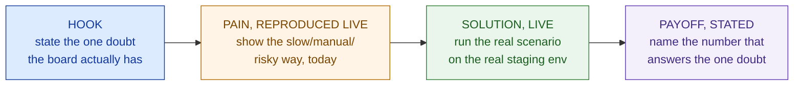
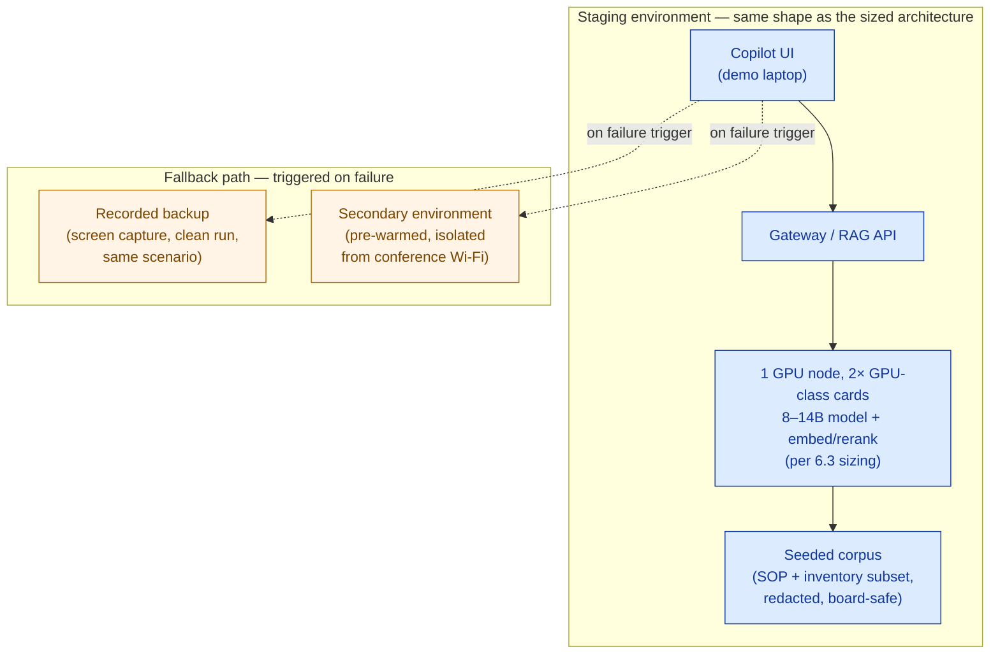

# Demo Design & Delivery

> A demo doesn't need to impress the room. It needs to answer the one doubt that's keeping the deal from closing — and survive doing it live.

**Type:** Present
**Track:** AI, Data & Infrastructure Solution Architect (Presales)
**Prerequisites:** 7.2 Whiteboarding & Architecture Communication
**Time:** ~5h
**Lab:** —
**Ship It:** Demo script + environment plan

## The Problem

You're two weeks from contract signature with Cakrawala Group. The board has seen the whiteboard sketches from 7.2, the sizing sheet from 6.3, and the HLD from 6.6. Everyone nods along to slides. Then the CFO says the sentence that changes the room: *"Before we sign, we want to see it work. Live. Next Tuesday, in front of the full board."* A rival — a global systems integrator with a much bigger logo on their slide deck — is demoing the same week. You have one shot, in one room, to prove the bounded AI ops-copilot from 6.3 is real and not vaporware.

Here is where a technically excellent SA loses a deal they had already won on paper. Under pressure to impress a board that includes people who don't read architecture diagrams, the instinct is to make the demo bigger than what was actually scoped: show the copilot answering *any* question, not just SOP and inventory queries; promise sub-second answers because a number that starts with "3" feels slow to say out loud; skip the fallback plan because "it worked in the office yesterday." Then Tuesday arrives. The GPU node's network link to the retail outlet's demo laptop stutters on the conference Wi-Fi. The model, pushed off-script by an improvised question from a board member about warehouse headcount forecasting — a question the narrow SOP/inventory corpus was never built to answer — either hallucinates an answer or visibly refuses, and because nobody told the room what the copilot is *supposed* to refuse, it reads as a broken product instead of a working guardrail. The rival's polished, pre-recorded video plays back flawlessly right after. Cakrawala's board remembers the stutter, not the eleven months of disciplined scoping that got you here.

None of that had to happen. A demo is not a magic trick — it is an **engineered proof**, and it fails for the same reason bad architecture fails: no one drew the boundary of what it is supposed to do, and no one planned for the boundary being tested. The discipline in this lesson is the same one you already learned for PoC scoping back in 1.6 — *pre-agreed success criteria, no over-promising, a defined "then what" for both pass and fail* — applied to the highest-pressure ten minutes of the entire sales cycle: showing the thing on a screen, live, in front of the people who sign. Get the scope, the environment, and the fallback right, and a demo becomes the cheapest, highest-leverage proof point in the deal. Get it wrong, and eleven months of careful architecture evaporate in ninety seconds of dead air.

Four failure modes recur across almost every botched demo, and they map directly onto the four disciplines this lesson teaches:

| Common mistake | What it looks like in the room | The discipline that prevents it |
|---|---|---|
| Demoing features not in the proposal | The copilot fields a general-knowledge question outside the SOP/inventory corpus, impressing the room right up until it can't answer the *next* general-knowledge question | **Demo scoping** — show exactly what's proposed, nothing more |
| No fallback for a live hiccup | Dead air on stage while someone restarts a service, in front of the exact people deciding whether to trust you with a production rollout | **Environment planning** — a rehearsed fallback, ready to trigger in seconds |
| No clear "what this proves" framing | A tour of every feature, so the board remembers the demo was long, not what it established | **The one-thing-to-prove discipline** — one doubt, answered unmistakably |
| Demoing to impress, not to answer the room's doubt | A flashy but irrelevant capability shown because it's visually satisfying, while the board's actual doubt goes unaddressed | **The narrative arc** — hook the real doubt, reproduce the real pain, answer it directly |

## The Concept

A demo is not "the product, shown." It is a **targeted argument**, built the same way you'd build any other deliverable: state the claim, scope it tightly, and back it with evidence the room can't dispute. Four disciplines make that argument land — and all four fail quietly, which is why they're the ones rookies skip.

### 1. Demo scoping — show exactly what's proposed, never more

The single rule that prevents the over-promising trap in The Problem: **the demo must show exactly the solution in the proposal — no bigger, no smaller.** For Cakrawala that means the bounded ops-copilot from 6.3: an 8–14B model on one GPU node, answering questions grounded in the narrow SOP/inventory corpus, for the ~1,000–1,500 named users and ~50 peak concurrent it was sized for — not a general-purpose chatbot, not next quarter's roadmap feature, not a capability that exists only in a slide. Recap 5.3's **cite-or-refuse discipline**: every answer the copilot gives in the demo must be grounded in a real retrieved passage with a visible citation, or the copilot must visibly decline. That "decline" behavior is not a bug to hide — it is the guardrail the room is implicitly being sold, and a well-run demo *shows it declining once, on purpose*, so the board sees the safety mechanism instead of discovering it by accident.

```
SCOPING RULE                          WHY IT MATTERS ON DEMO DAY
──────────────────────────────────────────────────────────────────────────
Demo the PROPOSAL, not the VISION      A bigger promise than what's contracted
                                        sets an expectation you'll be graded
                                        against in UAT — and lose.

Demo the BOUNDED corpus, not          Off-corpus questions either hallucinate
"anything you can think of"           (credibility risk) or refuse (looks
                                       broken if the room wasn't told to
                                       expect it).

Show the guardrail on purpose         A cite-or-refuse decline shown once,
                                       narrated, reads as "this is safe."
                                       The same decline, undemonstrated and
                                       hit by surprise, reads as "this is
                                       broken."
```

### 2. The "one thing this must prove" discipline

Every demo answers exactly **one doubt** — the same discipline as the PoC contract from 1.6, compressed into ten minutes instead of six weeks. Before you write a single line of script, write down the one sentence the demo exists to prove, and reject every feature, question, or flourish that doesn't serve it. For Cakrawala, the doubt on the table is not *"can AI answer questions"* — the board already believes that, everyone's seen ChatGPT. The doubt is operational: ***"will this thing actually work fast enough, accurately enough, and safely enough to trust in a real store, on a real shift?"*** Every choice in the demo — the scenario, the pacing, the props — serves that one sentence. A demo that tries to prove five things proves none of them memorably; a demo that nails one specific doubt is the artifact the board repeats to each other in the elevator afterward.

### 3. Environment planning — staging, seeding, script, and the fallback

A live demo runs on infrastructure, and infrastructure fails at the worst possible moment — that is not pessimism, it is a base rate. Environment planning has four decisions, and skipping any one of them is how Tuesday goes wrong:

| Decision | What "wrong" looks like | What "right" looks like |
|---|---|---|
| **Staging vs. production-like** | Demoing on a laptop with a mocked API that "shows the idea" | A staging environment wired the same way as the sized architecture (real GPU node, real RAG pipeline, real gateway) — different data, same shape |
| **Seeded data** | Live-querying whatever's in the system that day, hoping something relevant comes back | A small, curated, realistic dataset — a handful of SOPs and inventory records seeded specifically so the scripted question has a clean, citable, on-target answer |
| **Script vs. improvisation** | Winging it because "we know the product," inviting off-corpus questions with no plan | A rehearsed script for the core proof, with a *bounded, prepared* space for Q&A — not zero improvisation, but no *unrehearsed* improvisation on the one thing that must land |
| **Fallback plan** | No plan B; if staging hiccups, dead air while someone SSHs into a server on stage | A recorded backup (screen capture of a clean run) or a second, independent environment, ready to switch to within seconds, narrated as smoothly as the main path |

The fallback is the discipline most demos skip, and it's the one that separates a recoverable hiccup from a lost deal. You are not planning for the demo to fail — you are planning for the fact that live infrastructure, live Wi-Fi, and live audiences are unpredictable, and a prepared pivot reads as competence, while an unprepared one reads as fragility.

### 4. The narrative arc, applied to a script

Recap 7.1's storytelling arc — hook, pain, solution, payoff — and apply it literally to demo minutes, not slide bullets:



Skipping the "pain, reproduced live" beat is the most common structural mistake: SAs jump straight from hook to solution, and the room never feels the contrast, so the payoff lands flat. Spend thirty seconds showing how a store manager finds an SOP answer *today* — flipping through a binder, or paging a supervisor — before the copilot ever appears on screen. The gap between that and a cited answer in a few seconds is the entire pitch; don't let the room infer it, show it.

### 5. Handling a live failure gracefully

Even a well-planned demo can hit a hiccup — a Wi-Fi stutter, a slow cold-start, a laptop update prompt. The failure itself rarely sinks a deal; the *reaction* to it does. Three rules:

1. **Never apologize excessively.** One calm acknowledgment ("looks like the connection's catching up") is enough — three apologies make a two-second lag feel like a crisis.
2. **Pivot to the fallback without announcing a "Plan B" moment of panic.** Switch to the recorded backup or the second environment the same way you'd turn a page — because you rehearsed the pivot, it should look rehearsed.
3. **Keep narrating.** Silence while you fix something is the moment the room starts doubting everything else you've shown. Narrate what's happening in plain language and keep moving the story forward.

Here is what a demo script actually looks like on paper — the artifact that makes rules 1–3 possible, because a rehearsed pivot only works if the trigger and the fallback line are written down in advance, not improvised under pressure:

```
STEP  SCREEN / ACTION                    SPOKEN LINE (abbreviated)              FALLBACK TRIGGER
──────────────────────────────────────────────────────────────────────────────────────────────────
1     Slide: empty store aisle photo     "Right now, a store manager with a     —
                                          stock question pages a supervisor
                                          or digs through a binder."
2     Live: staging copilot UI, type     "Watch this: same question, typed      Staging URL doesn't load
      seeded SOP/inventory question       live, on the actual sized platform     in <5s → switch to
                                          — one GPU node, the same corpus."      recorded backup (Step 5)
3     Live: answer streams in with       "Answer, with a citation back to the   Answer takes >10s or
      visible source citation             actual SOP page — not a guess."       drops the citation →
                                                                                 narrate + switch to backup
4     Live: type an out-of-corpus        "And if I ask something outside its    Model attempts an answer
      question on purpose                 lane — headcount forecasting — it     instead of declining →
                                          should decline, not guess."            acknowledge calmly, explain
                                                                                 the guardrail verbally
5     [FALLBACK] Play recorded clip      "Here's the same flow captured         (this step only plays if
      of steps 2–4, clean run            earlier today on the same             triggered above)
                                          environment, so you can see the
                                          full round trip end-to-end."
6     Slide: the one number that         "That's a cited answer inside the      —
      answers the doubt                  target window — fast enough for a
                                          shift, not a lab demo."
```

Notice step 4 is *deliberate* — the demo scripts in a controlled "failure" (a refusal) so the room sees the guardrail on the SA's terms, not the model's. That single design choice does more to build trust than ten more successful answers would.

## Design It

Build the demo script and environment plan for Cakrawala Group's board demo, following the same five moves every time you design a demo.

### Step 1 — Write the one thing this demo must prove

Not "the AI copilot works." The specific doubt on the table, in one sentence a CFO would recognize:

```
ONE THING TO PROVE:
"The bounded ops-copilot returns an accurate, cited answer to a real store
SOP/inventory question inside the ~3–6s target latency from the 6.3 sizing
sheet — fast and trustworthy enough to use mid-shift, on the actual sized
platform (1 GPU node, 8–14B model, narrow SOP/inventory corpus) — not that
it is a general-purpose assistant."
```

Every later decision is graded against this sentence. A feature, question, or flourish that doesn't serve it gets cut, no matter how impressive it looks in isolation.

### Step 2 — Design the seeded, realistic scenario

Pick a scenario a board member has *seen happen* — that's what makes "reproduced live" land. For Cakrawala: a store manager at one of the ~350 retail outlets needs the SOP for handling a damaged-goods return before the customer leaves the counter. Seed the staging corpus with the real (redacted) SOP document containing that procedure and a matching inventory record, so the live question has exactly one clean, citable answer — not a corpus so broad the model has to guess which passage is relevant, and not so narrow that the "live typing" feels staged.

```
SEEDED SCENARIO
Persona:   Store manager, Outlet #214 (fictional), mid-shift
Question:  "What's the process for a damaged-goods return with no receipt?"
Expected:  A 2–3 sentence answer citing the specific SOP section + the
           relevant inventory-adjustment rule, returned inside 3–6s.
Off-script probe (Step 4 of the script): "How many staff should we
hire next quarter?" — outside the corpus on purpose, to show the
cite-or-refuse guardrail decline gracefully.
```

### Step 3 — Plan the environment: staging + fallback



Two independent fallback options, not one: a recorded backup (zero infrastructure dependency, always works) and a pre-warmed secondary environment on a separate, wired connection (still live, still impressive, just not exposed to the same conference Wi-Fi that might be flaking). Decide *before* demo day which one triggers first — the script in The Concept section names the recorded backup as the primary fallback because it has the fewest moving parts on the day that matters most.

### Step 4 — Write the script with the narrative arc

Follow the hook → pain → solution → payoff arc from The Concept, and write it down to the spoken line — not bullet points to riff from, but sentences to rehearse, because a rehearsed pivot on failure (Step 5 below) only works if the whole script, not just the happy path, is written in advance. The worked script in `outputs/` follows exactly the six-step shape shown above, scoped to this scenario.

### Step 5 — Rehearse the contingency, out loud, at least once

Run the *failure* path in rehearsal, not just the happy path. Deliberately kill the staging connection mid-demo during a practice run and rehearse the exact pivot line ("looks like the connection's catching up — let me bring up the run we captured earlier today") until it sounds unremarkable. A team that has only ever rehearsed success will sound rattled the first time reality doesn't cooperate — which, on a board-mandated demo day against a competing SI, is a bet you don't want to place live.

### Step 6 — Brief the room before you start

The thirty seconds before you touch the keyboard are as important as the demo itself. State the one thing this demo will prove, out loud, in the board's own language — *"in the next five minutes, you'll see whether this copilot is fast and accurate enough to trust on a real shift, using the exact platform we sized for you, not a bigger promise than what's in the proposal."* Naming the scope up front turns an off-corpus question later into an expected, even welcome, guardrail demonstration instead of a surprise. It also pre-empts the rival-SI comparison the board is inevitably making in their heads: you are the SA who told them exactly what they were about to see and then delivered precisely that.

### Pre-flight checklist — run this the morning of demo day, not the night before

```
☐ ONE THING TO PROVE      written down, one sentence, matches Step 1 exactly
☐ SEEDED DATA              loaded into staging, spot-checked for the exact
                           scripted answer + citation
☐ STAGING ENVIRONMENT      smoke-tested on the ACTUAL demo network (not the
                           office Wi-Fi — the conference room's)
☐ FALLBACK #1 (recording)  plays cleanly, audio synced, on the demo laptop
                           itself — not "somewhere in the cloud"
☐ FALLBACK #2 (secondary)  pre-warmed, wired connection tested, ready to
                           tab-switch to within one click
☐ SCRIPT                   rehearsed end-to-end at least twice, including
                           the deliberate off-corpus decline (Step 4)
☐ FAILURE PIVOT LINE       rehearsed out loud, sounds unremarkable, not
                           improvised for the first time on stage
☐ ROOM BRIEFING            opening scope statement rehearsed, names the one
                           thing to prove before the keyboard is touched
```

Every unchecked box on this list is a specific, nameable way Tuesday goes wrong — that specificity is the point. A vague "make sure it's ready" instruction is not a pre-flight check; a list you can fail item by item is.

## Compare It

### Live demo vs. recorded video vs. self-serve sandbox

| | **Live demo** | **Recorded video** | **Self-serve sandbox** |
|---|---|---|---|
| **Proves** | The thing genuinely runs, in real time, under real questions | The thing ran once, cleanly — polish, not spontaneity | The customer trusts it enough to explore unsupervised |
| **Risk** | Highest — live infra, live Wi-Fi, live improvisation | Lowest — nothing can go wrong on stage | Medium — customer can wander off-corpus with no narrator to catch it |
| **Best for** | The moment that must build trust in a room (board sign-off) | A safety net for the live demo, or an async follow-up to stakeholders who missed the room | Late-stage technical due diligence, once trust is already largely established |
| **Cakrawala fit** | The board demo itself — this is the highest-leverage room in the deal | The Step-5 fallback in the script above, and the leave-behind for board members who couldn't attend | Offered *after* the board demo, to the IT team doing technical diligence, with the corpus and guardrails already explained |

Use all three in sequence on a real deal — live to build trust at the decision moment, recorded as insurance and as an async artifact, sandbox once the room already believes you and just wants to poke at it themselves.

### Scripted vs. improvised

| | **Scripted** | **Improvised** |
|---|---|---|
| **Reliability** | High — every line, timing, and fallback trigger rehearsed | Low — depends entirely on the presenter's composure under pressure |
| **Risk** | Can feel stiff if over-rehearsed, or brittle if the room asks something off-script | Can feel authentic, but a single off-corpus question can derail the "one thing to prove" |
| **Right call for Cakrawala** | Script the core proof (steps 1–4, 6 above) tightly; leave a **bounded, pre-planned** improvisation window (step 4's deliberate off-script probe) rather than genuinely open Q&A during the proof itself |

The trap is treating this as binary. The right shape is a scripted spine with one *planned* improvisation beat — genuine spontaneity is saved for the Q&A that follows the proof, not embedded inside it.

### Demoing your own environment vs. the customer's actual data

| | **Your own environment, seeded data** | **Customer's actual production data** |
|---|---|---|
| **Access** | You control it fully — no data-sharing agreement needed before demo day | Requires data access, sanitization, and often legal sign-off before you can even build the demo |
| **Sensitivity** | Zero exposure risk — seeded/redacted data only | Real risk: PII, regulated finance-leasing records, or competitive inventory data on a screen the rival's team might glimpse |
| **Realism** | High if seeded carefully (Step 2); can feel synthetic if seeded carelessly | Maximum — nothing proves fit like the customer's own numbers answering back |
| **Cakrawala call** | **Own staging environment, seeded with a redacted real SOP + inventory record** — the finance-leasing BU's regulated data never belongs in a board demo regardless of how compelling it would be; the retail SOP/inventory slice is low-sensitivity enough to seed realistically without a data-sharing negotiation on the clock |

The general rule: reach for the customer's actual data only when the sensitivity is low and the access lead time fits the demo timeline; otherwise, a carefully seeded environment that mirrors the real shape of their data proves the same point without the legal and security exposure.

## Ship It

This lesson ships a reusable **Demo Script + Environment Plan** — the artifact an SA fills out before any board-level or executive demo, so the highest-risk ten minutes in the deal gets the same rigor as the HLD. Both files live in [`outputs/`](../outputs/):

- **[`template-demo-script-and-environment-plan.md`](../outputs/template-demo-script-and-environment-plan.md)** — a fill-in-the-blank template: the one-thing-to-prove statement, an environment plan (staging + fallback, in the same shape as the Mermaid diagram above), a six-step script table, and a fallback/contingency checklist. Hand it to a colleague and they can plan a demo from it without reinventing the structure.
- **[`example-cakrawala-group-demo-script.md`](../outputs/example-cakrawala-group-demo-script.md)** — the template fully worked for Cakrawala Group's board demo of the bounded AI ops-copilot from 6.3, so the skeleton isn't abstract.

This deliverable feeds forward twice: **7.4** (Proposal & Executive Summary Writing) cites the demo as delivered proof — "we demonstrated X to your board on [date], inside the target latency, on the actual sized platform" is a proof point no competitor's slideware can match — and the **Capstone G** engagement reuses this exact template for its own live-defense moment.

## Exercises

1. **(Easy)** Take the six-step demo script for Cakrawala and rewrite step 4 — the deliberate off-corpus probe — for a *different* question that would plausibly come from a board member (not a store-floor question). Write the spoken line the presenter uses to explain the resulting decline as a guardrail, not a failure.
2. **(Medium)** Apply the "one thing this must prove" discipline to a different scenario: Cakrawala's logistics BU wants a demo of the dispatch/route-optimization tier from 6.1's architecture. Write the one-sentence doubt this demo would need to answer for a logistics VP (hint: it is not "the algorithm is smart" — think about what a logistics operator actually doubts about automation replacing a dispatcher's judgment), then sketch a five-step script following the hook → pain → solution → payoff arc.
3. **(Hard)** Cakrawala's board demo is scheduled for the same week the rival SI is demoing a competing solution. Extend the worked example with a **competitive framing pass**: without disparaging the rival by name, write two script lines — one for the "pain reproduced live" beat and one for the "payoff stated" beat — that implicitly differentiate the bounded, right-sized 6.3 copilot from an assumed "general-purpose chatbot" pitch a large SI is more likely to bring. Save your addition alongside the worked example; you'll reuse this competitive framing discipline in 7.6 (Competitive Analysis & Handling Objections).

## Key Terms

| Term | What people say | What it actually means |
|------|-----------------|------------------------|
| Demo scoping | "Show what it can do" | Demo *exactly* what's proposed and sized — never a bigger promise than the contract, never a smaller one than what was actually built. |
| One thing to prove | "Impress the board" | The single, specific doubt the demo exists to resolve — every scenario, question, and prop is chosen to serve that one sentence, not to showcase breadth. |
| Staging environment | "The test server" | An environment wired the same *shape* as the sized production architecture (same GPU count, same pipeline), with seeded rather than live production data. |
| Seeded data | "Sample data" | A small, curated dataset built specifically so the scripted scenario has one clean, citable, on-target answer — not a random subset of whatever exists. |
| Fallback plan | "Hope it works" | A pre-rehearsed pivot — a recorded backup or a second live environment — ready to switch to within seconds of a live failure, decided and rehearsed before demo day, not improvised on stage. |
| Cite-or-refuse discipline | "The AI answers questions" | The guardrail (from 5.3) where every answer is grounded in a retrieved source with a citation, or the model declines — a demo should show the decline once, on purpose, as proof of the guardrail. |
| Narrative arc (demo) | "Walk through the features" | Hook → pain reproduced live → solution live → payoff stated (from 7.1) — applied literally to spoken lines and screen actions, not just slide bullets. |
| Room briefing | "Just start the demo" | The thirty-second scope statement given before the demo starts, naming the one thing it will prove — turns a later guardrail decline into an expected proof point instead of a surprise failure. |

## Further Reading

- [Made to Stick — Chip & Dan Heath](https://heathbrothers.com/books/made-to-stick/) — the "concrete, credible, emotional" framing behind why a reproduced-pain beat outperforms a features list in any live proof.
- [Demo-or-Die: Lessons from MIT Media Lab](https://www.media.mit.edu/) — the "working prototype beats a polished slide" ethos that shaped modern tech demo culture, including the discipline of scoping a demo to what genuinely runs.
- [Google SRE Workbook — Postmortem Culture](https://sre.google/workbook/postmortem-culture/) — the same "narrate calmly, don't over-apologize, keep moving" discipline for handling a live failure gracefully, written for incidents but directly transferable to demo day.
- [Presentation Zen — Garr Reynolds](https://www.presentationzen.com/) — practical guidance on rehearsal discipline and the gap between a scripted spine and genuine improvisation, echoed in this lesson's scripted-vs-improvised trade-off.
