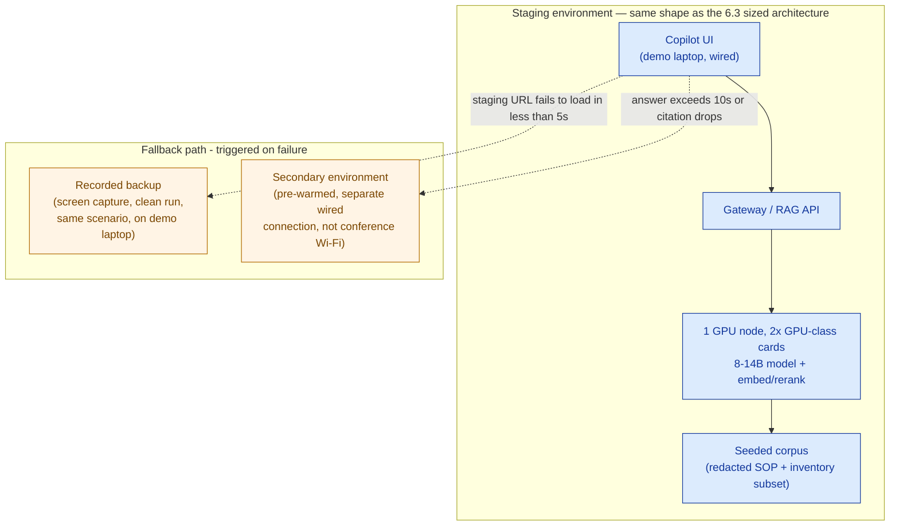

# Demo Script + Environment Plan — Cakrawala Group (Worked Example)

> This is the [Demo Script + Environment Plan template](./template-demo-script-and-environment-plan.md) filled in for **Cakrawala Group** (fictional): the board demo of the bounded AI ops-copilot sized in 6.3 (~1,000–1,500 named users, ~50 peak concurrent, 8–14B model on 1 GPU node with 2× GPU-class cards, a narrow SOP/inventory corpus — explicitly not enterprise-scale). Demo day falls in the same week a rival global systems integrator is demoing a competing solution to the same board.

**Customer:** Cakrawala Group  ·  **Prepared by:** `<SA name>`  ·  **Date:** `<YYYY-MM-DD>`
**Demo occasion:** Board sign-off, final gate before contract  ·  **Audience:** Cakrawala Group board (CFO, COO, CIO, retail BU head — mixed technical depth, high commercial scrutiny)
**Competing bid in play:** A global systems integrator, demoing the same week  ·  **Demo length:** 8 minutes + Q&A

---

## 1. The one thing this demo must prove

```
ONE THING TO PROVE:
"The bounded ops-copilot returns an accurate, cited answer to a real store
SOP/inventory question inside the ~3–6s target latency from the 6.3 sizing
sheet — fast and trustworthy enough to use mid-shift, on the actual sized
platform (1 GPU node, 8–14B model, narrow SOP/inventory corpus) — not that
it is a general-purpose assistant."
```

This is deliberately narrower than "AI works" — the board already believes AI works, they've all used a consumer chatbot. The doubt on the table is operational and financial: *will this specific, right-sized, ~$30k–45k GPU footprint actually hold up in a real store, on a real shift* — not whether a bigger, unbounded model would be more impressive.

## 2. Demo scoping — what's IN, what's OUT

```
IN:  The bounded ops-copilot exactly as sized in 6.3 — one GPU node, 2×
     GPU-class cards, an 8–14B instruct model, the narrow retail
     SOP/inventory corpus, cite-or-refuse grounding per 5.3's discipline.

OUT: Anything resembling a general-purpose assistant. No logistics
     dispatch questions (that's a different tier, per 6.1). No finance-
     leasing questions (regulated data never appears in a board demo,
     per 6.2's segmentation). No roadmap features not yet contracted.
```

> Guardrail rule applied: the off-script probe in §5 (step 4) is a deliberate, planned decline — proof the cite-or-refuse discipline from 5.3 is real, not a slide claim.

## 3. Seeded scenario

```
PERSONA:           Store manager, Outlet #214 (fictional), mid-shift,
                    customer waiting at the counter.
QUESTION/ACTION:    "What's the process for a damaged-goods return with
                    no receipt?"
EXPECTED RESULT:    A 2–3 sentence answer citing the specific SOP section
                    plus the matching inventory-adjustment rule, returned
                    inside the ~3–6s target from 6.3.
OFF-SCRIPT PROBE:   "How many staff should we hire next quarter?" — a
                    workforce-planning question well outside the SOP/
                    inventory corpus, asked on purpose in step 4 to show
                    the copilot decline rather than guess.
```

The seeded corpus for staging contains a small, redacted subset: the damaged-goods-return SOP section, the matching inventory-adjustment rule, and a handful of adjacent SOP/inventory records so the retrieval isn't trivially a single-document lookup — realistic enough to be credible, narrow enough to be reliable on the day.

## 4. Environment plan — staging + fallback



| Decision | Choice | Why |
|---|---|---|
| Staging vs. production-like | Staging wired identically to 6.3's sized shape: 1 GPU node, 2× GPU-class cards, same gateway/RAG pipeline | Proves the *actual* sized platform, not a mocked stand-in — the board is deciding whether to fund exactly this footprint |
| Seeded data | Redacted SOP/inventory subset (§3), not live production data | Finance-leasing and full retail production data never belong on a board-room screen; a seeded subset proves the retrieval and citation behavior identically |
| Script vs. improvisation | Steps 1–3 and 5–6 fully scripted; step 4 is a *planned* improvisation beat, not open-ended | Keeps the core proof reliable while still showing the guardrail behaving under an unplanned-looking question |
| Primary fallback | Recorded backup (screen capture, on the demo laptop itself, no network dependency) | Zero moving parts — works even if the entire venue's network fails, which a secondary environment on the same building's connection would not survive |
| Fallback trigger condition | Staging URL fails to load within 5s, or the live answer exceeds ~10s / drops its citation | Named thresholds, not "if it looks broken" — a specific trigger is rehearsable; a vague one is not |

## 5. Demo script

```
STEP  SCREEN / ACTION                    SPOKEN LINE (abbreviated)              FALLBACK TRIGGER
──────────────────────────────────────────────────────────────────────────────────────────────────
1     Slide: empty store aisle photo     "Right now, a store manager with a     —
                                          stock question pages a supervisor
                                          or digs through a binder while a
                                          customer waits at the counter."
2     Live: staging copilot UI, type     "Watch this: same question, typed      Staging URL doesn't load
      seeded return-policy question       live, on the exact platform we        in <5s → switch to
                                          sized for you — one GPU node, the      recorded backup (step 5)
                                          same narrow corpus, nothing bigger."
3     Live: answer streams in with       "Answer, with a citation back to the   Answer takes >10s or
      visible source citation             actual SOP section — not a guess."     drops the citation →
                                                                                  narrate + switch to backup
4     Live: type the off-script          "And if I ask something outside its    Model attempts an answer
      workforce-planning question         lane — staffing forecasts — it        instead of declining →
      on purpose                          should decline, not guess. That's     acknowledge calmly, explain
                                          the guardrail working, not a bug."     the guardrail verbally
5     [FALLBACK] Play recorded clip      "Here's the same flow captured         (only plays if triggered
      of steps 2–4, clean run             earlier today on this exact           above)
                                          environment — same corpus, same
                                          hardware, full round trip."
6     Slide: the target-latency number   "That's a cited answer inside the      —
                                          3-to-6-second target from our
                                          sizing sheet — fast enough for a
                                          real shift, not a lab demo."
```

## 6. Handling a live failure

```
1. Acknowledge once, calmly: "looks like the connection's catching up" —
   never more than one line of acknowledgment.
2. Pivot to the recorded backup the same way you'd turn a slide — no
   "moving to Plan B" announcement, because it was rehearsed to look
   unremarkable.
3. Keep narrating throughout the switch: describe what the room would be
   seeing live, so the story keeps moving even during the few seconds
   of transition.
```

## 7. Room briefing (the 30 seconds before you start)

```
"In the next eight minutes, you'll see whether the ops-copilot we sized
for you — one GPU node, a right-sized model, your own SOP and inventory
content — is fast and accurate enough to trust on a real shift. This is
exactly the platform in the proposal, not a bigger promise than what
you're being asked to fund."
```

## 8. Pre-flight checklist (run day-of, not the night before)

```
☑ One thing to prove — matches §1, confirmed with the account team
☑ Seeded data — redacted SOP + inventory subset loaded, spot-checked for
  the exact damaged-goods-return answer + citation
☑ Staging environment — smoke-tested on the actual boardroom's wired
  connection, not the office network
☑ Fallback #1 (recording) — plays cleanly on the demo laptop, no network
  dependency, audio synced
☑ Fallback #2 (secondary env) — pre-warmed on an independent wired line,
  one tab-switch away
☑ Script — rehearsed end-to-end twice, including the step-4 off-script
  decline
☑ Failure pivot line — rehearsed out loud until it sounds unremarkable
☑ Room briefing — rehearsed, to be delivered before the keyboard is
  touched
```

## 9. Carry-forward → 7.4 (Proposal) and Capstone G

| Line | From this plan | Use in the proposal |
|---|---|---|
| One thing proved | §1 | "We demonstrated the ops-copilot to Cakrawala's board on [date], returning a cited answer inside the 3–6s target, on the actual sized 1-GPU-node platform — not a mock-up." |
| Scope demonstrated | §2 | Confirms the demo matched the contracted scope exactly — no gap between what was shown and what's being signed. |
| Guardrail shown | §3 / step 4 | Direct evidence the cite-or-refuse discipline from 5.3 holds under an unplanned-looking question — a differentiator against a rival SI's likely broader, less-grounded pitch. |

## Why this beats "just show the product"

Walking in with an unscoped demo — "let's see what it can do" — invites exactly the failure the rival SI would love: an off-corpus question surfaces a hallucination or an unexplained refusal, and the board reads either as evidence the platform isn't ready. Scoping the demo tightly to the 6.3 sizing, seeding a realistic but low-sensitivity scenario, planning the guardrail decline on purpose, and rehearsing the failure pivot turns the highest-risk ten minutes of the deal into the strongest piece of proof in it: a board that watched the *actual* sized platform answer *their* question, inside the number their own sizing sheet promised, survive a deliberate edge case gracefully — and never once saw a promise bigger than what they're being asked to fund.
