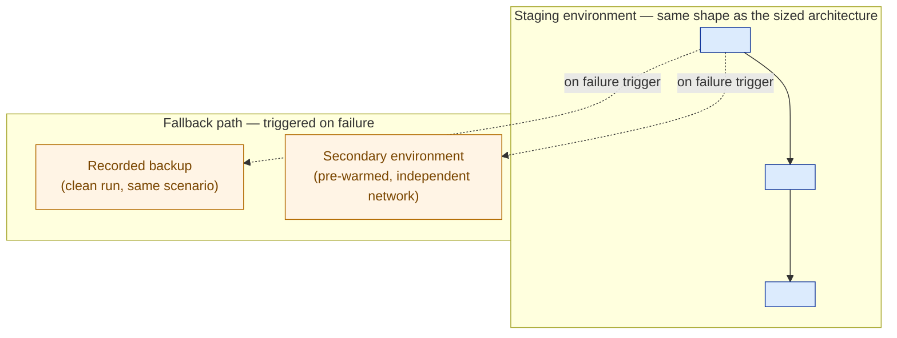

# Demo Script + Environment Plan — Template

> Fill this in before any board-level or executive-facing live demo. A demo is a targeted argument, not a feature tour: it exists to resolve **one** doubt, on infrastructure that mirrors what was actually proposed, with a rehearsed fallback for the live failure that infrastructure will eventually produce. Never demo a bigger promise than the proposal. Never skip the fallback. Never let a guardrail decline happen as a surprise instead of a proof point.

**Customer:** `<company>`  ·  **Prepared by:** `<SA name>`  ·  **Date:** `<YYYY-MM-DD>`
**Demo occasion:** `<board sign-off / executive review / technical diligence>`  ·  **Audience:** `<who's in the room, and what they already believe>`
**Competing bid in play:** `<rival name(s), or "none">`  ·  **Demo length:** `<N minutes>`

---

## 1. The one thing this demo must prove

```
ONE THING TO PROVE:
"<One sentence — the specific doubt this audience has about the PROPOSED
solution, stated in terms they'd recognize. Not 'the product works' —
name the exact operational, financial, or trust question on the table.>"
```

Rules: this must be a single sentence · it must name the *specific* doubt, not a generic capability · every later section is graded against it, and anything that doesn't serve it gets cut.

## 2. Demo scoping — what's IN, what's OUT

```
IN:  <exactly what was proposed/sized — the bounded feature, the actual
     corpus/dataset, the actual sized infrastructure>
OUT: <everything bigger than the proposal — roadmap features, general-
     purpose capability, anything not yet contracted>
```

> The guardrail rule: if the solution has a "decline/refuse" behavior at its scope boundary (e.g. a cite-or-refuse discipline), plan to demonstrate it **once, on purpose** — a scripted decline reads as a safety feature; an accidental one reads as a bug.

## 3. Seeded scenario

```
PERSONA:           <who is asking, in what real situation>
QUESTION/ACTION:   <the exact scripted question or action>
EXPECTED RESULT:   <the specific, citable, on-target answer/outcome, and
                    the target latency/SLA it must land inside>
OFF-SCRIPT PROBE:  <a deliberate out-of-scope question, planned in
                    advance, to show the guardrail declining gracefully>
```

Seed the staging data specifically for this scenario — curated and realistic, not a random slice of whatever exists, and not so broad the live answer becomes a gamble.

## 4. Environment plan — staging + fallback



| Decision | Choice | Why |
|---|---|---|
| Staging vs. production-like | `<…>` | `<…>` |
| Seeded data | `<…>` | `<…>` |
| Script vs. improvisation | `<…>` | `<…>` |
| Primary fallback | `<recorded / secondary environment>` | `<…>` |
| Fallback trigger condition | `<what specifically triggers the switch>` | `<…>` |

## 5. Demo script

```
STEP  SCREEN / ACTION            SPOKEN LINE (abbreviated)         FALLBACK TRIGGER
────────────────────────────────────────────────────────────────────────────────────
1     <hook — state the doubt>  "<…>"                              —
2     <pain, reproduced live>   "<…>"                               —
3     <solution, live>          "<…>"                               <trigger condition>
4     <deliberate off-script    "<…>"                               <what if it answers
      probe, per §3>                                                instead of declining>
5     [FALLBACK] <if triggered> "<…>"                               (only if triggered)
6     <payoff, stated>          "<…>"                                —
```

## 6. Handling a live failure

```
1. Acknowledge once, calmly — no repeated apologies.
2. Pivot to the rehearsed fallback (§4) without announcing a "Plan B" panic moment.
3. Keep narrating — silence is what erodes trust, not the hiccup itself.
```

## 7. Room briefing (the 30 seconds before you start)

```
"<the one-thing-to-prove statement, in the audience's own language,
stated before you touch the keyboard>"
```

## 8. Pre-flight checklist (run day-of, not the night before)

```
☐ One thing to prove — written, matches §1 exactly
☐ Seeded data — loaded, spot-checked for the exact scripted answer
☐ Staging environment — smoke-tested on the ACTUAL demo network
☐ Fallback #1 (recording) — plays cleanly on the demo device itself
☐ Fallback #2 (secondary env) — pre-warmed, one click away
☐ Script — rehearsed end-to-end at least twice, including the off-script probe
☐ Failure pivot line — rehearsed out loud, sounds unremarkable
☐ Room briefing — rehearsed, delivered before the keyboard is touched
```

## 9. Carry-forward → 7.4 (Proposal) and Capstone

| Line | From this plan | Use in the proposal |
|---|---|---|
| One thing proved | §1 | Cite as delivered evidence: "we demonstrated X to [audience] on [date], inside [target], on the actual sized platform." |
| Scope demonstrated | §2 | Confirms the proposal's scope matches what was shown — no gap between demo and contract. |
| Guardrail shown | §3 off-script probe | Evidence the safety/accuracy discipline is real, not a slide claim. |
