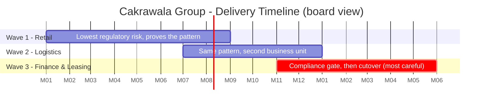

# Proposal & Executive Summary Writing

> The HLD is what you built. The proposal is what gets voted on. If the two disagree by even one number, the board trusts neither.

**Type:** Present
**Track:** AI, Data & Infrastructure Solution Architect (Presales)
**Prerequisites:** 7.3 Demo Design & Delivery
**Time:** ~4h
**Lab:** —
**Ship It:** Proposal + executive summary

## The Problem

Cakrawala Group's board has seen the HLD (6.6) and sat through the demo (7.3). The CIO who sponsored the engagement pulls you aside afterward: *"The board meets Thursday. Send me something I can forward tonight — and know that half of them will only read the first page."* You have, sitting in a folder, a ten-page HLD that took five lessons of work to produce: architecture patterns, zero-trust security, sizing, a full BOM, a risk register. It is accurate, it is thorough, and it is the wrong document to forward. An HLD is written for someone who will read all of it — a mix of technical and business readers willing to sit with ten pages. A board packet gets forwarded to a director who opens it on a phone between two other meetings and reads exactly one screen before deciding whether to keep reading.

Two failure modes are waiting here, and they are opposite mistakes. The first: you resend the HLD with a new cover page and call it "the proposal." It technically has everything — but a director who opens a ten-page technical document loses momentum on page two, skims to the price, and forwards it to "the technical people" to review instead of voting on it. You just turned a decision document into a homework assignment, and homework assignments get deferred to the next board cycle. The second failure mode is worse: under pressure to compress, you write a fresh proposal from a blank page — and paraphrase the investment figure instead of citing it. The HLD says **~Rp 52 billion, band Rp 48–58 billion**; your rushed proposal says "approximately Rp 50 billion." A director who has both documents open — and someone always does — notices the mismatch in ten seconds. This is the exact failure mode Phase 5 and Phase 6 warned about with sizing and BOM inputs: **a number that drifts between two of your own documents is worse than a number that's merely conservative**, because it signals that nobody is actually in control of the deal's arithmetic. You do not get a second chance to make a first impression on a board packet.

There is a third pressure in this room that the HLD never had to deal with: a rival "global systems integrator" is also submitting a proposal for the same board meeting. Their document will almost certainly be longer, glossier, and full of reference logos. Length and gloss are not what wins a board vote — clarity of ask, credibility of numbers, and a plan the board can picture actually happening are. This lesson is about writing the document that does that: shorter than the HLD, unambiguously sales-forward, traceable to the exact figures your own team already produced, and built around one clear thing you are asking the board to do.

## The Concept

### The proposal is one altitude more compressed than the HLD

6.6 taught you that an HLD compresses five technical lessons into one board-legible document — the "one page, then depth on demand" discipline. The proposal takes that same discipline and applies it one more time. If the HLD is the *board document that explains the architecture well enough to be approvable*, the proposal is the *board document built to be forwarded to someone who will never open the HLD at all*. It assumes zero technical willingness to engage. Every reader gets the ask, the number, the timeline, and the reason to trust you — in that order, on the first page.

```
             ALTITUDE                     WHO READS IT                 WHAT IT MUST DO
─────────────────────────────────────────────────────────────────────────────────────
 6.6  HLD                   Board + CIO/CTO + a few technical      Explain the architecture
      (technical-sales      directors willing to read 8-10 pages   well enough that a
      hybrid)                                                       technical reader can
                                                                     defend the "why"

 7.4  PROPOSAL               Every board member, including the      State the ask clearly
      (sales-forward)        ones who will read ONLY page one       enough that ANY reader
                                                                     can vote without
                                                                     needing to understand
                                                                     the architecture

 7.4  EXEC SUMMARY            The director who reads nothing else    Stand alone: the ask,
      (standalone)                                                   the cost, the timeline,
                                                                      the outcome — with no
                                                                      dependency on any other
                                                                      document existing
```

The proposal does not re-derive anything. Every technical claim in it was already decided in Phase 6; the proposal's only new work is **compression and framing** — deciding what to cut, what to lead with, and how to phrase the ask so a non-technical reader can act on it. If you find yourself doing new architecture reasoning while writing a proposal, stop — that reasoning belongs in the HLD, and its absence there is a gap, not something to patch in the sales document.

### The proposal's structure is a sales structure, not a technical one

An HLD structures itself around the *system*: context, architecture, security, sizing, cost, risk. A proposal structures itself around the *decision*: what are we deciding, why now, what does it cost, when do we see it working, why this team, what happens next. That is a different ordering discipline, and it is not optional — swap any two of these sections and the document reads as unsure of itself.

```mermaid
flowchart LR
    cover["Cover +<br/>Exec Summary"] --> ask["The Ask<br/>(stated in ¶1)"]
    ask --> problem["Problem /<br/>Opportunity"]
    problem --> solution["The Solution<br/>(one page)"]
    solution --> invest["Investment<br/>(the BOM, cited exactly)"]
    invest --> timeline["Timeline<br/>(3-wave delivery)"]
    timeline --> whyus["Why Us<br/>(vs. the rival SI)"]
    whyus --> cta["Next Steps /<br/>Call to Action"]

    classDef stepA fill:#DCEBFD,stroke:#12379C,color:#12379C;
    classDef stepB fill:#EAF6EC,stroke:#2E7D32,color:#1B5E20;
    classDef stepC fill:#FFF4E5,stroke:#B26A00,color:#7A4600;
    classDef stepD fill:#FDECEF,stroke:#C2185B,color:#880E4F;
    class cover,ask stepA;
    class problem,solution stepB;
    class invest,timeline stepC;
    class whyus,cta stepD;
```



Notice the ask (§2 below) comes *before* the problem statement. This is deliberate and it is the single biggest structural difference from how most SAs default to writing: their instinct is "build the case, then reveal the number." A board proposal inverts that. State what you want approved in the first paragraph, *then* justify it — because the reader deciding whether to keep reading is deciding based on whether the ask is even in their remit to approve, not based on whether you've built suspense.

### The executive summary is a standalone document, not a preview

Treat the executive summary as a document that must survive being read completely alone — printed on one page, forwarded without the attachment, read on a phone with the rest of the PDF never opened. That means it cannot say "see §5 for the investment figure." It must *contain* the investment figure, the timeline, and the target outcome, self-sufficiently, every time. A useful test: if you deleted every page of the proposal except the executive summary, could the board still vote? If the answer is no — if voting requires flipping to another page — the executive summary has failed its one job.

```
PROPOSAL                                    HLD (6.6)
─────────────────────────────────────────   ─────────────────────────────────────────
Audience:  every board member, incl.         Audience:  board + CIO/CTO + technical
           non-technical, incl. skimmers                directors willing to read fully
Length:    3-5 pages (+ 1-page exec summary  Length:    8-12 pages
           that stands fully alone)
Purpose:   get the ask APPROVED               Purpose:   explain the architecture well
                                                          enough to be approvable
Detail:    outcomes, cost, timeline, trust —  Detail:    patterns, security model,
           architecture named, not explained             sizing, cost, risk — explained
Leads with: THE ASK (paragraph one)           Leads with: the 90-second executive summary,
                                                          then context, then architecture
Numbers:   CITED from 6.4/6.3, never          Numbers:   CITED from 6.1-6.5, never
           re-derived                                    re-derived
Fails if:  a reader must open another          Fails if:  a technical reader can't defend
           document to understand the ask                the "why" behind a design choice
```

### Traceability discipline: the same rule, one altitude up

You have now seen this rule enforced at three altitudes in a row, and it does not get looser as the document gets shorter — if anything it gets stricter, because a shorter document gives a skeptical reader less room to find your reasoning and more incentive to just check the number against something else they have. Every figure in the proposal — the ~Rp 52 billion ask, the 12–18 month window, the 15–20% cost-to-serve target, the sizing footprint — must match 6.4's BOM and 6.3's sizing output **exactly**, not approximately. "Approximately Rp 50 billion" when the BOM says ~Rp 52 billion is not rounding for readability; it is an unforced, self-inflicted credibility wound, and it is the exact failure mode a Phase 5/6 SA was warned about when sizing numbers drifted between lessons. If a number changes between the HLD and the proposal, the change happened in the wrong document — go back and re-run the BOM or the sizing sheet, then update every downstream document from that single source, never patch the proposal in isolation.

### Common failure patterns in a first draft

Every one of these has shown up in a real first-draft proposal, and every one is fixable before it ever reaches a board. Check a draft against this table before it leaves your hands.

| Anti-pattern | What it looks like | Why it costs you the deal |
|---|---|---|
| The re-skinned HLD | New cover page, same ten pages, same section order (context → architecture → security → sizing → cost → risk) | Readers who wanted a decision document get a homework assignment; it gets forwarded to "the technical people" instead of voted on |
| The buried ask | The investment figure and timeline don't appear until page 4 or 5, after several paragraphs of context | A skimming reader never reaches the ask at all, and can't tell in the first ten seconds whether this is even in their remit to approve |
| The paraphrased number | "Approximately Rp 50 billion" or "roughly a year and a half" instead of the BOM's exact ~Rp 52B / 12–18 months | A reader cross-checking against the HLD or BOM finds the mismatch in seconds and stops trusting every other number in the document |
| The vague close | "We'd welcome the opportunity to discuss further" as the final line | Nothing here can be voted on; the deal stays open-ended, which is exactly the extra runway a rival bidder wants |
| The AI-as-headline trap | Leading the solution section with the AI ops-copilot because it's the most exciting part to write about | Contradicts 6.4's own framing — the AI line is ~6% of the BOM by design; leading with it invites the board to (wrongly) assume AI risk dominates the deal |
| The competitor takedown | Naming the rival SI directly and listing their weaknesses | Reads as insecure rather than confident; wins are made by contrasting decision criteria (§ Design It, Step 6), not by attacking a name that isn't in the room to respond |

### One ask, stated as a decision, not a discussion

The single most common weakness in a first-draft proposal is a vague closing line — "we'd welcome the opportunity to discuss further." That is not a call to action; it is a request to keep the deal open-ended, and an open-ended deal is one the rival SI has more time to out-position. A real CTA names the **exact decision** you want made, by **whom**, by **when**: *"We ask the board to approve the Rp 52 billion investment and authorize the CIO to execute the Statement of Work by [date], starting Wave 0 within 30 days of approval."* That sentence can be voted on in a board meeting. "Let's discuss further" cannot.

## Design It

You are writing two artifacts for Cakrawala Group: the full **Proposal** and the standalone **Executive Summary**. Both draw only on facts already established — 6.1's architecture patterns, 6.3's sizing, 6.4's BOM (cited, not re-derived), 6.5's three-wave migration plan, and 6.6's HLD narrative. Work section by section.

### Step 1 — State the ask before anything else

Before writing a single word of context, write the ask. It is the sentence the whole rest of the document defends.

```
THE ASK (paragraph one, no preamble)
─────────────────────────────────────────────────────────────────────────
Approve an investment of ~Rp 52 billion (band Rp 48-58 billion) — inside
the board's approved Rp 45-65 billion ceiling — to modernize Cakrawala
Group's shared technology platform across Retail, Logistics, and Finance
& Leasing, delivered over a 12-18 month window in three migration waves,
targeting a 15-20% reduction in group cost-to-serve.
```

Every number in that sentence is a citation, not an estimate: ~Rp 52B / band Rp 48–58B is 6.4's BOM total exactly; 12–18 months is the pinned delivery window from 6.4 and 6.5; 15–20% cost-to-serve is the pinned target from 6.4 §7's ROI check. Nothing here is new arithmetic — it is the same ask the HLD's §7 recommendation made, compressed to one paragraph and moved to the front.

### Step 2 — Frame the problem as cost of inaction, not as a technical gap

A board proposal's problem statement is not "the estate is fragmented" (that's the HLD's framing) — it's "here is what fragmentation is costing you, and why the cost gets worse the longer you wait." Reuse 6.6's business-context facts, but reframe them as urgency:

```
Cakrawala Group runs ~350 retail outlets, ~40 logistics hubs, and one
finance/leasing back office on three siloed technology estates, employing
~18,000 people against ~Rp 8 trillion in annual revenue. Every quarter
the group runs three unconnected platforms instead of one shared platform
is a quarter the 15-20% cost-to-serve opportunity goes uncaptured — and
the finance-leasing unit's regulatory exposure gets harder to de-risk
retroactively, not easier, the longer it stays on legacy infrastructure.
```

### Step 3 — Compress the solution to one page

Name the patterns; do not re-explain them. A board reader needs to know *that* the risk is engineered down, not *how* the anti-corruption layer's transformation rules work.

```
THE SOLUTION, ONE PAGE
─────────────────────────────────────────────────────────────────────────
A shared, zero-trust platform migrates Retail and Logistics off legacy
using a strangler-fig pattern (replace capability by capability, legacy
stays the safety net until proven stable) connected through a shared
event bus. Finance & Leasing keeps its legacy core in place behind an
anti-corruption layer until its own dedicated wave, so the group's most
regulated business unit is never the one absorbing early migration risk.
The platform is sized at ~40 Kubernetes nodes plus one GPU node (2 cards)
for a bounded AI ops-copilot, plus one shared lakehouse for analytics
across all three business units.
```

Every noun in that paragraph is cited: strangler-fig, event bus, and anti-corruption layer are 6.1's pattern selections; the sizing figures are 6.3's; "bounded AI ops-copilot" is the same phrase 6.4 used to explain why the AI line is 6% of the BOM, not its headline. The proposal earns credibility by sounding like it *knows* the architecture without making the board sit through it.

### Step 4 — Reproduce the investment section from the BOM, exactly

This is the section a rival SI's proposal will try hardest to beat on — and the section where a single transcription error costs you the most. Pull 6.4's BOM line items verbatim; do not summarize them into a single number.

```
INVESTMENT (3-year TCO, cited from 6.4's BOM — not re-derived)
─────────────────────────────────────────────────────────────────────────
 Infrastructure (hardware)                                    Rp 14.0B
 Cloud (Retail + Logistics, 3-yr)                              Rp 9.0B
 Data platform (lakehouse, 3-yr)                                Rp 6.0B
 AI (bounded ops-copilot, 3-yr)                                 Rp 3.0B
 Software licensing (3-yr)                                      Rp 5.0B
 Professional services / labor                                Rp 11.0B
 ───────────────────────────────────────────────────────────────────────
 Subtotal                                                      Rp 48.0B
 Contingency / risk buffer (~8.3%)                               Rp 4.0B
 ───────────────────────────────────────────────────────────────────────
 TOTAL (3-year TCO)                              ~Rp 52.0B (band Rp 48.0-58.0B)

 CapEx: Rp 14.0B      OpEx: Rp 38.0B      Board ceiling: Rp 45-65B (clears with room)
```

Board readers care about two more things a technical BOM buries: **payback** and **why the AI line is small**. Both are already answered in 6.4 §7 — cite them, don't recompute them: ramp-adjusted payback lands at **~month 13**, inside the 12–18 month delivery window; the AI line stays at ~6% of the total because the ops-copilot is deliberately bounded to one node, two cards, one use case — not gold-plated the way a rival's larger AI ambition might be priced.

### Step 5 — Reproduce the timeline from 6.5, compressed to a wave summary

Do not reprint 6.5's full Gantt chart, risk register, or RACI table — those live in the HLD's appendix and the risk register itself. The proposal needs only the wave shape and why the order was chosen.



```
WAVE 1: Retail            ->  WAVE 2: Logistics        ->  WAVE 3: Finance & Leasing
(lowest regulatory risk,        (same proven pattern,          (compliance gate clears
 proves the pattern first)       second business unit)          FIRST, then cutover last)
```

One sentence of "why this order" earns its place here, because a board member will ask it out loud if you don't answer it first: *"Retail and Logistics move first because a rollback there is a service outage, not a regulatory event — Finance & Leasing moves last, and only after a dedicated compliance gate clears."*

### Step 6 — Write "why us," naming the rival without naming it

You do not attack the rival "global systems integrator" by name or run down their reputation — that reads as insecure, not competitive. You win the "why us" section by contrasting **decision criteria**, and letting the board draw the obvious conclusion.

```
WHY US                                        A LARGE GENERALIST SI TYPICALLY BRINGS…
─────────────────────────────────────────────────────────────────────────────────────
Solution sized to THIS deal (~40 nodes,       A reference architecture sized for a
 1 GPU node, 1 lakehouse) - not a template     larger deal, then scoped down - AI and
                                                infra lines often run larger than needed
Every figure traceable to a named BOM line     Bundled pricing, harder to audit line
 and sizing input, auditable by procurement     by line against your own cost model
Risk-sequenced migration (regulated unit       Migration order often follows the SI's
 moves last, behind a named compliance gate)   own staffing calendar, not your risk profile
AI scoped to one bounded use case, ~6% of      AI often positioned as the headline,
 the total - not the headline                  inflating both cost and delivery risk
```

### Step 7 — Close with one decision, one date

```
NEXT STEPS
─────────────────────────────────────────────────────────────────────────
We ask the board to:
  1. Approve the ~Rp 52 billion investment (band Rp 48-58B).
  2. Authorize the CIO to execute the Statement of Work by [date].
  3. Confirm Wave 1 (Retail) kicks off within 30 days of approval.

Decision owner: the board, this meeting. Not a follow-up call.
```

### Step 8 — Extract the standalone executive summary

Once the full proposal is drafted, pull the ask, the one-page solution, the investment total, the timeline, and the CTA into a single page that contains no reference to "see §4" or "see the BOM." Read it in isolation and confirm a reader who saw nothing else could still vote. This is not a shorter version of the proposal's introduction — it is a self-sufficient document that happens to also open the proposal.

## Compare It

| Approach | What it optimizes for | Reach for it when… |
|---|---|---|
| **Narrative proposal** (this lesson) | A clear, singular ask a board can vote on; persuasion through framing and traceable numbers | The buyer is a board or an executive sponsor deciding on an internally-scoped engagement — most enterprise transformation deals, including Cakrawala's |
| **RFP-response-style compliance proposal** (recap 1.6) | Section-by-section coverage against a customer-issued requirements document; scored against a rubric, often by a procurement team, not a board | The deal arrived as a formal **RFx** with numbered requirements (1.6's RFx family) — you are being scored line-by-line, and skipping a requirement costs points even if your narrative is stronger elsewhere. The compliance matrix does most of the defensive work; the executive summary still matters, but it cannot substitute for requirement coverage |
| **One-document proposal** | Speed, and a self-contained artifact that survives forwarding without an attachment getting lost | The ask is well-understood already (post-HLD, post-demo, as with Cakrawala) and the board's job is confirmation, not first exposure to the idea |
| **Proposal + deck combo** | A live-presented moment (7.7's executive presentation) backed by a leave-behind document | You will be in the room to present — the deck carries the narrative arc live, the proposal document is what stays behind after you leave and gets forwarded to people who weren't in the room |
| **Lead with price** | A cost-sensitive buyer, or a deal where you already know you're the low bidder | The economic buyer (often the CFO, per 1.5's MEDDICC) has flagged budget as the binding constraint and wants the number resolved before engaging with the story |
| **Lead with outcome** | A deal where the number alone won't win — differentiation matters, and a rival is also bidding | This is Cakrawala's situation: a rival global systems integrator is also proposing, so leading with "15–20% cost-to-serve reduction, delivered risk-first" differentiates before the board even reaches the investment section |

The "it depends" a customer will actually ask: *"Why isn't this formatted like the RFP we sent you?"* If Cakrawala's engagement had arrived as a formal RFP, the compliance matrix would need to exist *in addition to* this proposal — 1.6 already taught that the matrix wins the scoring round while the executive summary and win themes win the room. Cakrawala's engagement, by contrast, grew out of discovery and an HLD the board already saw — there was no numbered RFP to answer, so the narrative proposal *is* the primary artifact, not a supplement to one.

## Ship It

This lesson ships a **Proposal + Executive Summary** template and a fully worked Cakrawala Group example. Both live in [`outputs/`](../outputs/):

- **[`template-proposal-and-executive-summary.md`](../outputs/template-proposal-and-executive-summary.md)** — a fill-in-the-blank template with the full proposal structure (cover → ask → problem → solution → investment → timeline → why us → CTA) plus a standalone executive-summary variant that must pass the "read this page alone and still be able to vote" test.
- **[`example-cakrawala-group-proposal.md`](../outputs/example-cakrawala-group-proposal.md)** — the template fully worked for Cakrawala Group, citing 6.4's BOM figures and 6.5's migration waves exactly, ready to forward to a board alongside (not instead of) the 6.6 HLD.

This artifact feeds forward twice: **7.5 (Commercial Awareness, Pricing & ROI)** takes this proposal's investment section and builds the pricing negotiation strategy around it, and **Capstone G (Executive Presales Demo)** uses this proposal as the leave-behind document that survives after the live demo and presentation are over.

## Exercises

1. **(Easy)** Take the Cakrawala executive summary in `outputs/` and delete every section of the full proposal except it. Read only that one page and list, in writing, the four facts a board member needs to vote (the ask, the cost, the timeline, the outcome). If any of the four is missing or requires flipping to another document, name the gap.
2. **(Medium)** Cakrawala's finance-leasing BU CFO reads the proposal and asks: *"Why does the AI line only account for ~6% of the investment when everyone else is pitching AI as the headline?"* Write the two-to-three sentence answer you'd give live, citing 6.4's bounded-scope reasoning — without opening the BOM in front of them.
3. **(Hard)** The rival global systems integrator's proposal leaks to your CIO sponsor: it proposes Rp 61 billion, an 18–24 month timeline, and a "full AI transformation" spanning all three business units simultaneously (no wave sequencing). Rewrite this lesson's "Why Us" section to directly (but respectfully) contrast against those three specific claims, without inventing new numbers for Cakrawala's own proposal — every figure you use must still trace to 6.3/6.4/6.5.

## Key Terms

| Term | What people say | What it actually means |
|------|-----------------|------------------------|
| Proposal | "The sales version of the HLD" | A distinct artifact, one altitude more compressed than the HLD, structured around the *decision* (ask → problem → solution → investment → timeline → why us → CTA) rather than around the *system*. It assumes the reader may never open the HLD. |
| Executive summary | "The intro paragraph" | A standalone document that must contain the ask, the cost, the timeline, and the outcome self-sufficiently — a reader who sees only this page must still be able to vote, with no dependency on any other section existing. |
| The ask | "What we're proposing" | The single, votable sentence — investment amount, timeline, target outcome — stated in the first paragraph, before any justification. Not a discussion topic; a decision to be made. |
| Traceability discipline | "Making sure the numbers are right" | Every figure in the proposal must match the source deliverable (6.4's BOM, 6.3's sizing) *exactly*, never paraphrased or rounded differently — a mismatch a reader can find destroys trust in every other number in the document. |
| Call to action (CTA) | "Let's discuss further" | A named decision, decision-maker, and date — e.g., "approve the budget and authorize the SOW by [date]" — phrased so it can be voted on in the meeting it's presented to, not deferred to a follow-up conversation. |
| Compliance proposal | "Answering the RFP" | A section-by-section response scored against a customer-issued RFx's numbered requirements (1.6) — optimized for coverage and scoring, distinct from a narrative proposal optimized for persuasion and a clear ask. |
| Why us | "Our differentiators" | A section that wins by contrasting decision criteria (sizing precision, traceability, risk sequencing, scope discipline) against a competitor's likely approach — without naming or disparaging the competitor directly. |

## Further Reading

- [HBR — How to Write a Winning Business Proposal](https://hbr.org/) (Harvard Business Review) — the discipline of leading with the ask and writing for a reader who will only read the first page, applied generally beyond technology proposals.
- [Association of Proposal Management Professionals (APMP) — Body of Knowledge](https://www.apmp.org/) — the formal discipline behind win themes, executive summaries, and compliance-matrix proposal writing referenced in Compare It.
- [Bain & Company — The Power of the Executive Summary](https://www.bain.com/) — why board and C-suite readers frequently engage with only the first page of a document, and how to design for that reading pattern deliberately rather than fighting it.
- 6.6 Writing the HLD (this track) — re-read its altitude discipline before drafting a proposal; the proposal is that same discipline applied one level further.
- 1.6 RFx & PoC Strategy (this track) — the compliance-matrix discipline this lesson's Compare It contrasts against when the engagement arrives as a formal RFP instead of growing out of discovery.
