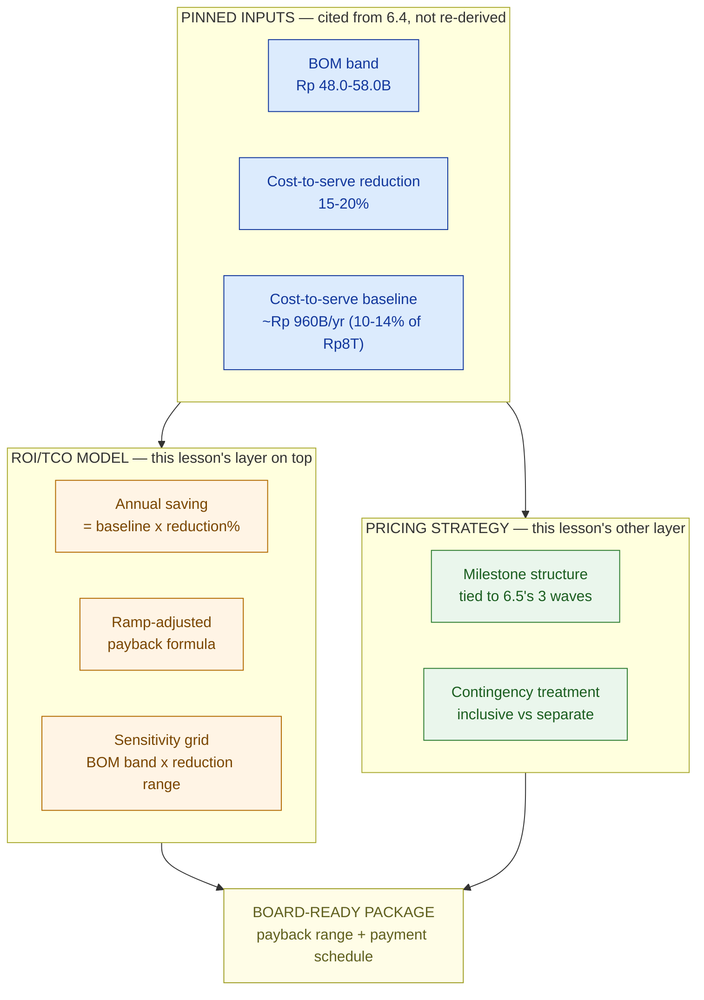

# Commercial Awareness, Pricing & ROI

> The board doesn't approve an architecture — it approves a business case. Turn the BOM into a number the CFO can defend and a structure procurement can sign.

**Type:** Design
**Track:** AI, Data & Infrastructure Solution Architect (Presales)
**Prerequisites:** 7.4 Proposal & Executive Summary Writing
**Time:** ~4h
**Lab:** —
**Ship It:** ROI/TCO calculator + pricing strategy

## The Problem

Cakrawala Group's steering committee has your architecture (6.1–6.3), your priced BOM (6.4: **~Rp 52.0 billion, board band Rp 48.0–58.0 billion**, over a 3-year TCO), and your risk-staged migration plan (6.5: three waves, 12–18 months). Every technical question has an answer. Then the CFO asks two questions that have nothing to do with architecture at all: *"How do we actually pay for this — one invoice, or something staged?"* and *"You keep saying this transformation pays for itself. Show me the number, and show me you're not just telling me what I want to hear."* A rival — a large global systems integrator — is pricing a competing bid for the same program, and their proposal will answer both questions too. The one with the more defensible commercial story wins the room, not necessarily the one with the better architecture.

This is where a technically excellent SA loses deals they should win. Two failure modes show up constantly, and both are commercial, not technical. The first is a **pricing structure mismatch**: quoting a rigid fixed-price lump sum against a 12–18 month transformation that everyone — including the customer — knows will discover things along the way, or quoting open-ended time-and-materials against a board that needs a ceiling to approve the spend at all. Either one stalls procurement, because the structure doesn't fit how the customer's finance function actually releases money. The second, more dangerous failure is a **hand-waved ROI claim** — "this will cut your cost-to-serve by 15–20%, trust me" — with no baseline, no formula, and no range behind it. The moment the CFO's own analyst opens a spreadsheet and asks "reduction of *what*, exactly, and starting from which number?", an unsupported ROI claim doesn't just fail to convince — it actively damages the credibility of everything else in the proposal, including the BOM that was actually rigorous.

The fix for both failure modes is the same discipline this phase has built all along: **never present a bare number**. 6.4 already built the priced, banded BOM and even ran a first-pass payback check against the pinned 15–20% cost-to-serve target — that calculation is not something this lesson re-does from scratch. Re-deriving a figure that a prior lesson already pinned is exactly the mistake that made an earlier phase's closing lesson fragile: numbers drifted lesson to lesson because nobody treated the upstream output as fixed. Phase 6 fixed that discipline by pre-pinning the BOM, the delivery window, and the ROI target as facts every later lesson cites, not re-derives. This lesson inherits that discipline: it takes 6.4's exact figures — **~Rp 52.0B (band Rp 48.0–58.0B)**, **12–18 months**, **15–20% cost-to-serve reduction** — as fixed inputs, and builds two new things on top of them: a **pricing structure** that fits a milestone-staged, risk-managed program, and a fuller **sensitivity-based ROI/TCO model** that shows the board a defensible range instead of a single point estimate. Get this right and the commercial story closes the deal the architecture opened.

## The Concept

### Presales altitude: build the model and defend it — don't run finance

This lesson is marked **Design**, not **Present**, for a reason: the deliverable is a working model, built and defended, not a rehearsed pitch. That said, the altitude still matters. An SA's job here is *not* to become the customer's FP&A department — it is not the SA's job to run a full corporate finance close, negotiate the customer's own discount rate policy, or produce audit-grade financial statements. The SA's job is to build the commercial model that makes the deal's economics *legible and defensible in the room*: pick the pricing structure that fits the delivery plan, show the ROI math with every assumption visible, and be able to answer "why this number and not another one" without retreating to "trust me." Everything past that — the full NPV/IRR model, the statutory tax treatment of capitalized labor, the customer's own budget reallocation — is real work, but it's finance's work, commissioned as a named follow-on once the board says yes. Confusing the two is its own failure mode: an SA who tries to out-finance the CFO's own team loses credibility the same way one who hand-waves the number does, just in the opposite direction.

### Pricing structure is a risk-transfer decision, not an invoicing preference

Every pricing structure answers one question differently: **who bears the risk that the estimate is wrong, and when do they find out?** There are four structures an SA needs fluently, recapping the CapEx/OpEx framing from 6.4 because the accounting lens and the pricing structure interact directly:

| Structure | Who bears schedule/scope risk | Cash-flow shape | Fits best when… |
|---|---|---|---|
| **Fixed-price** | Vendor (SI) — a scope change requires a formal change order | Lump sum(s) against a signed scope | Scope is genuinely stable and well-understood (a known hardware refresh, a like-for-like migration) |
| **Time & materials (T&M)** | Customer — pays for actual hours regardless of outcome | Continuous, usage-billed | Scope is deliberately exploratory (a discovery engagement, a PoC before commitment) |
| **Milestone-based** | Shared — vendor is paid as verifiable stage-gates clear, so both sides carry schedule risk together | Staged, tied to delivery events | A multi-wave program with clear exit criteria per stage (exactly Cakrawala's situation — see 6.5) |
| **Outcome-based / gainshare** | Vendor takes the largest share, in exchange for upside if the outcome overshoots | A base fee plus a bonus/penalty tied to a measured KPI | The customer wants price to track the very ROI claim being pitched, and the outcome is genuinely measurable |

A fixed-price quote on a program this size looks reassuring for about one meeting, then breaks the moment a wave's exit criteria slip or a legacy integration turns out messier than scoped (6.5's risk #3 and #4) — because every change becomes an adversarial change-order negotiation instead of a planned contingency draw. Pure T&M is the opposite failure: a board that needs to approve a ceiling (Cakrawala's pinned Rp 45–65B) cannot approve an open tab. **Milestone-based pricing is the structure that actually matches how this program is already built** — 6.5 already staged the delivery into three waves with named, verifiable exit criteria (SLO stability for 30 consecutive days, reconciliation matches, a compliance sign-off gate). Tying payment to those same gates means the commercial structure and the delivery structure are the *same* structure, not two documents that can drift apart.

### Building the ROI/TCO model: cite, don't re-derive

6.4 already built the first-pass ROI check, and its exact numbers are the fixed inputs for everything below:

```
CITED VERBATIM FROM 6.4 — DO NOT RE-DERIVE
─────────────────────────────────────────────────────────────────────────
Investment (3-yr TCO, pinned)........ ~Rp 52.0B         (board band Rp 48.0-58.0B)
Delivery window (pinned).............. 12-18 months
Group revenue (deal discovery fact)... ~Rp 8 trillion / year
Cost-to-serve baseline (assumption)... ~12% of group revenue, range 10-14%
  -> Rp 960B/yr (range Rp 800B-1.12T/yr)                  [6.4 Step 6 / output S7]
Target cost-to-serve reduction (pinned) 15-20%
  -> Rp 144B/yr @ 15%  ...  Rp 192B/yr @ 20%  ...  midpoint ~Rp 168B/yr
6.4's own ramp-adjusted payback (central case)........... ~13 months
─────────────────────────────────────────────────────────────────────────
```

What 6.4 did *not* do — because it wasn't 6.4's job — is show the board what payback looks like across the *full* uncertainty picture: the BOM band **and** the savings range **at the same time**. A single point estimate ("payback in 13 months") is one honest number, but a board that has watched a rival GSI present a suspiciously precise ROI slide has learned to distrust exactly that kind of confidence. **This lesson's job is to turn 6.4's single point into a defensible grid** — the same ramp formula, applied across both dimensions 6.4 already pinned as uncertain, so the board sees a range they can trust rather than a number they have to take on faith.



Every figure below still carries an assumption, a formula, and a range — no exceptions, even at this commercial altitude. A pricing strategy is not "run finance's numbers for them"; it's presales work — building the model *and* being able to defend every cell in it when the CFO pushes back.

Five mistakes account for most commercial packages that unravel after signature — check your own against this list before it leaves your hands:

1. **Re-deriving an upstream figure** instead of citing it — recomputing the cost-to-serve baseline or the BOM total from scratch here, drifting from 6.4's exact numbers by even a rounding choice.
2. **Presenting a single payback number** with no visible range, inviting the one follow-up question ("based on what baseline?") it has no good answer to.
3. **A pricing structure that ignores the delivery plan** — quoting fixed-price or pure T&M against a program 6.5 already staged into verifiable waves, instead of matching the commercial structure to it.
4. **A gainshare or bonus clause against an unmeasurable outcome** — relocating the argument from price to measurement methodology instead of strengthening the pitch.
5. **Confusing a negotiation lever with a discount** — presenting contingency-separate pricing as if the total contract value dropped, when the honest floor is unchanged.

## Design It

Let's build Cakrawala Group's ROI/TCO calculator and pricing strategy, in five steps: recap the pinned inputs, choose and structure the pricing model, build the full sensitivity grid, package the negotiation levers, and roll the whole thing into a one-page commercial summary the steering committee can approve in a single meeting.

### Step 1 — Recap the pinned inputs (from 6.4, not re-derived)

Every number in this step is copied, not recalculated: **investment ~Rp 52.0B (board band Rp 48.0–58.0B)**, **delivery window 12–18 months**, **target cost-to-serve reduction 15–20%**, **cost-to-serve baseline ~Rp 960B/yr (range Rp 800B–1.12T/yr, from ~12% of the ~Rp 8T group revenue, range 10–14%)**. If any of these look wrong, the fix is to flag it back to 6.4 and re-price there — not to quietly adjust it inside this lesson's model, which is exactly the drift that pre-pinning exists to prevent.

### Step 2 — Choose the pricing structure: milestone-based, tied to 6.5's waves

Cakrawala's delivery is already staged into three waves with named exit criteria (6.5). The pricing structure should be the *same* structure — payment releases exactly when a wave's exit criteria clear, so the customer never pays ahead of verified progress and the delivery team is never asked to keep building past a stage nobody has accepted yet.

```
MILESTONE PAYMENT SCHEDULE — tied to 6.5's wave exit criteria
Assumption: % of contract value released at each gate; base value = Rp 52.0B (central estimate)
──────────────────────────────────────────────────────────────────────────────────────────
GATE                                    TRIGGER (from 6.5)                    %      Rp (of 52.0B)
──────────────────────────────────────────────────────────────────────────────────────────
M0  Signature / mobilization             Contract signed, team mobilized       15%    Rp 7.8B
M1  Wave 0 exit (Foundation)              Platform live, event bus + ACL       15%    Rp 7.8B
                                          smoke-tested, security baseline OK
M2  Wave 1 exit (Retail)                  SLO stable 30 consecutive days,      20%    Rp 10.4B
                                          reconciliation matches legacy
M3  Wave 2 exit (Logistics)               Same bar as Wave 1, PLUS event bus   20%    Rp 10.4B
                                          proven under 2nd BU's traffic shape
M4  Wave 3 compliance gate cleared        All 4 sign-off checks pass           10%    Rp 5.2B
                                          (residency, audit trail, reporting,
                                          rollback drill) — BEFORE cutover
M5  Wave 3 exit + final acceptance        Finance-leasing cutover stable,      15%    Rp 7.8B
                                          extended parallel-run closed
Retention                                 Released at formal program sign-off  5%     Rp 2.6B
──────────────────────────────────────────────────────────────────────────────────────────
TOTAL                                                                          100%   Rp 52.0B
──────────────────────────────────────────────────────────────────────────────────────────
```

**Formula:** `milestone payment = gate % x Rp 52.0B central estimate`. **Range:** if the final contract prices at the band's edges (Rp 48.0B or Rp 58.0B) instead of the central Rp 52.0B, every milestone rescales proportionally — the *percentages* are the pinned commercial agreement, not the rupiah figures. **Why this split:** the two heaviest gates (M2, M3 — retail and logistics stability) sit where 6.5's register already carries the highest technical and delivery risk (risks #3, #4, #6, #7); weighting payment to land there means the vendor is paid *as* that risk is retired, not regardless of it. The compliance gate (M4) is deliberately its own line, worth less than the wave exits either side of it, because it's a go/no-go control point, not a delivery milestone — nobody should be incentivized to rush a regulatory sign-off for a payment.

Mapped against 6.5's own wave calendar, the payment cadence is a straight read-through of the delivery plan — which is the entire point of choosing this structure:

```
CASH-FLOW VIEW — milestone payments against 6.5's wave calendar (months)
─────────────────────────────────────────────────────────────────────────────
 Month:     1        3            8            12           17/18
 Wave:    [Wave 0: Foundation][Wave 1: Retail][Wave 2: Logistics][Wave 3: Fin-leasing]
 Payment:  M0        M1           M2           M3        M4  M5
           (sign,    (foundation  (retail      (logistics (gate)(final,
           mobilize) live)        stable 30d)  stable)           extended
                                                                  parallel-run
                                                                  closed)
 % of Rp52.0B: 15%     15%          20%          20%      10% 15% (+5% retention)
─────────────────────────────────────────────────────────────────────────────
Nobody is ever paid ahead of a verified gate; delivery is never asked to keep
funding work past a stage the customer hasn't yet accepted.
```

### Step 3 — Build the ROI/TCO sensitivity grid

This is the step that turns 6.4's single-point payback (~13 months, central case) into a board-grade range, using the *same* ramp-adjusted formula 6.4 established — applied across the two dimensions 6.4 already pinned as uncertain: the BOM band and the 15–20% savings range.

```
ROI / TCO CALCULATOR — built on 6.4's pinned inputs, not new assumptions
═══════════════════════════════════════════════════════════════════════
INPUTS (cited from 6.4)
  Cost-to-serve baseline .......... ~Rp 960B/yr  (range Rp 800B-1.12T/yr)
  Target reduction (pinned) ....... 15-20%
  Investment / BOM (pinned) ....... ~Rp 52.0B    (band Rp 48.0-58.0B)
  Adoption ramp (from 6.4) ........ linear, 0% at kickoff -> full run-rate by month 24

FORMULAS
  Annual saving          = cost-to-serve baseline x target reduction%
  Cumulative saving(T)   = Annual saving x T^2 / 4        for T <= 2 years  [6.4's ramp curve]
  Payback period T (yrs) = 2 x SQRT( BOM / Annual saving )

SENSITIVITY GRID — payback period (months), BOM band x savings range
                                Savings @ 15%           Savings @ 20%
                                (Rp 144B/yr)             (Rp 192B/yr)
─────────────────────────────────────────────────────────────────────
  BOM Rp 48.0B (low band)         13.9 months             12.0 months
  BOM Rp 52.0B (central)          14.4 months             12.5 months  <- 6.4's own
                                                                          midpoint case
                                                                          (168B/yr) landed
                                                                          at ~13 months,
                                                                          inside this cell
  BOM Rp 58.0B (high band)        15.2 months             13.2 months
─────────────────────────────────────────────────────────────────────
ILLUSTRATIVE PAYBACK RANGE: ~12-15 months across the full grid, presented
to the board as a "12-16 month" headline to leave honest margin at the edges.
NEVER present the 13-month central figure alone — present the grid, or at
minimum the range it produces.
```

**Why the ramp curve is quadratic, not linear:** 6.4's `T^2/4` term follows directly from a *linearly ramping* annual run-rate — if the saving rate itself climbs in a straight line from 0% to 100% by month 24, the *cumulative* saving at any point is the area under that ramp, which grows with the square of elapsed time, not elapsed time itself. This is not a new assumption introduced here; it is the same curve 6.4 already committed to, applied at more grid points. It matters for the negotiation because it means payback accelerates faster in the second half of the ramp than the first — a customer worried about "will this ever actually pay off" should be shown that the curve bends *in their favor* as adoption matures, not against them.

**Reading the grid for the room:** the best case (low BOM, high savings achievement) breaks even at 12 months — inside even the compressed end of the delivery window. The worst case in this grid (high BOM, low savings achievement) still breaks even at just over 15 months — inside the 18-month delivery window, with the platform then running for roughly 20+ more months of the 3-year TCO horizon still capturing savings. **Every cell in this grid is a genuine payback inside the program's own delivery window** — that is the actual commercial argument, and it is far more persuasive delivered as a grid the CFO's team can recompute themselves than as one number they're asked to trust.

### Step 4 — Negotiation levers embedded in the pricing

Two levers, both derived from artifacts already built, turn this from a static number into something to actually negotiate with:

**Lever 1 — contingency-inclusive vs. contingency-separate quote.** 6.4's Rp 52.0B already bundles the Rp 4.0B risk-based contingency (its four named risks: FX, integration, schedule compression, licensing true-up). Two ways to present the same total:

| | Contingency-inclusive | Contingency-separate |
|---|---|---|
| Headline quoted to the board | **Rp 52.0B**, all-in | **Rp 48.0B** base + a capped Rp 4.0B contingency reserve |
| How contingency is drawn | Already priced in, no separate approval needed | Drawn only against a *named, occurring* risk from 6.5's register, billed as it fires |
| When to use | Straightforward negotiation, customer values simplicity over a lower headline | Competitive situation (a rival GSI bid) where a lower headline number matters, and the customer's risk appetite is genuine — not just a negotiating posture |
| The catch | Nothing hidden, but no visible "give" left in the negotiation | Total contract value floor is still ~Rp 48.0B — this lever changes *optics and control*, not the underlying economics |

Against a competing global-SI bid, leading with **Rp 48.0B contingency-separate** is a legitimate, honest lever: it is 6.4's own subtotal before the risk buffer, it is defensible line by line, and it hands the customer's finance team visible control over the Rp 4.0B reserve (drawn only against 6.5's own named risks, which they've already reviewed) instead of asking them to trust a bundled number. It is not a discount — it is a re-presentation of the same figures with the risk-based logic made explicit, which is exactly the kind of transparency a rival's flat lump-sum bid usually can't match.

**Lever 2 — gainshare kicker on the 15–20% range.** The milestone schedule in Step 2 covers delivery; it says nothing about the *outcome*. Layer a small outcome-based bonus on top: if measured cost-to-serve reduction at the 18-month mark, per BU, exceeds 15% and tracks toward the 20% end of the pinned range, a modest bonus (e.g., a single-digit percentage of contract value, capped) pays out at the M5 gate. This costs nothing if the outcome lands at the low end of the pinned range, and it gives the customer's board a direct answer to "what if it works even better than promised" — a question a purely milestone-priced competitor bid usually leaves unanswered.

Package the two levers, the milestone schedule, and the sensitivity grid together and the CFO's original two questions get real answers: **payment is staged against the same gates delivery already has to clear, and the payback lands somewhere between 12 and 15 months across every combination of the board's own pinned uncertainty — not a single number asked to be trusted, but a grid the finance team can recompute themselves.**

### Step 5 — Roll it into a one-page commercial summary

Everything above compresses into a single page a steering committee can approve without a follow-up meeting — the commercial equivalent of 7.4's executive summary:

```
COMMERCIAL SUMMARY — Cakrawala Group Transformation Program
─────────────────────────────────────────────────────────────────────────
INVESTMENT (cited from 6.4, not re-derived)   ~Rp 52.0B  (band Rp 48.0-58.0B)
DELIVERY WINDOW (cited from 6.4/6.5)          12-18 months, 3 waves
PRICING STRUCTURE                             Milestone-based, 6 gates + retention,
                                               tied 1:1 to 6.5's wave exit criteria
CONTINGENCY TREATMENT                         Presented contingency-separate:
                                               Rp 48.0B base + capped Rp 4.0B reserve
                                               (drawn only against 6.5's named risks)
PAYBACK (illustrative, full sensitivity grid) ~12-15 months; headline to the board:
                                               "12-16 months" across the pinned BOM
                                               band x 15-20% savings range
UPSIDE MECHANISM                              Capped gainshare kicker if measured
                                               reduction tracks toward 20% by month 18
─────────────────────────────────────────────────────────────────────────
ONE LINE: staged payment against verified delivery, honest range instead of a
guess, upside shared if it overshoots — approvable in one meeting.
```

## Compare It

**Fixed-price vs. T&M vs. outcome-based/gainshare — risk transfer, revisited.** Fixed-price transfers execution risk fully to the vendor and works when scope is genuinely stable; it fails on a multi-wave transformation because every legitimate discovery (an underestimated legacy integration, per 6.5's risk #3) becomes an adversarial change order instead of a planned draw against contingency. T&M transfers the risk fully to the customer and fails the opposite way — a board with a pinned ceiling (Rp 45–65B) cannot approve an open tab, no matter how good the relationship. Outcome-based/gainshare is the sharpest tool but the narrowest fit: it only works when the outcome is genuinely, independently measurable (Cakrawala's cost-to-serve reduction can be, because 6.4 already defined the baseline and the target) — quoting gainshare against a fuzzy or disputed metric just relocates the argument from price to measurement methodology, which is worse. Milestone-based sits in the middle deliberately: it shares risk in proportion to verifiable delivery events, which is why it is the correct *primary* structure for this deal, with a small gainshare layer added on top rather than replacing it.

**Simple payback vs. NPV/IRR — which one actually persuades a board.** A full NPV/IRR model is not wrong, and 6.4 explicitly flagged it as legitimate follow-on work once the board has approved the headline number. But leading with IRR to *this* audience, at *this* stage, has a specific failure mode: IRR requires a discount-rate assumption, and the moment a board member disputes the discount rate, the conversation shifts from "does this pay back" to "whose discount rate is right" — a debate presales cannot win in the room and does not need to have yet. Simple payback — "you get your money back in about a year, and the platform keeps generating savings for roughly two more years after that inside the 3-year TCO horizon" — requires no assumption the board has to argue about beyond the ones already pinned (6.4's baseline, the reduction target). Use the simpler metric to close the room; commission the NPV/IRR model as the named follow-on deliverable once the deal is approved, exactly as 6.4 scoped it.

**Sensitivity ranges vs. single-point ROI claims.** A rival GSI bid that shows up with one crisp number — "18% cost-to-serve reduction, 11-month payback, guaranteed" — reads as confident for exactly as long as it takes someone on the customer's finance team to ask "based on what baseline, and what happens at 15% instead of 18%?" A number with no visible range invites exactly that question, and has no good answer once asked. A grid like Step 3's, by contrast, pre-empts the question: it shows the customer's own team the worst case *inside* the grid still breaks even inside the delivery window, which is a stronger claim than a single optimistic point precisely because it survives scrutiny instead of hoping to avoid it.

**Commercial tooling** (name the products; know when to reach for which — an SA is expected to know the landscape even though building the model by hand, as this lesson does, is the deliverable that actually ships):

| Tool | Use when |
|---|---|
| **Salesforce CPQ / DealHub / Conga** | The customer's own procurement runs configure-price-quote workflows and expects milestone/payment schedules in a compatible structured format, not a standalone spreadsheet. |
| **Icertis / ContractPodAi (CLM)** | The milestone schedule and gainshare clause need to become binding contract language — a contract lifecycle management tool, not this lesson's model, is where the legal wording lives. |
| **A dedicated NPV/IRR finance model (Excel, Anaplan, or the customer's FP&A tooling)** | Once the board approves the headline payback range and commissions the heavier discount-rate-adjusted model 6.4 and this lesson both defer — that model lives in finance's own tooling, not presales'. |
| **This lesson's ROI/TCO calculator (what ships below)** | Everything up to that approval: the sensitivity grid, the milestone schedule, and the negotiation levers — because no CPQ or CLM tool prices *your own* contingency logic or ramp assumptions for you. |

The "it depends" a customer will actually ask: *"Why not just guarantee the 20% reduction and skip the range?"* The honest answer is that a guarantee the vendor cannot actually control end-to-end (adoption behavior, a customer-side process change, a macro shift in the BUs' own revenue mix) is a promise dressed as a number — and it invites exactly the follow-up question a rival's flat guarantee usually can't survive: *"guaranteed by what mechanism, and what's the penalty if it doesn't land?"* The sensitivity grid answers the same underlying question — *"what should I actually expect?"* — with a range built from assumptions the customer can inspect, which is a stronger commercial position than a guarantee that only sounds stronger until it's tested.

## Ship It

This lesson ships the **ROI/TCO Calculator + Pricing Strategy** — the commercial layer that sits directly on top of 6.4's BOM and 6.5's wave plan, and the artifact that closes the business case for Capstone G. Both files live in [`outputs/`](../outputs/):

- **[`template-roi-tco-calculator-and-pricing-strategy.md`](../outputs/template-roi-tco-calculator-and-pricing-strategy.md)** — a fill-in-the-blank template: pinned-inputs recap (cited, not re-derived) → pricing structure decision → milestone/payment schedule → ROI sensitivity grid formula → negotiation levers → one-line commercial summary. Hand it to a colleague with any priced BOM and staged migration plan, and they can build a defensible commercial package from it.
- **[`example-cakrawala-group-roi-and-pricing-strategy.md`](../outputs/example-cakrawala-group-roi-and-pricing-strategy.md)** — the template fully worked for Cakrawala Group, built explicitly on 6.4's cited **~Rp 52.0B (band Rp 48.0–58.0B)**, **12–18 month**, and **15–20% cost-to-serve reduction** figures, landing on the milestone schedule from Step 2 and the ~12–15 month (headline: 12–16 month) payback grid from Step 3.

**How to present it — three audiences, one model:** the **board/CFO** gets the sensitivity grid and the milestone schedule's totals — they approve or reject off the range and the payment cadence, not the line-by-line formulas. **Procurement** gets the full milestone table with exact percentages and gate triggers — this is what they put in the contract's payment schedule. **The delivery lead** gets the mapping between milestone gates and 6.5's wave exit criteria — this is what tells them which delivery event triggers which invoice, so finance and delivery are reading the same document.

## Exercises

1. **(Easy)** Cakrawala's CFO asks for the payback figure at exactly the pinned central case — Rp 52.0B investment, the midpoint of 15–20% savings (i.e., 168B/yr, matching 6.4's own central-case number). Recompute it using Step 3's formula and show that it reproduces 6.4's own ~13-month figure. Explain in two sentences why reproducing an upstream number is a *check*, not a re-derivation.
2. **(Medium)** The rival global systems integrator's bid is rumored to be a flat Rp 45.0B fixed-price quote with no staged milestones. Using Compare It's risk-transfer framing, write a half-page argument for why Cakrawala's steering committee should prefer the milestone-based Rp 48.0–52.0B structure over the lower fixed-price number, referencing at least two named risks from 6.5's register that a fixed-price structure would leave uncovered.
3. **(Hard)** Extend Step 3's sensitivity grid with a third dimension: assume the delivery window compresses from the planned 12–18 months to a hard 10 months (recap 6.4 Exercise 3's schedule-compression logic). Using the ramp formula's assumption (savings ramp to full run-rate by month 24 regardless of delivery-window length, since adoption lags delivery), determine whether the payback range in Step 3 changes at all — and if it doesn't, explain in your write-up why a delivery-window change and a savings-ramp change are not the same variable, and where in 6.5's risk register that distinction would need to be flagged.

## Key Terms

| Term | What people say | What it actually means |
|------|-----------------|------------------------|
| Pricing structure | "How we bill it" | The mechanism that assigns *risk*, not just cash flow — fixed-price, T&M, milestone-based, and outcome-based/gainshare each transfer schedule and scope risk differently between vendor and customer. |
| Milestone-based pricing | "Payments in stages" | Payment released against *verifiable delivery gates* (a wave's exit criteria), not a calendar date — so the commercial and delivery structures are the same structure. |
| Outcome-based / gainshare | "Pay for results" | A base fee plus a bonus (or penalty) tied to a measured KPI the customer and vendor both agree on in advance — only viable when the outcome is independently measurable, as Cakrawala's cost-to-serve reduction is. |
| ROI/TCO sensitivity grid | "The ROI number" | A payback estimate computed across every combination of a pinned uncertainty range (here: the BOM band x the savings range) — presented as a grid, never collapsed to one point. |
| Ramp-adjusted payback | "Break-even" | The point where cumulative *realized* (not full-run-rate) savings equal the investment, accounting for savings phasing in with adoption rather than starting at full value on day one. |
| Contingency-inclusive vs -separate quote | "One price or two" | Presenting the same total either bundled (simpler) or split into a base plus a capped, named-risk-triggered reserve (a lower headline number with equal total economics) — a negotiation lever, not a discount. |
| Gainshare kicker | "A bonus clause" | A capped, outcome-triggered bonus layered on top of a milestone structure — costs nothing if the outcome lands at the low end of a pinned target range, pays out only if it overshoots. |
| NPV / IRR | "The real ROI math" | A discount-rate-adjusted valuation of future cash flows — more rigorous than simple payback, but its discount-rate assumption is itself disputable, which can distract a board from a simpler, harder-to-dispute payback story at the approval stage. |
| Cost-to-serve | "Our operating cost" | Recap of 6.4: the subset of operating cost a transformation specifically targets, not total company opex — the baseline against which a reduction target is measured, cited here as ~Rp 960B/yr, never re-derived. |
| Milestone gate | "A checkpoint" | A named, verifiable delivery event (a wave's exit criteria from 6.5) that triggers a payment — the mechanism that makes the commercial schedule and the delivery schedule the same document. |

## Further Reading

- [FinOps Foundation — FinOps Framework](https://www.finops.org/framework/) — the "Quantify Business Value" capability, the closest formal analogue to turning a cost model into a defensible business case.
- [Project Management Institute — Earned Value Management (EVM) overview](https://www.pmi.org/learning/library/earned-value-management-systems-projects-8026) — the formal basis for milestone-based payment tied to verifiable progress rather than calendar time.
- [Harvard Business Review — coverage of value-based and outcome-based pricing](https://hbr.org/topic/subject/pricing) — the strategic case for when gainshare structures outperform fixed pricing.
- [Investopedia — Net Present Value (NPV) and Internal Rate of Return (IRR)](https://www.investopedia.com/terms/n/npv.asp) — a clean refresher on the discounted-cash-flow metrics referenced in Compare It, useful for the follow-on model 6.4 and this lesson both defer.
- [Gartner — IT Cost Optimization](https://www.gartner.com/en/information-technology/topics/it-cost-optimization) — recap from 6.4; the same analyst framing extends naturally to contingency treatment as a negotiation lever.
- [Deloitte — "Outcome-based pricing in professional services"](https://www2.deloitte.com/) — practical guidance on when gainshare/outcome-based clauses succeed versus when they just move the argument to measurement disputes, directly relevant to Step 4's Lever 2.

This is the artifact Capstone G's Executive Presales Demo will present alongside the HLD, the risk register, and the proposal — the moment the whole engagement's technical and commercial story has to hold together in front of an executive audience in one sitting.
