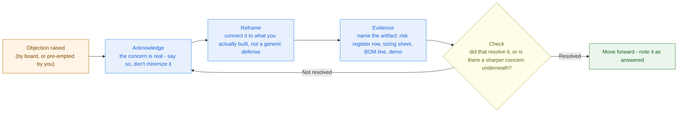

# Competitive Analysis & Handling Objections

> An objector who is still talking has not said no. The only battlecard that survives contact with a board is the one built from your own risk register, not from a marketing deck.

**Type:** Present
**Track:** AI, Data & Infrastructure Solution Architect (Presales)
**Prerequisites:** 7.5 Commercial Awareness, Pricing & ROI
**Time:** ~3h
**Lab:** —
**Ship It:** Battlecard + objection matrix

## The Problem

Cakrawala Group's steering committee has shortlisted two bidders for the "Shared Platform Consolidation" transformation program: your team, and a **global systems integrator** — a brand-name SI with reference logos from three continents, a standard "digital transformation accelerator" package, and a proposal that is, by every account you've heard secondhand, heavier and pricier than yours. You are not the only name in the room, and you will not be for the rest of this deal. Somewhere between now and contract signature, a board member is going to ask you, out loud, in front of the CFO and the CIO: *"Why you, and not them?"* And in the same meeting — maybe the same breath — someone is going to ask: *"Can our own people actually run this once you leave?"*

That second question is not a surprise. You already know it is coming, because **you wrote it down yourself.** In 6.5's risk register for this exact program, risk #1 — "mixed-skill team can't operate the new platform at required pace post-cutover" — scored 9 out of 9, the highest score on the register, ahead of every regulatory and technical risk. Risk #2 — a finance-leasing residency breach during migration — scored 6. These are not the global SI's talking points. They are *your* findings, from your own discovery, already mitigated in your own design. An SA who forgot that register exists will freeze when the board raises it, or worse, get defensive, as if being asked about a known risk were an ambush. An SA who remembers it will do something much better: raise it *first*, unprompted, with the mitigation already built into the plan — because a risk you found and fixed before anyone asked is a demonstration of competence, not a confession of weakness.

The common failure modes here are all avoidable. Trash-talking the competitor ("their solution is bloated, everyone knows that") reads as insecure and gives the board nothing to verify — it is unprofessional and it backfires. Making competitive claims with no evidence behind them ("we're more cost-effective") is just as weak as trash-talk; a board member who asks "how do you know?" and gets a shrug remembers the shrug, not the claim. Treating an objection as an attack rather than a buying signal turns a board member who is *engaging with your proposal enough to poke at it* into someone you've made feel dismissed — and a dismissed objector doesn't raise the objection again, they just quietly vote for the other bidder. And having no plan at all for the objections you already know are coming, when they are sitting in a document you wrote three lessons ago, is the most avoidable failure of all. This lesson builds the two artifacts that fix this: a **battlecard** for the specific competitor in this specific deal, and an **objection matrix** that pulls its hardest rows directly from 6.5's risk register — so the board's toughest question becomes the moment you look most prepared, not the moment you look most exposed.

## The Concept

Two disciplines, one document. A **battlecard** is competitive intelligence structured for the moment you need it mid-conversation, not a wall of prose you'd never open in a live meeting. An **objection-handling framework** is what you actually say once an objection lands, regardless of whether it came from the competitor's script or your own risk register.

### Battlecard anatomy

A usable battlecard is short, scannable, and built around five questions, in this order:

```
BATTLECARD ANATOMY
+-------------------------------------------------------------------------+
| 1. COMPETITOR PROFILE                                                   |
|    Who they are. What they've won before. What they'll obviously pitch. |
+-------------------------------------------------------------------------+
| 2. THEIR LIKELY PITCH                                                   |
|    The 2-3 talking points they will open with, in their own language.   |
+-------------------------------------------------------------------------+
| 3. WHERE THEY'RE GENUINELY STRONG                                       |
|    Say it out loud. Don't dodge it. Boards trust an SA who names the    |
|    other side's real strengths more than one who claims to have none.   |
+-------------------------------------------------------------------------+
| 4. WHERE YOU WIN                                                        |
|    Specific and evidenced. Never "we're better" - always "here is the   |
|    artifact that shows why, for this deal, this customer."              |
+-------------------------------------------------------------------------+
| 5. PROOF POINTS                                                         |
|    Named deliverable + the lesson/output it came from. A claim with a   |
|    citation is a fact; a claim without one is an opinion.               |
+-------------------------------------------------------------------------+
```

Row 3 is the row most SAs skip, and it is the row that makes the rest of the card credible. A board that hears "their brand recognition and breadth of managed services are real, and here is why we're still the right call for *this* program" trusts every subsequent claim more than a board that hears only a list of the competitor's supposed weaknesses.

Five sections, deliberately, not fifteen. A battlecard is a reference you pull up in the ten seconds between a question landing and your answer starting — a document you'd need to scroll through mid-conversation has already failed at its one job. If a section doesn't fit on a single page, it belongs in a deeper competitive-intelligence file, not the card itself.

### Calibrating the acknowledge step for the audience

The same objection lands differently depending on who raises it, and the acknowledge step should match. A CFO who asks about cost is usually really asking "will this blow through budget" — acknowledge the financial discipline concern directly, then let the evidence do the reassuring. A CTO or IT director who asks the identical question in a different room is often really asking whether the number reflects real engineering rigor or a guess — acknowledge the rigor question, not the dollar figure, before showing the same evidence. This is the same audience-calibration instinct 7.1's technical storytelling teaches: the facts don't change, but which part of the concern you name first should.

### The objection-handling framework: acknowledge → reframe → evidence → check

Whether the objection is one the competitor planted or one your own risk register predicted, the sequence that handles it is the same, and none of the four steps is optional:



- **Acknowledge** — never argue, never dismiss. "That's the right question to ask" costs you nothing and buys the room's trust.
- **Reframe** — connect the objection to the specific design decision that addresses it, not to a generic reassurance. Genericness is what makes a battlecard feel like it came from marketing.
- **Evidence** — cite a named artifact: a risk register row and its score, a sizing sheet figure, a BOM line, a demo moment from 7.3. An unsupported claim is indistinguishable from spin.
- **Check** — ask if it landed. Skipping this step is how SAs talk past an objection instead of resolving it; the objector nods politely and votes the other way later.

The loop back to **acknowledge** matters: if the check reveals the objection wasn't fully resolved, you do not repeat the same evidence louder — you acknowledge the sharper version of the concern that just surfaced and reframe again. Objections often arrive layered; the first pass reveals the real one underneath.

### When you genuinely don't have the evidence

The framework assumes the evidence step has something real to point to. Sometimes it doesn't — a competitor raises a gap you haven't actually closed, or a board member surfaces a risk your register missed. The discipline here is the same one that makes the rest of the framework credible: say so. "That's a fair gap, we haven't priced that scenario yet — let us come back to you by Friday with a number" is a check that passes; inventing a confident-sounding non-answer is a check that fails the moment anyone probes it, and it costs you every proof point you've already earned in that meeting. A battlecard built from a real risk register will rarely put you in this position for the risks you already know about — which is the entire argument for building it that way instead of improvising.

### Objections as buying signals, not attacks

The board member who raises the skills-gap risk is not hostile — they are the person in the room who has to answer for this decision after you leave, and they are pressure-testing whether you understand that. **Silence is the worse outcome.** A silent room after a proposal has learned nothing and committed to nothing; a room that argues with your risk register is a room taking the decision seriously enough to look for the crack. Your job is not to have no cracks — it's to have already found and mitigated the ones that matter, and to be visibly unsurprised when someone else finds them too.

### Pre-empting the objections you already know are coming

The most disciplined move available to a presales SA is to **raise a known objection before anyone else does.** If risk #1 in 6.5's register is the highest-scored risk in the whole program, waiting for the board to bring it up cedes you the initiative and makes your mitigation look reactive, invented under pressure. Raising it yourself — "the biggest risk in this program isn't technical, it's operational: can a mixed-skill team run this platform day two, and here's exactly how we've staged that" — turns your own risk register into a credibility asset instead of a liability waiting to be discovered.

```
OBJECTION MATRIX (schematic)
+---------------------------+-------------------+----------------------------+-------------------------+
| OBJECTION                 | SOURCE            | RESPONSE (A-R-E-C)         | PROOF POINT              |
+---------------------------+-------------------+----------------------------+-------------------------+
| <paraphrase of the        | 6.5 risk register | acknowledge -> reframe ->  | <named artifact: risk    |
|  concern, in the board's  | row # + score,    | evidence -> check, one     | register row, sizing     |
|  own likely words>        | OR "competitive">  | line each                  | sheet, BOM line, demo>   |
+---------------------------+-------------------+----------------------------+-------------------------+
```

Every row in a real objection matrix must trace to a **source**: either a numbered, scored row in an actual risk register, or a specific competitive claim you can name and evidence. A matrix with rows that trace to neither is a list of guesses, and guesses are what make an SA improvise weakly under pressure — the exact failure this lesson exists to prevent.

## Design It

Build the battlecard and objection matrix for Cakrawala Group against the global systems integrator, using nothing invented — every strength, weakness, and objection below is sourced from a prior Phase 6 lesson.

Legend: **A→R→E→C** = Acknowledge → Reframe → Evidence → Check · **L/M/H** = Likelihood/Impact rating carried over verbatim from 6.5's risk register · **score** = the register's own Likelihood × Impact figure (1–9), never re-scored here.

### Step 1 — Profile the competitor honestly

The global SI's shape is predictable from its market position, not from insider information: brand-name references across multiple continents, a standardized "digital transformation accelerator" they will re-skin for Cakrawala, a large delivery bench they can mobilize fast, and a pricing model built around a bigger, more generic platform footprint than the one 6.3 actually sized for this customer. Their genuine strengths are real and worth stating plainly: brand recognition a nervous board finds reassuring, breadth of managed-services capability across every BU at once, and enough delivery headcount to make "can you actually staff this" a non-issue for them.

### Step 2 — Write their likely pitch, in their language

- *"We've delivered platform consolidations at conglomerates twice this size — you're buying certainty, not a bet on a smaller partner."*
- *"Our accelerator gives you a proven, pre-built platform on day one instead of a bespoke build."*
- *"With our global bench, staffing and skills-transfer are solved — we bring the people, you don't have to grow them."*

Notice the last line: it directly targets the exact risk 6.5 scored highest. That is not a coincidence — a competent competitor also knows a skills-gap concern is the easiest lever to pull on a board that's already nervous about it. You do not get to be surprised by this pitch; you should have expected it the moment you scored that risk a 9.

**Where this intelligence actually comes from, in practice:** none of it requires anything improper. The RFP itself usually names the shortlist or at least confirms one exists. Procurement will often debrief losing and shortlisted vendors on request, sometimes informally through the same stakeholders you're already meeting. A rival SI's public case studies and published methodology pages tell you their standard delivery pattern without needing a single confidential document. And the customer's own questions are a signal — if the board starts asking about "accelerators" or "managed-service bundles" language they didn't use in earlier discovery sessions, someone has been pitching them that framing. Reading those signals is competitive intelligence; guessing without them and presenting the guess as fact is not.

### Step 3 — Name where you actually win, with evidence

| Where you win | Why (grounded evidence) |
|---|---|
| **Right-sized, not oversized** | 6.3's sizing sheet bounded the AI ops-copilot to 1 GPU node / 2× L40S-class cards for ~50 concurrent users on an 8–14B model — a deliberately narrow feature, not a generic platform reset. The sizing sheet's own contrast case shows what an undisciplined sizing looks like: a Bumi-Energi-scale, multi-node GPU cluster costing $260k–400k in GPU compute alone versus Cakrawala's $30k–45k. A global SI's standardized accelerator is built to be reused across every customer, which structurally biases it toward the bigger, more generic footprint — you are not guessing that they'll oversize, you are pricing against the shape their business model requires. |
| **Cost discipline, not just a lower number** | 6.4's BOM lands at ~Rp 52.0B (board band Rp 48.0–58.0B), built line-by-line off 6.3's sizing with a risk-based, not padded, ~8.3% contingency. A "bigger brand premium" isn't a slur — it's the arithmetic consequence of pricing a bigger, less-bounded platform; you can show your BOM's line items, they cannot show that their price maps to Cakrawala's actual sized workload rather than their template. |
| **Local presence and regulatory fluency** | Finance-leasing's OJK-style residency requirement (6.2's zero-trust design, 6.5's risk #2) is a domestic regulatory reality a global SI's home playbook was not written around. Local presence means faster day-2 response, not just a compliance checkbox — and it's the reason the residency migration path (in-country only, at rest and in transit) was designed in rather than retrofitted. |
| **The risk is already found and mitigated, not discovered live** | 6.5's own register, scored before the board ever asked, already carries the mitigation for both the skills-gap and the regulatory risk. A global SI walking in cold has to build this analysis from scratch, in the room, under questioning. You walk in with it already dated, scored, and owned. |

### Step 4 — Build the objection matrix straight from 6.5's risk register

This is the row-by-row artifact a deal team defends live. Every "Source" cell below names either the exact risk register row and score from `example-cakrawala-group-risk-and-migration-plan.md`, or a specific, nameable competitive claim — nothing here is invented for the occasion.

| # | Objection (board's likely phrasing) | Source | Response (A→R→E→C, one line each) | Proof point |
|---|---|---|---|---|
| 1 | "Can our own people actually run this once you leave?" | **6.5 risk #1** — organizational, L:H/I:H, **score 9 — highest in the register** | Acknowledge: this is the single biggest risk in the whole program, not a side concern. Reframe: the mitigation isn't a training slide, it's the delivery model itself. Evidence: staged SI-partner-led delivery with named knowledge-transfer exit criteria, and a day-2 operations RACI assigned *before* Wave 0 starts (6.5 §4). Check: does that match the operating-model concern, or is there a specific role you're worried we haven't covered? | 6.5 risk register row #1 + program RACI (§4) |
| 2 | "How do you guarantee the finance-leasing data never leaves the country during migration?" | **6.5 risk #2** — regulatory/compliance, L:M/I:H, **score 6** | Acknowledge: regulator-facing data during a live migration is exactly where residency risk hides. Reframe: the migration path was designed around this constraint from day one, not bolted on. Evidence: migration routed exclusively through in-country infrastructure, with a residency audit report as a mandatory gate before Wave 3 begins (6.5 §3, check 1). Check: does that satisfy the compliance concern, or do you need to see the audit evidence format itself? | 6.5 risk register row #2 + compliance sign-off gate (§3) |
| 3 | "A global name has done this at bigger scale — why trust a smaller, local-scoped design?" | Competitive — brand/scale claim | Acknowledge: their scale and reference base are real, and bigger programs are real experience. Reframe: scale at *their* customers doesn't mean the right size for *this* one — Cakrawala's AI feature is bounded by design, not by capability limits. Evidence: 6.3's sizing sheet shows the ~50-concurrent, 8–14B-model footprint was derived from Cakrawala's actual usage inputs, contrasted against what an oversized deployment would cost (6.3 §6). Check: is the concern about scale specifically, or about whether the design has been sized rigorously — because that's answerable either way. | 6.3 sizing sheet §6 (bounded vs. oversized contrast) |
| 4 | "Won't their bundled platform work out cheaper once everything's included?" | Competitive — pricing/bundling claim | Acknowledge: a bundled accelerator can look cheaper on a slide before it's priced against this customer's actual workload. Reframe: a standardized platform prices for its average customer, not this one — bigger footprints don't shrink to fit smaller sized needs. Evidence: 6.4's BOM is itemized line-by-line off 6.3's sizing, lands at ~Rp 52.0B (band Rp 48.0–58.0B), with contingency scored against named risks rather than padded generically (6.4 §2–3). Check: would it help to walk through where a bundled quote would diverge from these line items? | 6.4 BOM §2 (itemized lines) + §3 (risk-based contingency) |
| 5 | "What if the 12–18 month timeline slips like these programs always do?" | **6.5 risk #3** — delivery, L:M/I:H, **score 6** | Acknowledge: schedule slip is the most common way transformation programs actually fail, board-level history bears that out. Reframe: the wave plan was built with slack against 6.3's actual build effort, not a hopeful guess. Evidence: Wave 0's foundation sizing is priced against 6.3's real node/GPU/lakehouse build effort, and wave overlap (Wave 2 starting once Wave 1 is *stable*, not once its rollback window fully closes) is deliberate schedule slack, not an accident (6.5 §2). Check: is the concern the overall window, or a specific wave you'd like walked through in more depth? | 6.5 risk register row #3 + wave table (§2) |

**Reading the matrix:** rows 1 and 2 are the two highest-scored risks in 6.5's own register — the objections you should raise *before* the board does. Rows 3 and 4 are the predictable competitive claims a brand-name SI will open with. Row 5 shows the pattern extends past the two headline risks: any scored row in the register is a candidate objection, sourced the same way. No row here was invented for a training exercise — each one traces to a document you already wrote.

**What the pre-emption of row 1 actually sounds like in the room** — the same acknowledge → reframe → evidence → check sequence, spoken rather than tabulated:

```
SA (pre-empting, before anyone asks):
  "Before we go further, I want to name the biggest risk in this program
   myself, because it's ours to own, not something for you to discover.
   [ACKNOWLEDGE] The single highest risk we scored across the entire
   transformation isn't technical — it's whether a mixed-skill team can
   run this platform at full pace once we've handed it over. That's a
   real, legitimate concern for any program this size.
   [REFRAME] So we didn't treat it as a training problem. We treated it
   as a delivery-model problem.
   [EVIDENCE] The build is staged with a named knowledge-transfer period
   and explicit exit criteria before full internal handover, and the
   day-2 operations RACI is assigned before Wave 0 even starts — not
   figured out after go-live.
   [CHECK] Does that match the operating concern you'd have raised, or
   is there a specific team or capability you'd want walked through in
   more depth?"

BOARD MEMBER: "...What happens if the knowledge transfer doesn't take —
  if six months in, our people still can't run it alone?"

SA (the loop back to ACKNOWLEDGE on the sharper concern that surfaced):
  "That's the real question underneath the first one, and it's fair.
   [REFRAME] The exit criteria aren't a calendar date, they're
   capability-based — the knowledge-transfer period doesn't close until
   your team clears them, whichever comes later.
   [EVIDENCE] That's written into the RACI and the SI contract itself,
   not left as a verbal assurance.
   [CHECK] Would it help to see the specific exit criteria list?"
```

Notice the second board question is not a new objection — it is the same objection, one layer deeper, which is exactly what the loop in the mermaid diagram above is for. Answering it with the *same* evidence louder would have failed; acknowledging the sharper version and pointing to a firmer piece of evidence (contractual exit criteria, not a schedule) is what actually resolves it.

### Step 5 — Decide what to pre-empt versus what to wait on

Not every objection should be raised unprompted — pre-empting everything sounds like an SA who's nervous, not confident. The discipline is to pre-empt only the objections that are (a) highest-scored in your own risk register, and (b) predictable from the competitor's structural position:

```
PRE-EMPTION DECISION
+-------------------------------------------+--------------------+----------------------------+
| OBJECTION                                  | PRE-EMPT LIVE?     | WHY                         |
+-------------------------------------------+--------------------+----------------------------+
| Skills-gap / day-2 operations (row 1)       | YES - open with it | Highest-scored risk in the  |
|                                             |                    | register; owning it first   |
|                                             |                    | reads as competence.        |
| Regulatory residency (row 2)                | YES - raise early  | Second-highest score;       |
|                                             |                    | any doubt here stalls the   |
|                                             |                    | whole finance-leasing wave. |
| Brand/scale comparison (row 3)              | NO - wait for it   | Pre-empting a competitor    |
|                                             |                    | comparison unprompted can   |
|                                             |                    | read as defensive; answer   |
|                                             |                    | it well when it lands.      |
| Price/bundling comparison (row 4)           | NO - wait for it   | Same reasoning; let the     |
|                                             |                    | board ask, then show the    |
|                                             |                    | itemized BOM.                |
+-------------------------------------------+--------------------+----------------------------+
```

The rule of thumb: pre-empt what's in *your own* risk register, because silence on your own known risk looks like you didn't do the work. Wait on competitive comparisons, because pre-empting those can look like you're anxious about losing rather than confident in your design.

**One-line battlecard summary, the way you'd say it to the delivery team before the meeting:**
> Against the global SI, we win on right-sizing (6.3), cost discipline (6.4), and local regulatory fluency (6.2) — but we open the meeting by naming our own highest risk (6.5 #1, skills gap) and second-highest (6.5 #2, residency) before the board does, because a risk we found and mitigated first is a strength, and a risk they find first is a doubt.

### Step 6 — Rehearse it before the room, not during it

A battlecard nobody has practiced out loud is the written equivalent of the untested rollback plan 6.5's compliance gate refused to accept on faith (§3, check 4): a hypothesis, not a capability. Before the actual pitch, run a short internal drill — one colleague plays a skeptical board member and fires the five rows of the objection matrix in random order, including the layered follow-up from Step 4's dialogue. The goal isn't to memorize a script; it's to hear where the "evidence" step goes vague under real pressure, so that gap gets closed against an internal colleague instead of against the board that decides the deal.

```
REHEARSAL DRILL CHECKLIST (run this before every live pitch, not just the first one)
+----------------------------------------------------------------------------------+
| [ ] Every row in the objection matrix fired at least once, out of order           |
| [ ] At least one layered follow-up asked, to test the loop-back (not just A-R-E-C |
|     once through)                                                                 |
| [ ] Presenter can name the source document for every evidence step without        |
|     looking it up                                                                 |
| [ ] Presenter has said, out loud, at least one "we don't have that number yet"     |
|     for a planted question with no real answer - practicing honesty, not just     |
|     confidence                                                                    |
| [ ] Pre-emption opening (Step 5's "YES" rows) rehearsed as the meeting's first     |
|     two minutes, not an afterthought reached if there's time                       |
+----------------------------------------------------------------------------------+
```

## Compare It

**A battlecard built by a vendor's marketing team** is written before the deal exists, for every customer at once. It lists generic differentiators — "best-in-class support," "proven methodology," "flexible pricing" — none of which survive a board member asking "compared to what, specifically, for us?" It has no objection matrix at all, because marketing doesn't have access to a customer-specific risk register; it has slogans instead of proof points.

**A battlecard built by the deal team**, like the one in Design It, is the opposite on every axis:

| | Marketing-built battlecard | Deal-team-built battlecard |
|---|---|---|
| Competitor profile | Generic archetype ("the big guys") | This specific rival's actual structural position (accelerator, brand, bench) |
| Where you win | Slogans ("we're more agile") | Named artifacts: 6.3's sizing contrast, 6.4's itemized BOM |
| Objection matrix | Doesn't exist, or is a FAQ list | Sourced row-by-row from *this customer's own* scored risk register |
| Credibility test | Falls apart on "how do you know?" | Survives it — every claim cites a document |
| Reusability | High across deals, low value per deal | Deal-specific, but the *method* (source from the risk register) is reusable |

The generic card loses not because its claims are false, but because it has no receipts. The deal-team card wins because every claim in it can be pointed at — a scored risk row, a sizing figure, a BOM line — and a board that can verify a claim trusts the next one more.

This is also why a deal-team battlecard cannot be outsourced back to marketing once it exists. Marketing can format it, brand it, put it on a template — but the sourcing work (which risk register row, which sizing figure, which BOM line) has to be done by whoever actually built the proposal, because that is the only place the receipts live.

**Proactive versus reactive objection handling** follows the same logic. Reactive handling waits for the objection, then scrambles for a response — even a good response, delivered under visible pressure, reads as improvised. Proactive handling puts the highest-scored risks on the table before anyone asks, with the mitigation already attached, which reframes the entire dynamic: the board isn't testing whether you have an answer, they're confirming the answer you already gave. Proactive handling is only credible, though, when it's backed by a real register — pre-empting objections you haven't actually mitigated is just trash-talk pointed at yourself.

**Maintenance cadence, honestly:** a marketing battlecard is written once and goes stale the moment a competitor changes its pitch or a pricing model shifts — nobody owns keeping it current because nobody on the deal is accountable for it being wrong. A deal-team battlecard has a natural refresh trigger built in: every time 6.5's risk register gets re-scored (the lesson's own cadence is "weekly during any active wave, monthly in any gap"), the objection matrix should be re-checked against it. A risk that drops in score, gets fully mitigated, or gets superseded by a new one changes which objections are worth pre-empting. Treat the battlecard as a living artifact tied to the register's cadence, not a one-time deliverable filed away after the first pitch.

## Ship It

This lesson ships the **Battlecard + Objection Matrix**, saved under [`outputs/`](../outputs/):

- **[`template-battlecard-and-objection-matrix.md`](../outputs/template-battlecard-and-objection-matrix.md)** — the fill-in-the-blank structure: competitor profile, their likely pitch, win/lose analysis with an evidence column, an objection matrix with a mandatory "Source" column (risk register row-and-score, or named competitive claim), and a pre-emption decision table.
- **[`example-cakrawala-group-battlecard.md`](../outputs/example-cakrawala-group-battlecard.md)** — the template fully worked for Cakrawala Group versus the global systems integrator, with every objection row sourced back to 6.5's actual risk register or a specific, nameable competitive claim.

This artifact feeds directly into **7.7 (Executive Presentation & Negotiation)** — the live session where these exact objections get raised in the room, and where the pre-emption plan in Step 5 gets executed for real.

## Exercises

1. **(Easy)** Take risk #4 from 6.5's register (the anti-corruption layer mistranslating legacy fields between BU schemas) and write one objection-matrix row for it: phrase the board's likely question, cite the source (risk #, score), and write a one-line acknowledge → reframe → evidence → check response.
2. **(Medium)** The global SI's proposal turns out to include a lower headline price than expected, undercutting Cakrawala's Rp 52.0B by roughly 15%. Extend the battlecard's "where you win" table with a new row addressing this directly — you may not dismiss the number, only show what it likely excludes or defers, using 6.4's BOM structure as your evidence.
3. **(Hard)** A different fictional customer — a mid-size hospital network — is evaluating your firm against a specialist healthcare-IT integrator. Using this lesson's method (not its content), build a full battlecard and a 4-row objection matrix for that customer, sourcing at least two objection rows from a plausible risk register you construct for them (patient-data residency, clinical-staff skills gap are reasonable analogues) and two from the specialist competitor's likely structural strengths. State your sources for every row the way Design It did.

## Key Terms

| Term | What people say | What it actually means |
|------|-----------------|------------------------|
| Battlecard | "A slide comparing us to the competitor" | A structured, scannable document built for live use mid-conversation: competitor profile, their likely pitch, your genuine and their genuine strengths, and named proof points — not a wall of marketing prose. |
| Objection matrix | "A list of FAQs" | A table of anticipated objections, each row tracing to a named **source** (a scored risk register row, or a specific competitive claim) with a rehearsed acknowledge→reframe→evidence→check response — never an invented or generic objection. |
| Acknowledge → reframe → evidence → check | "Rebuttal" | A four-step sequence for handling any objection without arguing or dismissing: confirm the concern is legitimate, connect it to what you actually built, cite a named artifact as proof, then ask if it landed. |
| Buying signal | "They're pushing back, we're losing them" | An objection from an engaged stakeholder is evidence they're evaluating seriously enough to look for the crack — a silent room, not a questioning one, is the room closer to no. |
| Pre-emption | "Bringing up our own weaknesses" | Deliberately raising your highest-scored known risks before anyone asks, with the mitigation already attached — turns a risk register from a liability waiting to be found into a credibility asset. |
| Proof point | "A talking point" | A claim tied to a specific, citable artifact (a risk register row, a sizing figure, a BOM line, a demo moment) — the difference between a fact the board can verify and an opinion they can only take on faith. |
| Win/lose analysis | "Trash-talking the competitor" | An honest, evidenced comparison that names the competitor's genuine strengths alongside your own — credible precisely because it doesn't pretend the other side has no strengths at all. |
| Competitive intelligence | "Inside information on the rival" | Reasoned inference from a competitor's public market position (their accelerator model, reference base, pricing pattern) — enough to predict their pitch accurately without needing, or claiming to have, insider access. |
| Living document | "A file that gets updated sometimes" | An artifact with an explicit refresh trigger — here, tied to the risk register's own review cadence — so it degrades from "current" to "stale" on a known schedule instead of silently, the way a one-off marketing card does. |

## Further Reading

- [Klue — What Is a Sales Battlecard? (with templates)](https://klue.com/blog/sales-battlecards) — a practical breakdown of battlecard structure and the win/loss evidence discipline this lesson builds on.
- [Gartner — How to Handle Objections During the Sales Cycle](https://www.gartner.com/en/sales/topics/sales-objection-handling) — the acknowledge-reframe-evidence pattern reflected in mainstream B2B sales research, applied here to a technical presales context.
- [Harvard Business Review — Objections Are a Sign of Interest, Not Rejection](https://hbr.org/topic/subject/sales) — the research basis for treating a raised objection as a buying signal rather than a threat to be neutralized.
- [Miller Heiman Group — Competitive Selling Strategies](https://www.milesnetwork.com/) — a broader treatment of proactive versus reactive competitive positioning, useful background for the Compare It section's method.
- [Porter — Competitive Strategy: Techniques for Analyzing Industries and Competitors](https://www.hbs.edu/faculty/Pages/item.aspx?num=195) — the classic framing for naming a rival's genuine structural strengths honestly instead of dismissing them, which is what makes Row 3 of the battlecard anatomy credible.
- Recap **6.5** (`05-risk-compliance-and-migration/outputs/example-cakrawala-group-risk-and-migration-plan.md`) directly — it is the single source every objection row in this lesson's worked example traces back to; re-reading it before any live pitch is the actual habit this lesson is trying to install.
