# Executive Presentation & Negotiation

> Everything you mapped, designed, priced, and defended converges in one room and one signature — walk in ready to close, not just to present.

**Type:** Present
**Track:** AI, Data & Infrastructure Solution Architect (Presales)
**Prerequisites:** 7.6 Competitive Analysis & Handling Objections
**Time:** ~4h
**Lab:** —
**Ship It:** Executive deck + negotiation plan

## The Problem

Eighteen months of work land on one calendar invite: **45 minutes with the Cakrawala Group board.** Everything since Phase 0 is in the room, whether you name it or not. You mapped the estate so you knew Retail, Logistics, and Finance & Leasing were three siloed technology stacks pretending to be one company. You qualified the deal so you knew the CFO controls the money, the CTO is your champion, and a rival **global systems integrator** has been circling this account for a year. You designed and sized the platform — the zero-trust posture, the ~40-node Kubernetes footprint plus a GPU node carrying an AI copilot, the three-wave migration — across Phases 2 through 6. You built the narrative, rehearsed it on a whiteboard, proved it in a demo, wrote it up as a proposal, priced it and modeled the return, and pre-built your answers to the objections you know are coming. Every one of those artifacts was necessary. None of them, alone, closes the deal.

Here is how a technically flawless deal still dies in this room. The board doesn't read a forty-page proposal — someone hands them a deck, and if the ask isn't legible on slide one, you've lost the room's attention before you've said a word. A demo-grade explanation of the architecture, delivered at board altitude, reads as "the SA loves their own diagram" — the board doesn't care how the event bus works, they care whether Rp 52 billion is worth it. And then, the moment the presentation ends, the real test begins: someone in the room says *"can you do this in nine months instead of eighteen?"* or *"the other integrator quoted 20% less — match it, and we sign today."* An SA who has done everything right up to this point can still lose here in about ninety seconds — by burying the ask under thirty slides of architecture, by treating a scope-cut request as a technical debate instead of a trade, or by conceding on price out of sheer relief that someone is finally negotiating instead of stalling.

The failure underneath all three is the same one Phase 0 named on day one: confusing **how the technology works** with **how it solves the customer's problem.** A board presentation that leads with the platform's cleverness is answering a question nobody in that room asked. A negotiation where the SA "wins" by protecting every architectural detail equally is protecting the wrong things — some scope is genuinely flexible, some is not, and conflating the two either gives away margin for nothing or turns a solvable objection into a walkout. This lesson is the last one in the track because it is where every prior artifact either earns its keep or gets ignored: the deck that compresses everything into one clear ask, and the negotiation plan that knows exactly what an SA can trade, what an SA must protect, and whose job it is to actually sign.

## The Concept

Three ideas carry this lesson: the **executive deck** (compressing everything into the smallest legible ask), **reading the room** (who in the room actually decides), and **negotiation** (what an SA can flex, what an SA must protect, and how to trade rather than concede).

### 1. The executive deck — compression, not summary

A board deck is not a shorter proposal. A written proposal is read alone, at leisure, and can afford depth. A board deck is *presented*, live, to people who will interrupt, and it must survive being read from the back row on a screen nobody controls. The discipline is **the ask goes first**, everything else is evidence for that ask, and depth lives in an appendix nobody flips to unless someone asks. Ten to twelve slides, no more — if you need thirteen, something on this list isn't earning its place:

```mermaid
flowchart LR
    ask["1. THE ASK<br/>one sentence, one number,<br/>one decision requested"]:::ask
    story["2-3. THE STORY<br/>why now — the cost of<br/>staying on 3 siloed stacks"]:::story
    arch["4. TARGET ARCHITECTURE<br/>ONE slide — the money diagram,<br/>not the LLD"]:::arch
    invest["5. INVESTMENT & ROI<br/>ONE slide — Rp 52B (48-58B band),<br/>15-20% cost-to-serve, payback"]:::money
    risk["6-7. RISK & SEQUENCING<br/>3 waves, compliance gate<br/>before Finance & Leasing cutover"]:::risk
    edge["8-9. THE COMPETITIVE EDGE<br/>why us over the rival GSI —<br/>the battlecard, compressed"]:::edge
    close["10-12. THE CLOSE<br/>restate the ask · next step ·<br/>decision date requested"]:::ask

    ask --> story --> arch --> invest --> risk --> edge --> close

    classDef ask fill:#FDECEC,stroke:#B42318,color:#B42318;
    classDef story fill:#DCEBFD,stroke:#12379C,color:#12379C;
    classDef arch fill:#F3F0FB,stroke:#5E35B1,color:#3F2A82;
    classDef money fill:#FFF4E5,stroke:#B26A00,color:#7A4600;
    classDef risk fill:#FDECEF,stroke:#C2185B,color:#880E4F;
    classDef edge fill:#EAF6EC,stroke:#2E7D32,color:#1B5E20;
```



Notice what compresses and what doesn't. The **story** shrinks to two slides because the board already knows their own pain — you're reminding them, not discovering it live. The **target architecture**, the product of five-plus lessons of Phase 6 design work, compresses to **one slide** — the same "money diagram" discipline behind any board-facing HLD: a board that wanted the LLD would have asked engineering, not you. The **investment and ROI** compresses to **one slide** with the headline numbers only — every figure on it must be one you can defend instantly if interrupted, because you will be interrupted exactly there. The **ask itself never compresses** — it opens the deck and closes it, stated identically both times, because a board that leaves the room able to repeat your ask in one sentence is a board that can carry it to the people who weren't in the room.

### 2. Reading the room — the qualification habit didn't stop mattering when the deck opened

Discovery and qualification work builds the habit of separating the **economic buyer** (controls the money, gives the final yes) from the **champion** (sells for you when you're not in the room) from everyone else in between. In a board presentation, that habit becomes tactical: the room has multiple people, and they are not equally important to what happens next.

```
   WHO'S ACTUALLY IN THE ROOM — read it before you open the deck
   ─────────────────────────────────────────────────────────────────
   ROLE                 LIKELY BEHAVIOR IN THE ROOM         YOUR MOVE
   ─────────────────────────────────────────────────────────────────
   Economic buyer       Asks about the NUMBER and the       Answer with the
   (CFO / board chair)  DOWNSIDE. Speaks last, decides.      ROI slide, not
                                                              the architecture.
   Champion (CTO)       Pre-briefed, nods at the story,     Let them field
                        may pre-empt an objection for you.  technical follow-
                                                             ups you'd need
                                                             three slides for.
   Skeptic / detractor  Asks the hardest question, often    Answer it directly,
   (e.g., a COO wary    early, to test if you can take      briefly — do not
   of disruption)       pressure without flinching.         get defensive.
   Influencer           Quiet, but the economic buyer        Watch their face on
   (e.g., group risk    will check their face before        the risk slide, not
   officer)             deciding. Rarely speaks first.       the architecture one.
   ─────────────────────────────────────────────────────────────────
   RULE: time discipline serves the economic buyer. If you're
   15 minutes into a 45-minute slot and still on slide 3, you have
   already told the room the ask doesn't matter enough to protect.
```

The single most common presentation failure isn't a bad slide — it's an SA who spends their time budget on the person asking the most *questions* (usually the skeptic or an engaged champion) instead of the person who actually **decides** (usually quiet until the end). Answer the skeptic's question and move on; don't let one voice consume the slot the economic buyer needs to see the close.

### 3. Negotiation — the SA's lane is scope and technical integrity, not price

The account executive negotiates price, commercial terms, and the contract; that is their lane, and an SA who wanders into it undermines the AE mid-negotiation. The SA's lane is **scope, sequencing, and technical integrity** — and the first negotiation skill is knowing, before you walk in, exactly which parts of your design are levers you can pull and which are the platform's structural integrity that cannot be traded away for anything short of walking from the deal.

```
   NEGOTIATION LEVERS — Cakrawala Group platform
   ══════════════════════════════════════════════════════════════════
   FLEXIBLE (the SA can trade these)         WHY IT'S SAFE TO FLEX
   ──────────────────────────────────────────────────────────────────
   Wave sequencing within Retail/Logistics   Rollback there is a service
   (which stores/hubs go in wave 1 vs 2)     outage, not a regulatory event
   ──────────────────────────────────────────────────────────────────
   AI copilot pilot scope (# of pilot        A smaller pilot still proves
   stores, feature set at go-live)           the concept; full rollout can
                                             follow wave 1 without it
   ──────────────────────────────────────────────────────────────────
   Delivery cadence / reporting rhythm       Process, not architecture —
   (weekly vs biweekly steering)             costs nothing to adjust
   ══════════════════════════════════════════════════════════════════
   PROTECTED (never traded for free)         WHY IT CANNOT FLEX
   ──────────────────────────────────────────────────────────────────
   Zero-trust security posture               Removing it reopens the exact
                                             cross-BU blast-radius risk the
                                             whole architecture exists to close
   ──────────────────────────────────────────────────────────────────
   Compliance gate before Finance &          A regulatory control, not a
   Leasing cutover                           schedule preference — skipping
                                             it exposes the group, not you
   ──────────────────────────────────────────────────────────────────
   The 3-wave sequence itself (order,        Removing waves ≠ compression;
   not just timing, of BU migration)         it re-introduces the exact risk
                                             the sequencing was designed to
                                             avoid
   ══════════════════════════════════════════════════════════════════
```

This is **principled negotiation**, not positional bargaining: the customer's *position* might be "cut the price" or "compress the timeline," but their underlying *interest* is almost always "reduce our risk" or "show the board a faster win." Once you negotiate the interest instead of the position, most asks have a scope-based answer that costs nothing structural — and the rule that makes it work is simple: **every concession is traded for something, never given for free.** If you reduce wave 1's scope, you ask for something in return (a faster sign-off, a named executive sponsor for wave 2, a reference case). A concession given for nothing teaches the other side that your first "no" was never really a no.

### 4. Time-boxing the room

A 12-slide deck still fails if it's delivered at the wrong pace. The single biggest tell of an SA who hasn't rehearsed is spending half the slot on slides 2-4 (the story and the architecture — the parts the SA finds most interesting) and then racing through slides 5-12 (the money, the risk, the edge, and the close — the parts the board actually came for). Budget the room's attention the way you'd budget compute: assign minutes per slide *before* you walk in, and protect the back half of the deck even if it means cutting a story you love.

```
   TIME BUDGET — a 45-minute board slot
   ─────────────────────────────────────────────────────────
   SLIDES         MINUTES   CUMULATIVE   WHY THIS SHARE
   ─────────────────────────────────────────────────────────
   1 (the ask)      2          2         Land it once, don't rush it
   2-3 (story)      5          7         They know their own pain —
                                         remind, don't rediscover
   4 (architecture) 4         11         One slide, one clean pass
   5 (investment)   5         16         Slow down here — expect
                                         the first hard question
   6-7 (risk/waves) 5         21         The compliance-gate story
                                         earns its own minute
   8-9 (AI + edge)  6         27         Differentiation — don't
                                         rush the "why us"
   10 (objections)  4         31         Pre-empt, don't relitigate
   11-12 (close)    4         35         Restate the ask verbatim
   Q&A buffer      10         45         Protected — never borrow
                                         from this to save slide 4
   ─────────────────────────────────────────────────────────
   RULE: if you're still on slide 4 at minute 15, cut to the ask
   and the investment slide directly — a board that never sees
   the ROI number never approves anything, no matter how good
   the architecture slide was.
```

Two tactical moves keep an SA inside this lane even under pressure, both borrowed from negotiation practice and both safe because they ask, rather than assert:

- **Labeling.** Name the interest out loud before answering it: *"It sounds like the concern is first-year risk on something unproven, not the AI copilot's long-term value — is that right?"* This does two things at once: it confirms you're negotiating the real interest, not the stated position, and it buys you a second to choose the right lever without looking like you're stalling.
- **A calibrated question, not a flat no.** Instead of "we can't compress the compliance gate," ask *"how would the board want us to handle it if a compressed timeline meant the compliance sign-off hadn't cleared before cutover?"* The question does the protecting for you — most rooms answer their own question with "no, don't do that," and you've held the line without sounding inflexible.

### 5. Closing signals — the SA validates, the AE signs

Buying signals in a board room are rarely a verbal "yes." Watch for the economic buyer starting to ask **implementation** questions ("who's our point of contact during wave 1?") instead of **justification** questions ("why should we do this at all?") — that shift is the signal the decision has effectively been made and the room is now managing execution risk, not evaluating the ask. When you see it, the SA's job is to **confirm technical readiness** — "yes, we can start discovery for wave 1 within two weeks of signature" — and then hand the room back to the AE for next steps, dates, and paper. Know your lane even at the moment of closing: you validate that the platform can do what you promised; you do not negotiate the contract, and you do not chase the signature. That restraint is exactly the discipline of never carrying the quota — true on day one of qualification, and still true in the very last minute of the deal.

### Pre-flight checklist — five minutes before you walk in

A short, honest gut-check catches the failures this lesson exists to prevent, before they happen live:

- [ ] Can I state the ask, from memory, in one sentence — the same sentence that opens and closes the deck?
- [ ] Do I know which person in the room is the economic buyer, and have I budgeted my time toward them?
- [ ] For every number on the investment slide, can I say which prior artifact it came from and what assumption sits behind it?
- [ ] Have I separated my levers into flexible and protected, on paper, before anyone in the room asks?
- [ ] Do I know, precisely, what I am *not* allowed to negotiate — and what I hand to the AE the moment it comes up?

If any box is unchecked, the deck isn't the risk in the room — you are.

## Design It

Build the two artifacts for Cakrawala Group's board moment: the deck outline and the negotiation plan for the three asks you should expect.

### Step 1 — Build the 12-slide executive deck outline

Every figure below is **cited from the Phase 6 HLD, not recalculated here.**

| # | Slide | Content (cited, not re-derived) |
|---|---|---|
| 1 | **The Ask** | "Approve **~Rp 52 billion** (banded **Rp 48–58 billion**) to modernize Retail, Logistics, and Finance & Leasing onto one shared platform over **12–18 months**, in **three migration waves**, targeting a **15–20% cost-to-serve reduction**." |
| 2 | Why now | Three siloed stacks (~350 retail outlets, ~40 logistics hubs, 1 finance/leasing back office) pay a fragmentation tax every quarter; the compliance window for Finance & Leasing favors acting now. |
| 3 | The cost of "do nothing" | Status quo cost-to-serve trend vs the 15–20% target; the rival GSI is already circling with a like-for-like migration that doesn't close this gap. |
| 4 | Target architecture (the money diagram) | One slide: strangler-fig on Retail/Logistics, anti-corruption layer + segmented enclave on Finance & Leasing, shared zero-trust platform (~40 K8s nodes + 1 GPU node) underneath. |
| 5 | Investment & ROI | **~Rp 52B (band Rp 48–58B)**; payback and 15–20% cost-to-serve figures cited, not recomputed. |
| 6 | The 3-wave plan | Wave 1: Retail. Wave 2: Logistics. Wave 3: Finance & Leasing — gated by compliance sign-off, never earlier. |
| 7 | Risk containment | Zero-trust segmented enclave around Finance & Leasing; a Retail incident cannot become a Finance & Leasing incident. |
| 8 | The AI copilot | Runs on the platform's GPU node; piloted on a subset of Retail first — the clearest, safest proof point for the group. |
| 9 | Why us — competitive edge | Named differentiators vs the rival GSI: proof from real design depth, not a generic like-for-like migration. |
| 10 | Objections pre-empted | The two hardest questions the board is likely to ask, answered before they're asked. |
| 11 | The ask, restated | Identical wording to slide 1 — the board should be able to repeat it. |
| 12 | Next step & decision date | Requested board decision date; what happens in week one after signature. |

### Step 2 — Draft the negotiation plan for the three likely asks

You already know, from qualification and objection prep, which three asks are coming. Prepare the trade, not just the answer.

**Ask 1 — "Cut the AI copilot's scope for a lower price."**
Read the interest: the board is nervous about paying for the newest, least-proven piece of the platform. Counter by trading scope, not price: shrink **wave 1's AI copilot pilot** to a smaller store footprint (the flexible lever), while keeping the whole platform's zero-trust and integration integrity intact. You've answered the real interest — lower first-year risk exposure — without touching the Rp 52 billion figure or the architecture that makes the 15–20% target reachable.

**Ask 2 — "Compress 12–18 months to 9."**
Read the interest: the board wants to show the market a faster win. Counter with the protected/flexible split directly: the **compliance gate before the Finance & Leasing cutover is non-negotiable** — it's a regulatory control, not a scheduling preference, and skipping it reopens the exact risk the whole wave sequence exists to close. What *can* compress is **waves 1 and 2** — Retail and Logistics carry service-outage risk, not regulatory risk, and a tighter cadence there is a legitimate trade. Offer: "we can bring Retail and Logistics in under 9 months combined; Finance & Leasing stays gated on compliance sign-off regardless of the combined-wave timeline."

**Ask 3 — "Match the rival GSI's price."**
Read the interest: the board wants to know they aren't overpaying, not necessarily the lowest number in the room. This is the AE's negotiation, not the SA's — but the SA's contribution is refusing to let the conversation become "which number is lower" when the real comparison is "which platform reaches 15–20% cost-to-serve reduction and closes the compliance gate on schedule." Hand the AE the technical differentiation that justifies the band, and let commercial terms — payment schedule, contract length, a reference-case clause — be the AE's trade for holding the number.

In practice, boards rarely raise these one at a time — a board that's serious about the deal often raises all three in the same conversation, stacking pressure ("compress it, cut the copilot, and match the price"). Resist answering them as one combined ask. Separate them back into three distinct trades out loud — *"let's take those one at a time: the copilot's pilot scope, the timeline, and the commercial terms"* — because a stacked, unseparated ask is exactly how a board gets three concessions for the price of pushing once. Each trade above still holds; the only new skill is refusing to let three asks collapse into one panicked yes.

### Step 3 — Rehearse against the clock, not just the content

Before the actual room, run the deck against the time budget from The Concept, out loud, with someone timing you slide by slide. Two things almost always surface: the story (slides 2-3) runs long because it's the part you know best and enjoy telling, and the investment slide (5) runs short because you haven't yet rehearsed the follow-up questions a CFO will ask on sight — "is that band pre- or post-tax?", "what's included in the Rp 52 billion — licences, services, both?" A dry run that only checks content and never checks pace will still fail in the room; a board doesn't grade your slides, it grades whether you controlled 45 minutes well enough to reach your own ask twice.

### Step 4 — Reflect: full circle from Phase 0

Phase 0's very first lesson warned against an SA who answers "how does the technology work" instead of "how does this solve the customer's problem" — a VP wanted a shop-floor copilot and got a nine-month integration surprise because nobody mapped the estate first. Every phase since has been in service of never repeating that mistake: map it, qualify it, design it across five technical domains, price it, defend it — and now, present it and negotiate it, still answering the same question. The Cakrawala board doesn't care that the platform runs on ~40 Kubernetes nodes; they care that three siloed businesses become one, at a bounded cost, with a bounded risk. That is the whole job, at every altitude, from the first lesson to this one.

## Compare It

### Executive deck vs the written proposal

| | Written proposal | Executive deck (this lesson) |
|---|---|---|
| **Consumption** | Read alone, at leisure, often forwarded to people who never met you | Presented live, in one sitting, to a room you can read and adjust for |
| **Length** | Can run to dozens of pages; depth is a feature | 10-12 slides; depth is deferred to an appendix nobody opens live |
| **Structure** | Executive summary up front, then full detail in order | The ask up front, evidence compressed to one slide per topic, ask restated at the end |
| **Numbers** | Can show the full BOM, the full ROI model, every assumption | Shows only the headline figures — must be defensible instantly under interruption |
| **Best for** | The paper trail, the people who weren't in the room, procurement's records | The 45 minutes where a yes or no actually gets decided |

Neither replaces the other — the proposal is the artifact of record; the deck is the artifact that gets a decision. An SA who tries to present the full proposal, slide for slide, has built a deck that will run long, lose the room's attention on slide 6, and never reach the ask restated at the end.

### Board presentation vs working-session presentation

| | Working session (whiteboarding) | Board presentation (this lesson) |
|---|---|---|
| **Format** | Live, drawn, iterative — the architecture emerges on the board | Polished, fixed slides — the architecture is already decided |
| **Audience** | Technical stakeholders, engineers, the champion | Economic buyer, executives, often non-technical |
| **Depth** | Can go deep on a component when asked | One slide for the whole target architecture; depth lives in an appendix |
| **Interruption** | Expected and welcomed — it's how you build shared understanding | Time-boxed; you answer, you don't wander |
| **Goal** | Build technical trust and alignment | Get a funding/scope decision |
| **What breaks it** | A presenter who won't improvise on the board | A presenter who won't compress — 30 slides where 12 belonged |

### Principled negotiation vs positional bargaining

| | Positional bargaining | Principled negotiation |
|---|---|---|
| **What's exchanged** | Positions ("cut the price," "no") | Interests ("reduce risk," "show a fast win") |
| **Typical result** | A win/lose standoff, or a concession given for nothing | A trade that satisfies the real interest without touching what's protected |
| **SA's tool** | None — this is the AE's game if played this way | The flexible/protected lever table from The Concept |
| **Risk if you get it wrong** | You concede scope or price with nothing gained, or you refuse everything and stall a real deal | Both sides leave with a defensible, bounded outcome |

### The SA's negotiation lane vs the AE's

| | Solution Architect | Account Executive |
|---|---|---|
| **Negotiates** | Scope, sequencing, technical trade-offs | Price, contract terms, payment schedule |
| **Protects** | Architectural integrity (security posture, compliance gates, migration sequencing) | Margin, deal economics |
| **Closing role** | Confirms technical readiness | Manages the signature and next steps |
| **Never does** | Discuss price or sign anything | Redesign the architecture on the spot |

The "it depends" a board will actually ask: *"Can't you just do all of it faster and cheaper?"* Your answer is the flexible/protected split: some of it, yes — trade the flexible levers for something in return. The rest is protected because it's the reason the number and the timeline are defensible in the first place.

## Ship It

This lesson — and the track — ships a reusable **Executive Deck + Negotiation Plan**, the artifact an SA builds for the single highest-leverage meeting on any enterprise deal. Both files live in [`outputs/`](../outputs/):

- **[`template-executive-deck-and-negotiation-plan.md`](../outputs/template-executive-deck-and-negotiation-plan.md)** — a fill-in 12-slide skeleton (citing every prior artifact, never re-deriving a figure) plus a negotiation-levers table (flexible vs protected, with the reason) and a likely-asks worksheet. A colleague can walk into any board meeting with this filled in.
- **[`example-cakrawala-executive-deck-and-negotiation-plan.md`](../outputs/example-cakrawala-executive-deck-and-negotiation-plan.md)** — the template fully worked for Cakrawala Group: the 12-slide outline citing **~Rp 52 billion (band Rp 48–58 billion)**, **12–18 months**, **15–20% cost-to-serve reduction**, and the **3-wave migration**, plus the negotiation plan for all three likely asks — the AI copilot scope-cut, the timeline compression, and the "match the rival" request.

Three habits make the deck and the plan earn their keep:

1. **The ask opens and closes the deck, in identical words.** Everything between is evidence, not narrative filler.
2. **Every figure on the investment slide is cited from an earlier artifact.** If you can't say "this number comes from the sizing/BOM work, and here's the assumption behind it," you're not ready to defend it under a board's first hard question.
3. **Walk in with the levers table already filled out.** Deciding what's flexible and what's protected *before* the room asks is the difference between trading and folding.

## Exercises

1. **(Easy)** Take the 12-slide outline above and cut it to 8 slides for a board with only a 20-minute slot. Which four slides merge or disappear, and which one — the ask — must survive unchanged in both versions? Justify your cuts against the "ask goes first, evidence supports it" rule.
2. **(Medium)** The Cakrawala CFO asks a fourth likely question this lesson didn't script: *"What happens to our current staff running the legacy systems during the migration?"* Using the flexible/protected framework, decide whether this is a negotiable scope item or a protected commitment, and draft the one-paragraph answer you'd give live in the room — citing the relevant migration wave.
3. **(Hard)** Write the negotiation plan for a **new** ask this lesson didn't cover: the board's group risk officer (an influencer, not the economic buyer) asks to remove the AI copilot entirely from the program, calling it "unproven," while the CFO stays silent. Identify whose interest is really driving the ask, decide what you'd trade, what you'd protect, and how you'd read the CFO's silence before answering — then write the one-minute response you'd give in the room, closing the loop on everything this track has built from Phase 0 onward.

## Key Terms

| Term | What people say | What it actually means |
|------|-----------------|------------------------|
| Executive deck | "The proposal, but shorter" | A live-presented, time-boxed artifact where the ask opens and closes the deck and every other slide is compressed evidence for it — not a condensed proposal. |
| Reading the room | "Watching body language" | Mapping who in the room holds which decision-relevant role (economic buyer, champion, skeptic, influencer) and allocating your limited time toward the one who decides. |
| Negotiation lever | "Something to give away" | A specific piece of scope, sequencing, or process you have pre-classified as safe to trade — decided before the meeting, not improvised under pressure. |
| Protected scope | "Things we won't budge on" | Architectural elements (security posture, compliance gates, migration sequencing) whose removal reopens a risk the design specifically exists to close — never traded for free. |
| Principled negotiation | "Being firm but fair" | Negotiating the counterpart's underlying *interest* (reduce risk, show a fast win) rather than their stated *position* (cut the price) — usually reveals a scope-based answer that costs nothing structural. |
| Concession-for-concession | "Meeting in the middle" | The rule that every scope or schedule concession is traded for something in return — a faster sign-off, a sponsor, a reference — never given away unconditionally. |
| Closing signal | "They said yes" | A shift from justification questions ("why do this?") to implementation questions ("who's our contact in wave 1?") — the tell that a decision has effectively been made. |
| SA's negotiation lane | "Whatever gets the deal done" | Scope, sequencing, and technical integrity — never price or contract terms, which stay with the account executive throughout, including at close. |
| Labeling | "Repeating back what they said" | Naming the counterpart's underlying interest out loud before answering it, so the negotiation targets the real concern instead of the stated demand. |
| Time-boxing the room | "Watching the clock" | Pre-assigning minutes per slide against the meeting length so the back half of the deck — investment, risk, edge, close — never gets rushed to make room for a story the SA enjoys telling. |

## Further Reading

- [*Getting to Yes* — Fisher & Ury (Harvard Negotiation Project)](https://www.pon.harvard.edu/daily/harvard-negotiation-project/) — the foundational text on principled negotiation (interests vs positions) underlying this lesson's negotiation-levers framework.
- [*Mastering Technical Sales* — John Care](https://www.masteringtechnicalsales.com/) — the reference on the SA's role in the close: technical validation, not signing, and how to hand off cleanly to the account executive.
- [Guy Kawasaki — The 10/20/30 Rule of PowerPoint](https://guykawasaki.com/the-only-10-slides-you-need-in-your-pitch/) — a blunt, practical case for the same compression discipline this lesson's 12-slide deck applies to a board.
- [*Never Split the Difference* — Chris Voss](https://www.blackswanltd.com/the-book) — a field-tested negotiation playbook (tactical empathy, labeling) that complements the flexible/protected framework when the room turns adversarial.

This is the final lesson of the 53-lesson Solution Architect track — the whiteboard, the estate map, the sizing sheet, and the qualification scorecard all end up, eventually, in a room exactly like this one.
